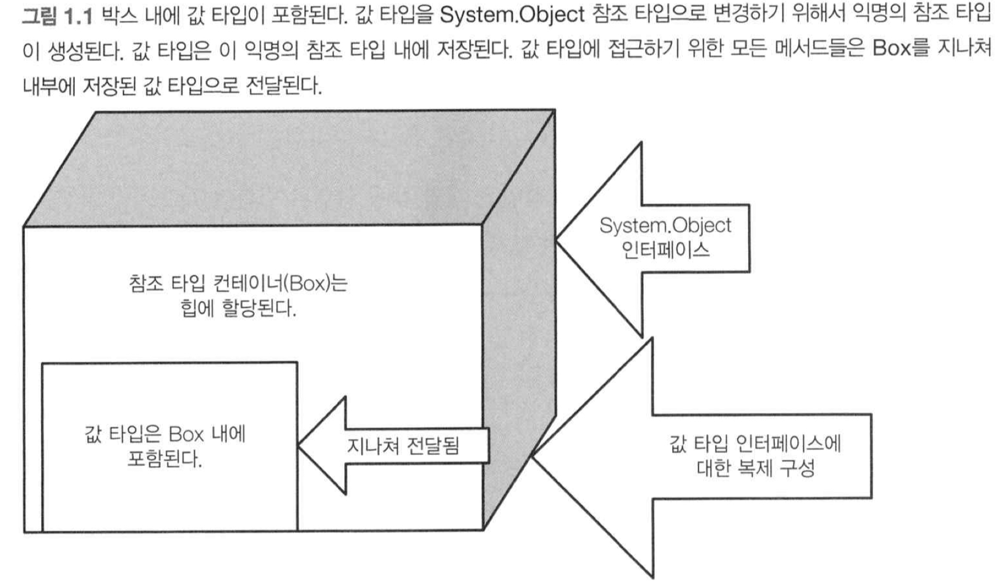

# Item 9. 박싱과 언박싱을 최소화하라

- `박싱` : 값 타입의 객체를 타입이 정해져 있지 않은 임의의 참조 타입 내부에 포함시키는 방법
- `언박싱` : 박싱되어 있는 참조 타입의 객체로부터 값 타입 객체의 복사본을 가져오는 방법
- 박싱과 언박싱은 성능에 좋지 않다. 간혹 그 과정에서 임시 객체가 생성되는데, 여기서 예상치 못한 버그가 발생하기도 한다.



- `.NET 2.0`에서 추가된 `제네릭`을 사용하면 박싱 언박싱을 피할 수 있다.
- 하지만 `.NET Framework`는 여전히 박싱과 언박싱을 사용하는 곳들이 존재한다.

```c#
Console.WriteLine($"A fiew numbers:{firstnumber}, {secondNumber}, {thirdNumber}");
```

- 위 코드에서 정숫 값은 **값 타입**이므로 문자열로 변하기 위해 박싱을 수행해야 한다.
- 컴파일러는 **값 타입**의 객체를 `System.Object` 타입의 객체로 변환해야 하는 경우 항상 박싱과 언박싱 코드를 자동으로 생성해준다.
- 이로 인한 성능저하를 개선하고 싶다면 `WriteLine()`에 값 타입을 직접 전달하지 말고 문자열 인스턴스를 전달하는 것이 좋다.

```c#
Console.WriteLine($"A fiew numbers:{firstnumber.ToString()}, {secondNumber.ToString()}, {thirdNumber.ToString()}");
```

- `.NET 1.x`의 컬렉션은 `System.Object` 타입의 객체에 대한 참조를 저장하도록 구현되어 있다. 따라서 컬렉션에 값 타입 객체를 추가하려면 박싱을 피할 수 없다.
- 이를 방지하기 위해 `제네릭`을 사용하는 것이 좋다.

</br>

- 값 타입은 암시적으로 여러 타입으로 박싱될 수 있으며, 어떤 부분에서 변환이 일어나는지 찾아내기 어렵다.
- **제네릭**이 아닌 컬렉션 내에 값 타입의 객체를 저장하거나 `System.Object` 내에 정의된 메서드를 호출하기 위해서 `System.Object` 타입으로 형변환을 수행하는 것과 같이 값 타입을 `System Object` 타입이나 인터페이스 타입으로 변경하는 코드는 가능한 한 작성하지 말아야 한다.
