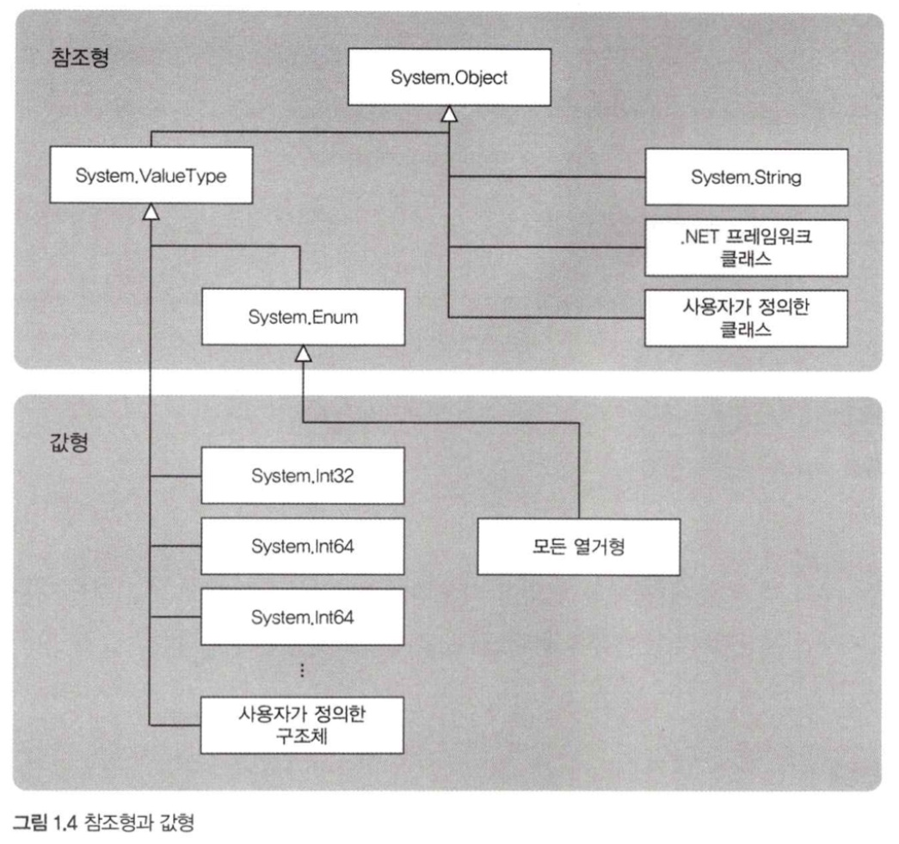
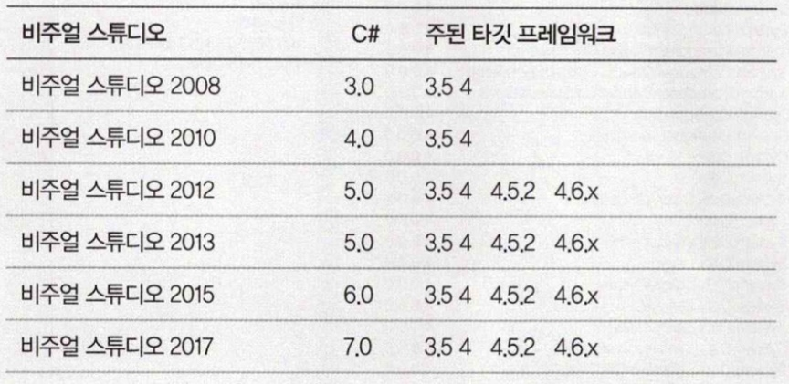

# 01. 객체지향 프로그래밍 기초

## 1. 클래스
### 클래스를 정의한다.

```c#
public class Product 
{
    public int Code { get; private set; }
    public string Name { get; private set; }
    public int Price { get; private set; }

    // 생성자
    public Product(int code, string name, int price) 
    {
        this.Code = code;
        this.Name = name;
        this.Price = price;
    }

    // 소비세 계산
    public int GetTax() 
    {
        return (int)(Price * 0.08);
    }

    // 세금을 포함한 가격을 구한다
    public int GetPriceIncludingTax() 
    {
        return Price + GetTax();
    }
}
```

### 클래스의 인스턴스를 생성한다.

```c#
Product yakkwa = new Product(123, "약과", 180);
```

- 변수에는 객체의 주소가 저장된다.

### 객체를 이용한다.

```c#
int price = yakkwa.Price;
int taxIncluded = yakkwa.GetPriceIncludingTax();
```

### 인스턴스는 여러 개 만들 수 있다.

- 하나의 클래스로부터 여러 개의 인스턴스를 생성할 수 있다.

### 코드 스니펫
- `props` 입력 후 더블 탭 : `public int MyProperty { get; set; }`
- `fore` 입력 후 더블 탭 : `foreach`
- `ctor` 입력 후 더블 탭 : 생성자

</br>

## 2. 구조체

```c#
struct MyStruct 
{
    public int X { get; set; }
    public int Y { get; set; }
}

MyStruct myStruct = new MyStruct { X = 1, Y = 2 };
```

- **클래스**는 변수가 있는 곳과 다른곳에 객체 영역이 확보되고 변수에는 그 참조가 저장된다.
- **구조체**는 변수 자체가 객체에 저장된다.

</br>

## 3. 값형과 참조형



- 값형에는 값 자체가 복사되어 메서드에 전달되므로 메서드 안에서 객체의 값을 변경해도 호출한 쪽에서는 그렇게 변경된 것에 영향을 받지 않는다.
- 참조형은 참조형 객체를 인수로 지정하면 객체를 가리키는 참조가 복사되어 메서드에 전달된다.

### 왜 나뉘어져 있을까?
- 프로그램이 실행되는 효율과 메모리 공간을 사용하는 효율 때문이다.
- 큰 객체가 값형이라면 요청마다 복사가 수행되어 비효율적이다.
- 큰 객체에는 참조형이, 작은 객체에는 값형이 유리하다.
- 실제로 `.NET` 프레임워크에서 구조체는 모두 작은 것에 대해서만 정의돼 있다.

</br>

## 4. 정적 멤버와 정적 클래스
### 정적 속성과 정적 메서드
- `정적 속성` : 인스턴스를 생성하지 않고 이용할 수 있는 속성
- `정적 메서드` : 인스턴스를 생성하지 않고 이용할 수 있는 메서드

```c#
public static DateTime Today 
{
    ...
}
```

### 정적 클래스
- 정적 클래스에는 인스턴스 속성이나 인스턴스 메서드가 없다.
- `new`를 하지 않아도 모든 속성을 사용할 수 있다.

```c#
public static class Console 
{
    ...
}
```

</br>

## 5. 네임스페이스
- 작성한 프로그램의 규모가 커지면 프로그래머들이 작성한 클래스와 나중에 추가한 타사 라이브러리의 클래스 이름이 같아질 가능성이 있다.
- 이를 **네임스페이스**로 분리한다.
- `using`으로 네임스페이스를 지정하여 형 이름만으로 클래스를 사용할 수 있다.

```c#
using System;

class Program 
{
    static void Main(string[] args) 
    {
        Console.WriteLine("Hello! C#");
    }
}
```

```c#
using System;

namespace SampleApp 
{
    class MyClass
    {
        ...
    }
}
```

</br>

## 6. 상속
### 상속이란
- 이미 정의된 클래스를 기반으로 해서 그 성질을 물려받고 이를 확장하거나 변경해서 새로운 클래스를 작성하는 것
- 부모 클래스의 성질을 그대로 물려받는다.
- 자식 클래스에서 새로운 메서드를 정의할 수도 있다.

```c#
public class Employee : Person
{
    ...
}
```

### is a 관계
- **A는 B이다의 관계** = **kind of 관계**
- 위의 관계가 성립되면 다음과 같이 인스턴스를 부모 클래스에 대입할 수 있다.(반대는 불가)
- 그렇게 되면, `A`의 고유 속성을 이용할 수는 없다.

```c#
B b = new A();
```

- 모든 클래스는 `System.Object` 클래스를 상속하고 있다.

### 참조에 어셈블리 추가
- 프레임워크에 있지만 네임스페이스를 찾을 수 없을 때
1. 어느 어셈블리에 속해있는지 확인한다.
2. `솔루션 탐색기`에 참조 폴더를 클릭하고 `참조 추가`를 선택한다.
3. `참조 관리자`에서 `어셈블리>프레임워크`를 선택한다.
4. 오른쪽 목록에서 해당 네임스페이스를 추가한다.

### IDE별 버전


### nullable 형식
- 값형에 null을 지정할 수 있게 하려면 `nullable(Nullable<T>형)`을 사용한다.

```c#
int? num = null;

if (num.HasValue)
{
    Console.WriteLine("num = {0}", num.Value);
}
```
