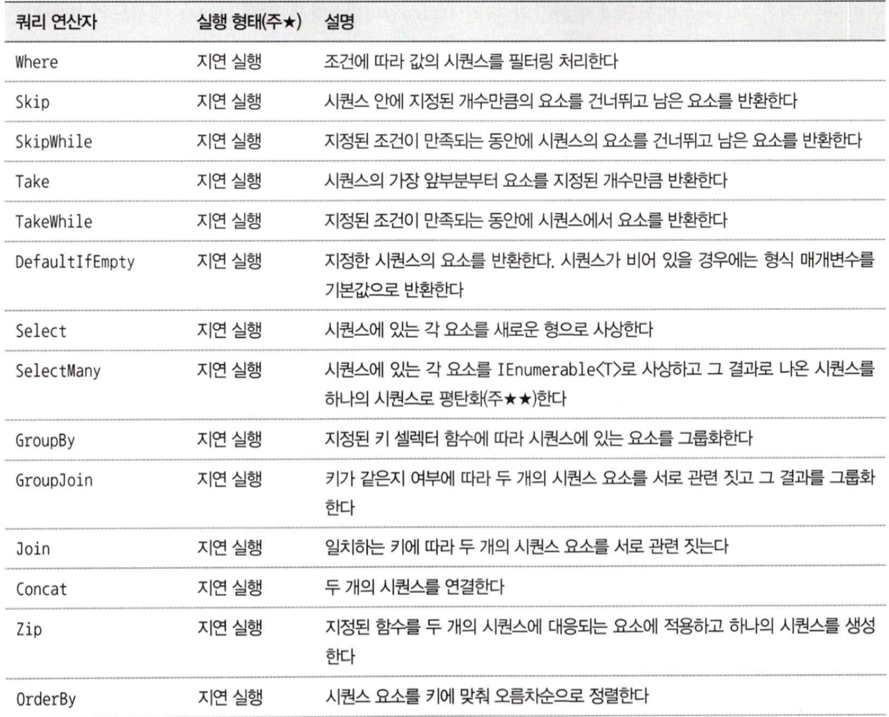
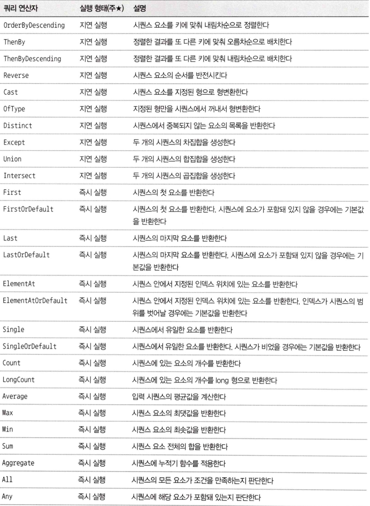
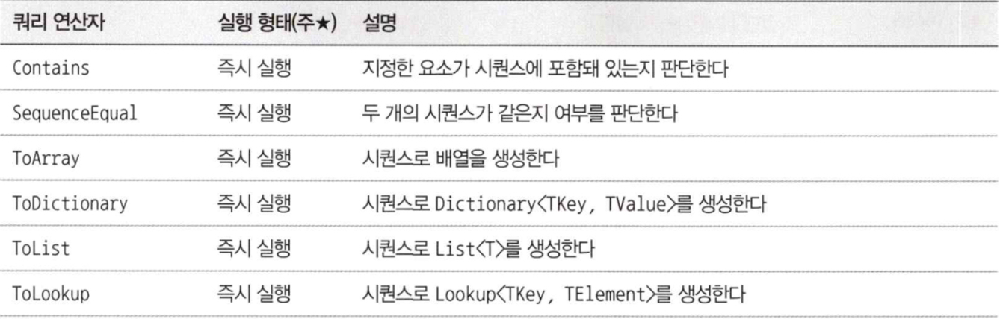

# 03. 람다식과 LINQ 기초
- 람다식은 `C# 3.0`부터 도입되었다.

## 1. 람다식 이전
### 메서드를 인수로 넘겨준다.

```c#
public int Count(int[] numbers, int num) 
{
    int count = 0;
    foreach(var n in numbers)
    {
        if (n == num)
        {
            count++;
        }
    }
    return count;
}
```

- 다른 조건으로 카운트하려고 할 경우에는 이 메서드를 이용할 수 없다.

### 델리게이트를 사용한다.

```c#
public delegate bool Judgement(int value);
...
public int Count(int[] numbers, Judgement judge)
{
    int count = 0;
    foreach(var n in numbers)
    {
        if (judge(n) == true)
        {
            count++;
        }
        return count;
    }
}
```

```c#
public void Do() 
{
    var numbers = new[] {5,3,4,6,7,8,9};
    var count = Count(numbers, IsEven);
    Console.WriteLine(count);
}

public bool IsEven(int n)
{
    return n%2 == 0;
}
```

### 익명 메서드를 이용한다.
- `C# 2.0`

```c#
public int Count(int[] numbers, Predicate<int> judge)
{
    int count = 0;
    foreach(var n in numbers)
    {
        if (judge(n) == true)
        {
            count++;
        }
    }
    return count;
}

public void Do() {
    var numbers new[] { 5,1,15,7,7,1,5};
    var count = Count(numbers, delegate(int n) {return n%2 == 0;});
    Console.WriteLine(count);
}
```

- `Predicate` 델리게이트를 사용하면 Judgement같은 델리게이트를 자신이 직접 정의하지 않아도 된다.

</br>

## 2. 람다식
- `C# 3.0` 부터 도입
### 2.1 람다식이란? 
#### Step 0. 가장 긴 코드

```c#
Predicate<int> judge = 
    (int n) => {
        if (n%2 == 0)
            return true;
        else
            return false;
    };
var count = Count(numbers, judge);
```

#### Step 1.
- judge 변수를 없애고 식을 직접 Count 메서드의 인수로 지정

```c#
var count = Count(numbers,
    (int n) => {
        if (n%2 == 0)
            return true;
        else
            return false;
    };
)
```

#### Step 2.
- if 문을 없앤다.

```c#
var count = Count(numbers, (int n) => { return n%2 == 0; });
```

#### Step 3.
- 람다식에서 `{}`가 하나의 명령문을 포함할 때는 `{}`와 `return`을 생략할 수 있다.

```c#
var count = Count(numbers, (int n) => return n%2 == 0);
```

#### Step 4.
- 컴파일러가 추론할 수 있는 인수의 형을 생략한다.

```c#
var count = Count(numbers, (n) => n % 2 ==0);
```

#### Step 5.
- 인수가 한 개인 경우에는 `()`를 생략할 수 있다.

```c#
var count = Count(numbers, n => n%2 == 0);
```

### 2.2 람다식을 사용한 예
- 어떻게 하는가(How)가 아니라 무엇을 하는가(What)라는 것을 생각하면서 코드를 작성할 수 있게 됐다.
- 추상도가 높아졌다.

</br>

## 3. List<T> 클래스와 람다식의 조합
### 3.1 Exists 메서드

```c#
var exists = list.Exists(s => s[0] == 'A');
Console.WriteLine(exists);
```

### 3.2 Find 메서드
- 처음 발견된 요소를 반환

```c#
var name = list.Find(s => s.Length == 6);
Console.WriteLine(name);
```

### 3.3 FindIndex 메서드

```c#
int index = list.FindIndex(s => s == "Berlin");
Console.WriteLine(index);
```

### 3.4 FindAll 메서드

```c#
var names = list.FindAll(s => s.Length <= 5);
foreach (var s in names)
    Console.WriteLine(s);
```

### 3.5. RemoveAll 메서드

```c#
var removedCount = list.RemoveAll(s => s.Contains("on"));
Console.WriteLine(removedCount);
```

### 3.6. ForEach 메서드

```c#
list.ForEach(s => Console.WriteLine(s));
```

### 3.7. ConvertAll 메서드

```c#
var lowerList = list.ConvertAll(s => s.ToLower());
lowerList.ForEach(s => Console.WriteLine(s));
```

</br>

## 4. LINQ to Objects의 기초
- `LINQ`란 `Language Integrated Query(언어로 통합된 쿼리)`이다.
- `C# 3.0`부터 도입되었다.
- 객체, 데이터, XML과 같은 다양한 데이터를 표준화된 방법으로 처리할 수 있다.

### 4.1 LINQ to Objects의 간단한 예

```c#
var names = new List<string> {
    "Seoul", "New Delhi", "Bangkok", "London", "Paris", "Berlin"
};

IEnumerable<string> query = names.Where(s => s.Length <= 5);
foreach (string s in query)
    Console.WriteLine(s);
```

- `IEnumerable<T>` 인터페이스를 구현하고 있는 형이라면 `Where` 메서드를 해당 객체를 대상으로 이용할 수 있다.

```c#
IEnumerable<string> query = names.Where(s => s.Length <= 5)
    .Select(s => s.ToLower());
```

- 결과들을 연결하여 메서드 체인이 가능하다.

### 4.2 쿼리 연산자
- `Where`와  `Select`라는 두 개의 메서드를 소개했는데 LINQ에 마련된 이들 메서드를 `쿼리 연산자`라고 한다.





### 4.3 시퀀스
- 표준 쿼리 연산자가 조작하는 데이터를 시퀀스 라고 한다.
- `IEnumerable<T>` 인터페이스를 구현한 객체는 모두 시퀀스로 간주된다.

### 4.4 지연 실행
- `Where` 메서드가 호출돼도 검색은 해당 시점에서 실행되지 않고 실제 값이 필요할 때 쿼리가 실행된다.
- 이를 **지연 실행**이라고 하는데, 실제로 데이터가 필요할 때 쿼리가 실행되는 것. 이것이 LINQ의 큰 특징이다.
- 쿼리를 명시적으로 실행하고 싶을 때, `ToArray`나 `ToList` 메서드를 사용하면 된다.(**즉시 실행**)

```c#
var query = names.Where(s => s.Length <= 5)
    .ToArray();
```

- LINQ에는 `Count` 메서드처럼 하나의 값을 반환하는 메서드가 있는데, 이런 메서드는 모두 **즉시 실행**되는 메서드입니다.

### [추가개념] 쿼리 구문

```c#
// 쿼리 구문
var query = from s in names
            where s.Length >= 5
            select s.ToUpper();

// 메서드 구문
var query = names.Where(s => s.Length >= 5)
                .Select(s => s.ToUpper());
```

- `C# 3.0`이 나올때 쿼리 구문에 이목이 집중되었지만 현재는 메서드 호출 방식이 주류이다.
- 아래와 같은 단점이 있기 때문이다.
  - 쿼리 구문은 LINQ의 모든 기능을 이용할 수 없다.
  - 점(`.`)으로 연결하는 메서드 구문이 생각을 방해받지 않고 연속해서 코드를 작성할 수 있다.
  - 점으로 연결하는 메서드 구문은 비주얼 스튜디오가 가진 강력한 인텔리센스 기능을 충분히 활용할 수 있다.

### [추가개념] 확장 메서드
- `C# 3.0`에 도입
- 확장 메서드를 정의하면 기존의 형에 새로운 메서드를 추가할 수 있다.

```c#
namespace CSharpPhrase.Extensions
{
    public static class StringExtensions
    {
        public static string Reverse(this string str)
        {
            return string.Empty;
        }
        char[] chars = str.ToCharArry();
        Array.Reverse(chars);
        return new String(chars);
    }
}
```

- 첫 번째 인수에 `this`키워드를 붙인 정적 메서드
- 확장 메서드를 정의할 때 인수를 두 개 이상 선언한 경우 두 번째 이후의 인수부터는 해당 확장 메서드가 호출될 때의 인수로 간주된다.
