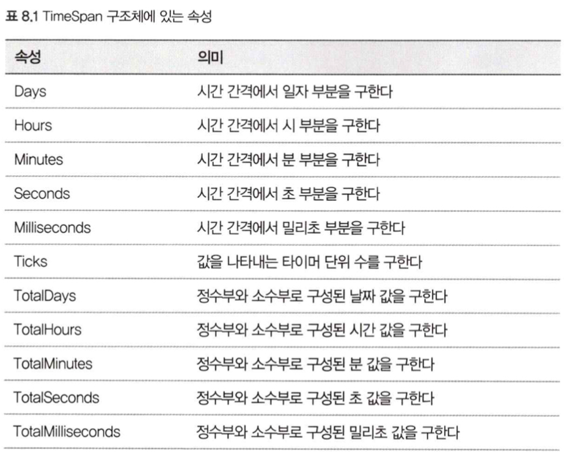

# 08. 날짜와 시간 처리

## 1. Date Time 구조체
### DateTime 객체를 생성한다.

```c#
var dt1 = new DateTime(2023, 1, 17, 8, 45, 20);
var today = DateTime.Today;
var now = DateTime.Now;
```

### DateTime에 포함된 속성

```c#
var now = DateTime.Now;
int year = now.Year;
int month = now.Month;
int day = now.Day;
int hour = now.Hour;
int minute = now.Minute;
int second = now.Second;
int microsecond = now.Millisecond;
```

### 지정한 날짜의 요일을 구한다.

```c#
var today = DateTime.Today;
DayOfWeek dayOfWeek = today.DayOfWeek;
```

### 윤년을 판정한다.

```c#
var isLeapYear = DateTime.IsLeapYear(2016);
```

### 날짜 형식의 문자열을 DateTime 객체로 변환한다.

```c#
DateTime dt1;
if (DateTime.TryParse("2018/6/12", out dt1)) {...}
```

</br>

## 2. 날짜의 포맷
### 날짜를 문자열로 변환한다.

```c#
var date = new DateTime(2017, 10, 22, 21, 6, 47);
var s1 = date.ToString("d"); // 2017-10-22
var s2 = date.ToString("D"); // 2017년 10월 22일 일요일
var s3 = date.ToString("yyyy-MM-dd"); // 2017-10-22
var s4 = date.ToString("yyyy년M월d일(ddd)"); // 2017년10월22일(일)
var s5 = date.ToString("yyyy년MM월dd일 HH시mm분ss초"); // 2017년10월22일 21시06분47초
var s6 = date.ToString("f"); // 2017년 10월 22일 일요일 오후 9:06
var s7 = date.ToString("F"); // 2017년 10월 22일 일요일 오후 9:06:47
var s8 = date.ToString("t"); // 오후 9:06
var s9 = date.ToString("T"); // 오후 9:06:47
var s10 = date.ToString("tt hh:mm"); // 오후 09:06
var s11 = date.ToString("HH시mm분ss초"); // 21시06분47초
```

### 날짜를 한국식으로 표시한다

```c#
var date = new DateTime(2023, 1, 12);
var culture = new CultureInfo("ko-KR");
var str = date.ToString("ggyyyy년M월d일", culture);
```

### 지정한 날짜의 연호를 구한다.

```c#
var date = new DateTime(2023, 1, 12);
var culture = new CultureInfo("ko-KR");
culture.DateTimeFormat.Calendar = new KoreanCalendar();
var era = culture.DateTimeFormat.Calendar.GetEra(date);
var eraName = culture.DateTimeFormat.GetEraName(era);
```

### 지정한 날짜에 해당하는 요일의 문자열을 구한다.

```c#
var date = new DateTime(2023, 1, 12);
var culture = new CultureInfo("ko-KR");
culture.DateTimeFormat.Calendar = new KoreanCalendar();
var dayOfWeek = culture.DateTimeFormat.GetDayName(date.DayOfWeek);
```

</br>

## 3. DateTime을 비교한다.
### 날짜와 시간을 비교한다.

```c#
if (dt1 < dt2) {...}
```

### 날짜만 비교한다.

```c#
if (dt1.Date < dt2.Date) {...}
```

</br>

## 4. 날짜를 계산한다(기초)
### 지정한 시분초 이후의 시각을 구한다.
- `TimeSpan` 구조체를 사용한다.

```c#
var now = DateTime.Now;
var future = now + new TimeSpan(1, 30, 0);
var past = now - new TimeSpan(1, 30, 0);
```



### n일 후와 n일 전의 날짜를 구한다.

```c#
var today = DateTime.Today;
var future = today.AddDays(20);
var past = today.AddDays(-20);
```

### n년 후와 n개월 후를 구한다.

```c#
var date = new DateTime(2009, 10, 22);
var future = date.AddYears(2).AddMonths(5);
```

### 두 시각의 차를 구한다.

```c#
var date1 = new DateTime(2009, 10, 22, 1, 30, 20);
var date2 = new DateTime(2009, 10, 22, 2, 40, 56);
TimeSpan diff = date2 - date1;
```

### 두 날짜의 차이를 구한다.

```c#
var date1 = new DateTime(2009, 10, 22, 1, 30, 20);
var date2 = new DateTime(2009, 10, 22, 2, 40, 56);
TimeSpan diff = date2.Date - date1.Date;
```

### 해당 월의 말일을 구한다.

```c#
var today = DateTime.Today;
int day = DateTime.DaysInMonth(today.Year, today.Month);
var endOfMonth = new DateTime(today.Year, today.Month, day);
```

### 1월 1월부터의 날짜 수를 구한다.

```c#
var today = DateTime.Today;
int dayOfYear = today.DayOfYear;
```

</br>

## 5. 날짜를 계산한다(응용)
### 다음 특정 요일을 구한다.

```c#
public static DateTime NextDay(DateTime date, DayOfWeek dayOfWeek)
{
    var days = (int)dayOfWeek - (int)(date.DayOfWeek);
    if (days <= 0)
        days += 7;
    return date.AddDays(days);
}
```

### 나이를 구한다.

```c#
public static int GetAge(DateTime birthday, DateTime targetDay)
{
    var age = targetDay.Year - birthday.Year;
    if (targetDay < birthday.AddYear(age))
    {
        age--;
    }
    return age;
}
```

### 지정한 날이 몇 주째에 있는지를 구한다.

```c#
public static int NthWeek(DateTime date)
{
    var firstDay = new DateTime(date.Year, date.Month, 1);
    var firstDayOfWeek = (int)(firstDay.DayOfWeek);
    return (date.Day + firstDayOfWeek - 1) / 7 + 1;
}
```

### 지정한 달의 n번째 X요일의 날짜를 구한다.

```c#
public static DateTime DayOfNthWeek(int year, int month, DayOfWeek dayOfWeek, int nth)
{
    var firstDay = Enumerable.Range(1, 7)
                    .Select(d => new DateTime(year, month, d))
                    .First(d => d.DayOfWeek == dayOfWeek)
                    .Day;
    var day = firstDay + (nth - 1) * 7;
    return new DateTime(year, month, day);
}
```
