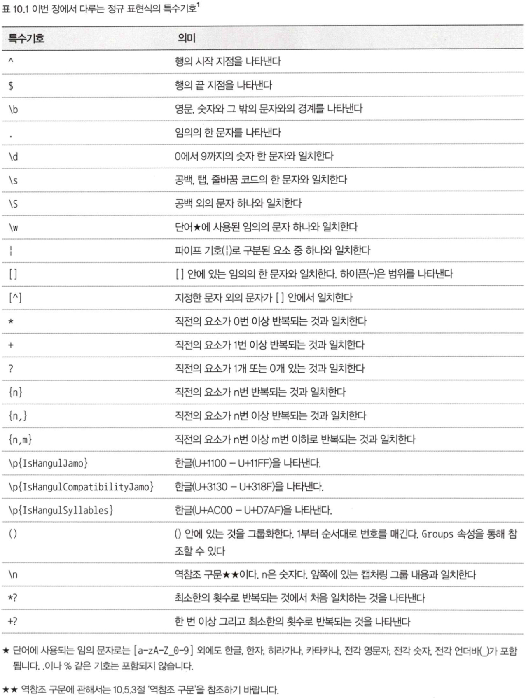
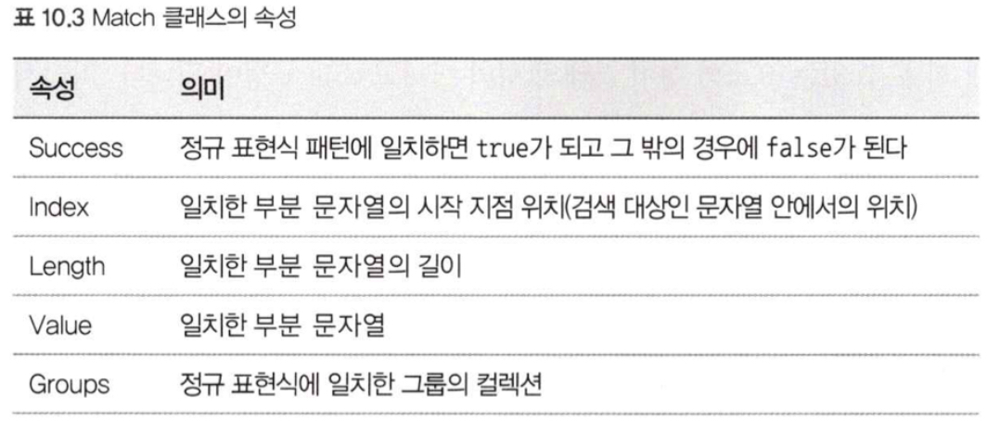
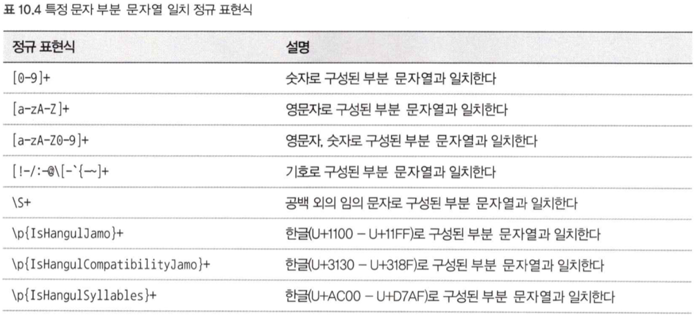
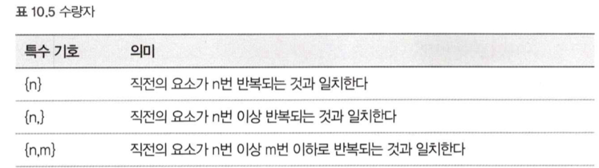
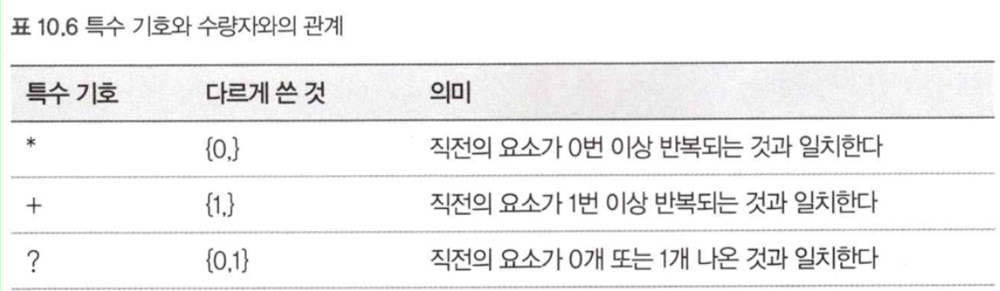
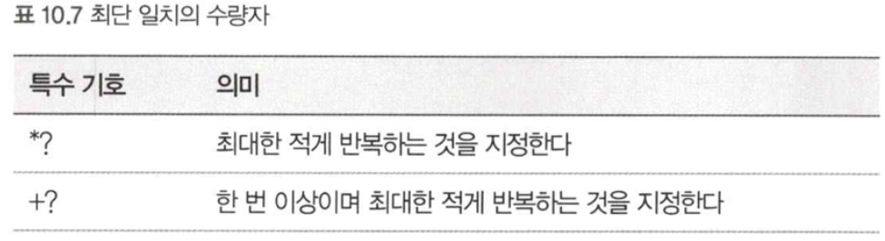

# 10. 정규 표현식을 활용한 고급 문자열 처리
## 1. 정규 표현식이란?



</br>

## 2. 문자열을 판정한다.
### 지정한 패턴에 일치하는 부분 문자열이 있는지 여부를 판정한다.

```c#
var text = "private List<string> results = new List<string>();";
bool isMatch = Regex.IsMatch(text, @"List<\w+>");

if (isMatch) {...}

bool regex = new Regex(@"List<\w+>");
bool isMatch = regex.IsMatch(text);
```

- 반복처리 안에서 같은 정규 표현식을 사용하려면 인스턴스를 생성하는 방식이 성능에 좋다.
- 정규 표현식 패턴을 쓸 때는 `@`가 붙은 축자 문자열 리터럴을 사용하는 것이 좋다
- 인스턴스를 사용하는 방식은 캐시되지 않는다.
- 고정적인 정규 표현식을 이용하는 응용 프로그램은 정규 표현식이 캐시될 수 있도록 정적 메서드를 사용할 것을 권장한다.(캐시의 크기는 15개로 정해져 있고, `Regex.CacheSize`로 수정할 수 있다.)

### 지정한 패턴의 문자열이 시작되는지 여부를 판정한다.

```c#
bool isMatch = Regex.IsMatch(text, @"^using");
```

### 지정한 패턴으로 문자열이 끝나는지 여부를 판정한다.

```c#
bool isMatch = Regex.IsMatch(text, @"합니다.$");
```

### 지정한 패턴에 완전히 일치하는지 여부를 판정한다.

```c#
var strings = new [] {"~~~", "~~~", "~~~",};
var regex = new Regex(@"^(W|w)indows$");
var count = strings.Count(s => regex.IsMatch(s));
```

</br>

## 3. 문자열 검색
### 처음에 나오는 부분 문자열을 찾는다.

```c#
Match match = Regex.Match(text, @"\p{IsHangulSyllables}+");
if (match.Success) {...}
```





### 일치하는 문자열을 모두 찾는다.

```c#
var matches = Regex.Matches(text, @"List<\w+>");
foreach(Match match in matches) {...}
```

- `Matches`의 반환값은 `MatchCollection`형이다.
- `MatchCollection` 내부의 요소의 형이 `object`이기 때문에 `var`을 사용할 수 없다.
- 결과에 따라 `NextMatch()`로 다음 요소를 조회할 수 있다.

### Matches 메서드의 결과에 LINQ를 적용한다.
- 사용할 수 있게 하려면 `Cast<T>` 메서드를 사용해 `IEnumerable<Match>`로 변환해야 한다.

```c#
var matches = Regex.Matches(text, @"\b[a-z]+\b")
            .Cast<Match>()
            .OrderBy(X => X.Length);
foreach (Match match in matches) {...}
```

### 일치한 부분 문자열의 일부만을 꺼낸다.

```c#
var text = "C#에는 <값형>과 <참조형>이라는 두 가지의 형이 존재한다.";
var matches = Regex.Matches(text, @"<([^<>]+)>");
foreach (Match match in matches) {...}
```

### 대소문자를 구분하는 방법

```c#
// 방법 1
"\b[Kk][Oo][Rr]\b"

// 방법 2
var mc = Regex.Matches(text, @"\bkor\b", RegexOptions.IgnoreCase);
foreach (Match m in mc) {...}
```

### 행의 시작 지점과 끝 지점의 의미를 변경해서 여러 행 모드로 바꾼다.

```c#
var text = "Word\nExcel\nPowerPoint\nOutlook\nOneNote\n";
var pattern = @"^[a-zA-Z]{5,7}$";
var matches = Regex.Matches(text, pattern, RegexOptions.Multiline);
foreach (Match m in matches) {...}
```

</br>

## 4. 문자열을 치환하고 분할한다.
### Regex.Replace 메서드를 사용해 쉽게 치환한다.

```c#
var text = "C# 공부를 쪼끔씩 진행해보자.";
var pattern = @"쪼끔씩|쪼금씩|쬐끔씩";
var replaced = Regex.Replace(text, pattern, "조금씩");
```

```c#
var text = "Word, Excel, PowerPoint, Outlook, OneNote";
var pattern = @"\s*,\s*";
var replaced = Regex.Replace(text, pattern, ", ");
```

```c#
var text = "foo.htm bar.html baz.htm";
var pattern = @"\.(htm)\b";
var replaced = Regex.Replace(text, pattern, ".html");
```

### 그룹화 기능을 이용한 치환

```c#
var text = "1024바이트, 8바이트 문자, 바이트, 킬로바이트";
var pattern = @"(\d+)바이트";
var replaced = Regex.Replace(text, pattern, "$1byte");
```

- `$1, $2, $3`은 그룹화 기능에서 `()`에 대응된다.

```c#
var text = "1234567890123456";
var pattern = @"(\d{4})(\d{4})(\d{4})(\d{4})";
var replaced = Regex.Replace(text, pattern, "$1-$2-$3-$4");
```

### Regex.Split 메서드를 이용해 분할한다.

```c#
var text = "Word, Excel, PowerPoint, Outlook, OneNote";
var pattern = @"\s*,\s*";
string[] substrings = Regex.Split(text, pattern);
foreach (var match in substrings) {...}
```

</br>

## 5. 더욱 수준 높은 정규 표현식
### 수량자





```c#
// 수량자 {n, }을 사용한 예
var text = "a123456 b123 Z12345 AX98765";
var pattern = @"\b[a-zA-Z][0-9]{5,}\n";
var matches = Regex.Matches(text, pattern);

// 수량자 {n, m}을 사용한 예
var pattern = @"\p{IsHangulSyllables}+-[0-9]{2,3}-[0-9]+";
var matches = Regex.Matches(text, pattern);
```

### 최장 일치와 최단 일치
- **최장 일치의 원칙** : 패턴에 매칭되는 것 중에서 가장 긴 것을 일치시킨다.

```c#
var text = "<person><name>김삿갓</name><age>22</age></person>";
var pattern = @"<.+>";
var matches = Regex.Matches(text, pattern);
// <person><name>김삿갓</name><age>22</age></person> 와 매치

var pattern = @"<(\w[^>]+)>";
var matches = Regex.Matches(text, pattern);
// <person>, <name>... 매치
```

### 최단 일치의 수량자를 사용해 최단으로 일치시킨다.



- `@"<(\w[^>]+)>"`를 `@"<(\w+?)>"`로 대체할 수 있다.

```c#
var text = "<person><name>김삿갓</name><age>22</age></person>";
var pattern = @"<(\w+?)>";
var matches = Regex.Matches(text, pattern);
```

### 역참조구문
- 그룹화한 문자열을 정규 표현식 안에서 참조할 수 있다.

```c#
var text = "도로를 지나가는 차들이 뛰뛰하고 빵빵 울린다.";
var pattern = @"(\w)\1";
var matches = Regex.Matches(text, pattern);

// "뛰뛰", "빵빵"이 매칭 됨
// \w가 일치하면, 일치한 것을 \1에서 한번 더 찾아냄
```
