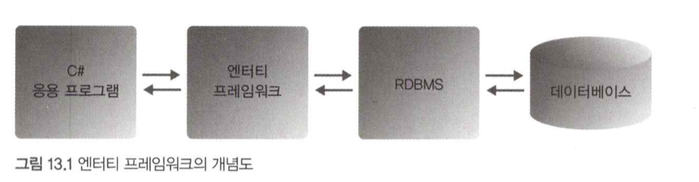

# 13. 엔티티 프레임워크로 데이터에 접근한다.

## 1. 엔티티 프레임워크에 있는 Code First를 이용한다.
- `C#`에서 데이터베이스에 접근하려면 `Entity Framework`라는 데이터 접근 기능을 사용한다.



- `Model First`, `Database First`, `Code First` 세 가지 개발 기법이 있는데, `Code First`가 가장 주목받고 있다.

## 2. 프로젝트를 생성한다.
- 새 프로젝트를 생성한다.
- `NuGet`으로 엔티티 프레임워크를 설치한다.

</br>

## 3. 엔티티 클래스(모델)를 작성한다.

```c#
public class Book {
    public int Id { get; set; }
    public string Title { get; set; }
    public int PublishedYear { get; set;}
    public virtual Author Author { get; set; }
}
```

```c#
public class Author {
    public int Id { get; set; }
    public string Name { get; set; }
    public DateTime Birthday { get; set; }
    public string Gender { get; set; }
    public virtual ICollection<Book> Books { get; set;}
}
```

</br>

## 4. DbContext 클래스를 생성한다.
### BooksDbContext 클래스를 생성한다.
- `ADO.NET` 엔티티 데이터 모델을 사용한다.

```c#
public class BookDbContext : DbContext {
    public BooksDbContext() : base("name=BooksDbContext")
    {

    }
    public DbSet<Book> Books { get; set; }
    public DbSet<Author> Authors { get; set; }
}
```

### 데이터베이스 접속 문자열을 확인한다.

```xml
<!--App.config-->
<connectionStrings>
    <add name="BooksDbContext"
        connectionString="data source=(LocalDb)\MSSQLLocalDB;
        initial catalog=SampleEntityFramework.
    >
```

</br>

## 5. 데이터를 추가한다
### 데이터를 추가한다.

```c#
using (Var db = new BooksDbContext()) {
    var book1 = new Book {
        Title = "별의 계승자",
        PublishedYear = 1977,
        Author = new Author {
            Birthday = new DateTime(1941, 6, 27),
            Gender = "M"
        }
    };
    db.Books.Add(book1);
    db.SaveChanges();
}
```
 
### 생성된 DB를 확인한다
### 데이터를 읽는다.

```c#
using (var db = new BooksDbContext())
{
    return db.Books
        .Where(book => book.Author.Name.StartsWith("제임스"))
        .ToList();
}
```

</br>

## 7. 또 데이터를 추가한다.
### Authors만 추가한다.

```c#
using (var db = new BooksDbContext())
{
    var author1 = new Author {...};
    db.Authors.Add(author1);
    db.SaveChanges();
}
```

</br>

## 8. 데이터를 수정한다

```c#
using (var db = new BooksDbContext())
{
    var book = db.Books.Single(x => x.Title == "별의 계승자");
    book.PublishedYear = 2016;
    db.SaveChanges();
}
```

</br>

## 9. 데이터를 삭제한다.

```c#
using (var db = new BooksDbContext())
{
    var book = db.Books.SingleOrDefault(x => x.Id == 10);
    if (book != null)
    {
        db.Books.Remove(book);
        db.SaveChanges();
    }
}
```

</br>

## 10. 수준 높은 쿼리
### 집필한 서적이 두 권 이상인 저자를 구한다.

```c#
var authors = db.Authors
        .Where(a => a.Books.Count() >= 2);
```

### 서적을 출판연도, 저자 이름 순서로 정렬해서 구한다.

```c#
var books = db.Books
        .OrderBy(b => b.PublishedYear)
        .ThenBy(b => b.Author.Name);
```

### 각 발행연도에 해당하는 서적 수를 구한다.

```c#
var groups = db.Books
        .GroupBy(b => b.PublishedYear)
        .Select(g => new {
            Year = g.Key,
            Count = g.Count()
        });
```

### 집필한 서적이 가장 많은 저자 한 명을 구한다.

```c#
var author = db.Authors
        .Where(a => a.Books.Count() == db.Authors.Max(x => x.Books.Count()))
        .First();
```

</br>

## 11. 관련 엔티티를 한꺼번에 읽어 들인다.

```c#
using (var db = new BooksDbContext())
{
    return db.Books
        .Where(b => b.PublishedYear > 1900)
        .Include(nameof(Author))
        .ToList();
}
```

</br>

## 12. 데이터 주석과 자동 마이그레이션
### 데이터 주석

```c#
// 해당 속성이 필수임을 알린다.
[Required]
public string Title { get; set; }

// 최대 문자수를 지시한다.
[MaxLength(30)]
public string Name{ get; set; }
```

### 자동 마이그레이션
- `C#`코드를 수정하면 자동으로 데이터베이스의 구조를 수정하는 기능

```c#
// Models 폴더에 추가
internal sealed class Configuration : DbMigrationsConfiguration<BooksDbContext> {
    public Configuration() {
        AutomaticMigrationsEnabled = true;
        AutomaticMigrationDataLossAllowed = true;
        ContextKey = "SampleEntityFramework.Models.BooksDbContext";
    }
}
```

```c#
public BooksDbContext() : base("name=BooksDbContext") {
    Database.SetInitializer(new MigrateDatabaseToLatestVersion<BooksDbContext, Configuration>());
}
```
