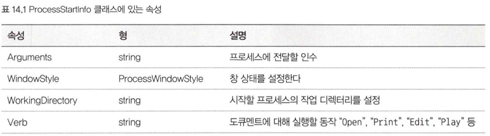

# 14. 그 밖의 프로그래밍 정석

## 1. 프로세스를 시작한다.
### 프로그램을 시작한다.

```c#
var path = @"%SystemRoot%\system32\notepad.exe";
var fullpath = Environment.ExpandEnvironmentVariables(path);
Process.Start(fullPath);
```

- `ExpandEnvironmentVariables`는 환경 변수를 치환해 줌.

### 프로세스가 끝나기를 기다린다.

```c#
process.EnableRaisingEvents = true;
process.Exited += (sender, eventArgs) => {
    this.Invoke((Action) delegate {
        label1.Text = "종료";
    });
}
```

### ProcessStartInfo 클래스를 사용해 섬세하게 제어한다.



```c#
// 창 크기 확대
var startInfo = new ProcessStartInfo {
    FileName = fullpath,
    Arguments = @"D:\temp\Sample.txt",
    WindowStyle = ProcessWindowStyle.Maximized
};
Process.Start(startInfo);
```

</br>

## 2. 버전 정보를 구한다.
### 어셈블리 버전을 구한다.
- 빌드했을 때 생성되는 어셈블리 파일에는 어셈블리 버전번호가 포함돼 있다.
- `<메이저 버전>.<마이너버전>.<빌드 번호>.<리비전 번호>`
- 버전 번호는 `AssemblyInfo.cs`의 `AssemblyVersion` 속성에 반영된다.

```c#
var asm = Assembly.GetExecutingAssembly();
var ver = asm.GetName().Version;
```

### 파일의 버전을 구한다.

```c#
val location = Assembly.GetExecutingAssembly().Location;
var ver = FileVersionInfo.GetVersionInfo(location);
```

### UWP 패키지 버전(제품 버전)을 구한다.
- UWP(Universal Windows Platform) 응용 프로그램에서 버전 번호를 취급하려면 패키지 버전을 이용한다.

```c#
var version = Windows.ApplicationModel.Package.Current.Id.Version;
```

</br>

## 3. 응용 프로그램의 구성 파일을 구한다.
- 응용 프로그램 고유의 다양한 설정 정보를 기록한 XML 형식의 파일
- 구성 파일을 통해 응용 프로그램을 다시 빌드하지 않고 동작을 설정할 수 있다.

### appSettings 정보를 구한다.

```c#
var enableTraceStr = ConfigurationManager.AppSettings["EnbaleTrace"];
var enableTrace = bool.Parse(enableTraceStr);
var timeoutStr = ConfigurationManager.AppSettings["Timeout"];
int timeout = int.Parse(timeoutStr);
```

- 지정한 키가 존재하지 않으면 `null`을 반환하고, 구한 값은 기본적으로 `string` 타입이다.

### 응용 프로그램 설정 정보를 열거한다.

```c#
NameValueCollection appSettings = ConfigurationManager.AppSettings;
foreach (var key in appSettings.AllKeys)
{
    string value = appSettings[key];
}
```

### 독자적인 형식의 응용 프로그램 설정 정보를 구한다.
1. 고유의 구성 섹션 클래스를 정의한다.
- `ConfigurationElement` 클래스를 상속한 고유의 구성 섹션 클래스를 정의한다.

```c#
public class TraceOption : ConfigurationElement {
    [ConfigurationProperty("enabled")]
    public bool Enabled {
        get { return (bool)this["enabled"]; }
    }
}
```

2. myAppSettings 요소에 대응되는 클래스를 정의한다.
- `ConfigurationSection` 클래스를 상속한다.

```c#
public class MyAppSettings : ConfigurationSection {
    [ConfigurationProperty("traceOptions")]
    public TraceOption TraceOption {
        get {return (TraceOption)this["traceOption"];}
        set {this["traceOption"] = value;}
    }
}
```

3. config 파일에 설정 정보를 기록한다.
```xml
<configuration>
    <configSections>
        <section name="myAppSettings" type="클래스타입"/>
    </configSections>
    <myAppSettings>
        <traceOption enabled="true"
            filePath="C:\MyApp\Trace.log"
            bufferSize="1024"/>
    </myAppSettings>
</configuration>
```

4. 설정 정보를 구하는 코드를 작성한다.

```c#
var cs = ConfigurationManager.GetSection("myAppSettings") as MyAppSettings;
var option = cs.TraceOption;
```

</br>

## 4. Http 통신
### DownloadString 메서드로 웹 페이지를 가져온다.

```c#
var wc = new WebClient();
wc.Encoding = Encoding.UTF8;
var html = wc.DownloadString("https://www.visualstudio.com");
```

### DownloadFile 메서드로 파일을 내려받는다.

```c#
var wc = new WebClient();
var url = "http://localhost/example.zip";
var filename = @"D:\temp\example.zip";
wc.DownloadFile(url, filename);
```

### DownloadFileAsync 메서드로 비동기 처리한다.

```c#
static void Main(string[] args)
{
    var wc = new WebClient();
    var url = new Uri("~~~");
    var fileName = "~~";
    wc.DownloadProgressChanged += wc_DownloadProgressChanged;
    wc.DownloadCompleted += wc_DownloadFileCompleted;
    wc.DownloadFileAsync(url, filename);
    Console.ReadLine();
}

static void wc_DownloadProgressChanged(object sender, DownloadProgressChangedEventArgs e)
{
    Console.WriteLine("{0}% {0}/{1}", e.ProgressPercentage, e.BytesReceived, e.TotalBytesToReceive);
}

static void wc_DownloadFileCompleted(object sender, System.ComponentModel.AsyncCompletedEventArgs e)
{
    Console.WriteLine("내려받기가 끝났습니다.");
}
```

- `CancelAsync` 메서드를 호출하면 내려받기를 취소할 수 있다.

### OpenRead 메서드로 웹 페이지를 가져온다.

```c#
var wc = new WebClient();
using (var stream = wc.OpenRead(@"~~~"))
using (var sr = new StreamReader(stream, Encoding.UTF8))
{
    string html = sr.ReadToEnd();
    Console.WriteLine(html);
}
```

### 매개변수를 주고 정보를 얻는다.

```c#
var wc = new WebClient();
wc.QueryString = new NameValueCollection() {
    ["action"] = "query",
    ["prop"] = "revisions",
};
wc.Headers.Add("Content-type", "charset=UTF-8");
var result = wc.DownloadString("~~~");
var xmlDoc = XDocuemnt.Parse(result);
```

- 받은 데이터는 `HTML`로 인코딩 되어 있으므로 `HttpUtility.HtmlDecode`로 디코딩 해야한다.

</br>

## 5. ZIP 아카이브 파일을 처리한다.
- `.NET Framework 4.5`부터 추가

### 아카이브에 있는 모든 파일을 추출한다.

```c#
var archiveFile = @"D:\~~~\example.zip";
var destinationFolder = @"D:\~~~\zip";
if (!Directory.Exists(destinationFolder))
{
    ZipFile.ExtractToDirectory(archiveFile, destinationFolder);
}
```

### 아카이브에 저장돼 있는 파일의 목록을 구한다.

```c#
var archiveFile = @"D:\~~~\example.zip";
using (ZipArchive zip = ZipFile.OpenRead(archiveFile))
{
    var entires = zip.Entires;
    foreach (var entry in entires)
    {
        Console.WriteLine(entry.FullName);
    }
}
```

### 아카이브에서 임의의 파일을 추출한다.

```c#
using (var zip = ZipFile.OpenRead(archiveFile))
{
    var entires = zip.Entires.FirstOrDefault(x => x.Name == name);
    if (entry != null) {
        var destPath = Path.Combine(@"d:\Temp\", entry.FullName);
        Directory.CreateDirectory(Path.GetDirectoryName(destPath));
        entry.ExtractToFile(destPath, overwrite: true);
    }
}
```

- `ZipFile.OpenRead`로 얻은 객체에 있는 `Entires` 속성의 형은 `ReadOnlyCollection<ZipArchiveEntry>`로. `IEnumerable<T>`를 구현하기 떄문에 `LINQ`를 사용할 수 있다.

### 지정한 디렉터리 안에 있는 파일을 아카이브로 만든다.

```c#
var sourceFolder = @"d:\temp\myFolder";
var archiveFile = @"d:\archives\newArchive.zip";
ZipFile.CreateFromDirectory(sourceFolder, archiveFile, CompressionLevel.Fastest, includeBaseDirectory:false);
```

- 압축 수준은 `Fastest`(속도 우선 압축), `Optimal`(최적 압축), `NoCompression`(무압축) 중 하나이다.
- `includeBaseDirectory`는 디렉토리를 포함하는지 여부이다.

</br>

## 6. 협정 세계시와 시간대
- `.NET Framework 3.5`이후 `DateTimeOffset`구조체와 `TimeZoneInfo`로 여러 지역의 시각을 지원할 수 있다.

### 현지 시각과 그에 대응되는 UTC를 구한다.

```c#
// 현재 시각
var now = DateTimeOffset.Now;
// UTC(협정세계시)
var utc = now.ToUniversalTime();
// UTC(협정세계시)를 현지 시각으로
var localTime = utc.ToLocalTime();
```

- `now`와 `utc`는 보이는 시간은 달라도, 같은 시간을 의미한다.

### 문자열을 DateTimeOffset으로 변환한다.

```c#
DateTimeOffset time;
if (DateTimeOffset.TryParse("2016/03/26 1:07:21 +09:00", out time))
{
    ...
}
```

### 지정한 지역의 시간대를 구한다.
- `FindSystemTimeZoneById` 정적 메서드를 사용한다.

```c#
TimeZoneInfo tz = TimeZoneInfo.FindSystemTimeZoneById("Pacific Standard Time");
// UTC와의 차이
tz.BaseUtcOFfset;
// 시간대 ID
tz.Id;
// 정식 이름
tz.DisplayName;
// 표준시의 정식 이름
tz.StandardName;
// 썸머타임 정식 이름
tz.DaylightName;
// 썸머타임을 실시하는가?
tz.SupportsDaylightSavingTime;
```

### 시간대 목ㄹ고을 구한다.

```c#
var timeZones = TimeZoneInfo.GetSystemTimeZones();
foreach (var timezone in timeZones)
{
    ...
}
```

### 지정한 지역의 현재 시각을 구한다.

```c#
// 인도의 TimeZoneInfo
DateTimeOffset utc = DateTimeOffset.UtcNow;
var timezone = TimeZoneInfo.FindSystemTimeZoneById("India Standard Time");

// TimeZoneInfo를 사용해 인도의 현재 시각을 구한다
DateTimeOffset time = TimeZoneInfo.ConvertTime(utc, timezone);

// 지정한 지역의 현재 시각을 구한다.
var ist = TimeZoneInfo.ConvertTimeBySystemTimeZoneId(utc, "India Standard Time");
```

### 한국 시간을 다른 지역의 시간으로 변환한다.

```c#
// 지역 시간을 구한다.
var local = new DateTime(2017, 10, 12, 11, 20, 0);
// DateTimeOffset으로 변환한다.
var datge = new DateTimeOffset(local);
// "Pacific Standard Time" 시각으로 변환한다.
DateTimeOffset pst = TimeZoneInfo.ConvertTimeBySystemTimeZoneId(date, "Pacific Standard Time");
```

### A 지역의 시각을 B 지역의 시각으로 변환한다.

```c#
var chinatz = TimeZoneInfo.FindSystemTimeZoneById("China Standard Time");
var chinaTime = new DateTimeOffset(2016, 4, 6, 9, 0, 0, chinatz.BaseUtcOffset);
// chinaTime에 베이징 시각이 들어있다.
// 이 시각을 "Hawaiian Standard Time" 시각으로 변환한다.
var hawaiiTime = TimeZoneInfo.ConvertTimeBySystemTimeZoneId(chinaTime, "Hawaiian Standard Time");
```
