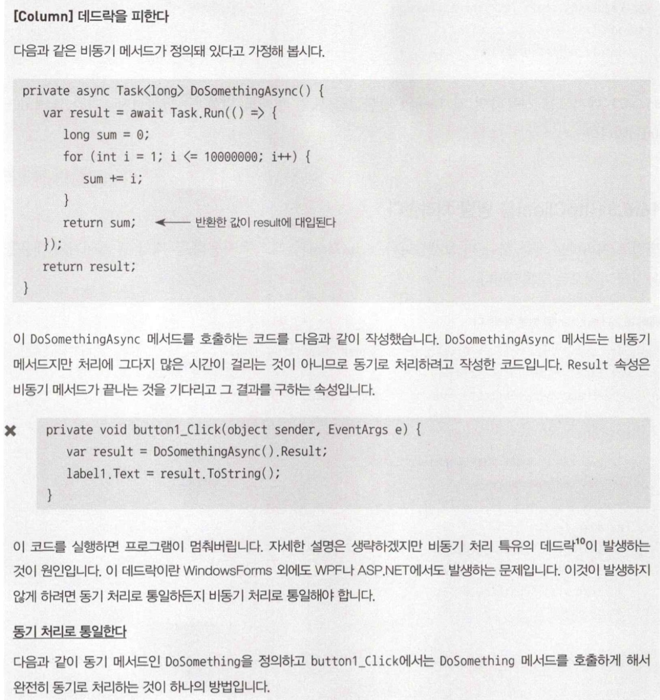
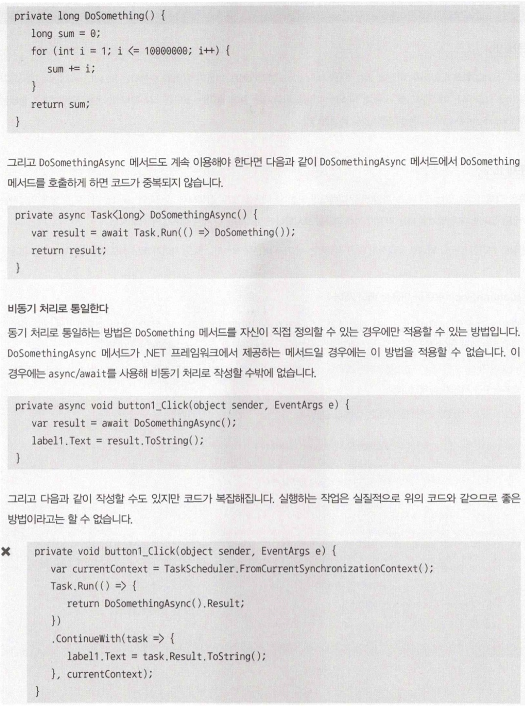

# 16. 비동기/병렬 프로그래밍

## 1. 비동기 처리와 병렬 처리의 필요성
## 2. async/await 이전의 비동기 프로그래밍
- `C# 5.0`부터 async/await라는 키워드가 도입되었다.

### 스레드를 이용한 비동기 처리

```c#
private void button1_Click(object sender, EventArgs e) {
    label1.Text = "";
    Cursor = Cursors.WaitCursor;
    DoLongTimeWork();
    label1.Text = "종료";
    Cursor = Cursors.Arrow;
}
```

- 위 코드에서 `DoLongTimeWork()`가 실행되는 동안 프로그램은 '응답없음' 이 된다.
- `Thread`를 사용한 코드

```c#
private void button1_Click(object sender, EventArgs e) {
    label1.Text = "";
    var sh = new Thread(DoSomething);
    th.Start();
}

private void DoSomething() {
    DoLongTimeWork();
    label1.Invoke((Action) delegate() {
        label1.Text = "종료";
    });
}
```

### BackgroundWorker 클래스를 사용한 비동기 처리
- `.NET Framework 2.0`부터 도입

```c#
private BackgroundWorker _worker = new BackgroundWorker();

public Form1() {
    InitializeComponent();
    _worker.DoWork += _worker_DoWork;
    _worker.RunWorkerCompleted += _worker_RunWorkerCompleted;
}

private void _worker_DoWork(object sender, DoWorkEventArgs e) {
    DoLongTimeWork();
}

private void _worker_RunWorkerCompleted(object sender, RunWorkerCompletedEventArgs e) {
    label1.Text = "종료";
}

private void button1_Click(object sender, EventArgs e) {
    label1.Text = "";
    _worker.RunWorkerAsync();
}
```

### Task 클래스를 이용한 비동기 처리
- `.NET Framework 4.0`부터 도입되었다.

```c#
private void button1_Click(object sender, EventArgs e) {
    toolStripStatusLabel1.Text = "";
    Task.Run(() => DoSomething());
}

private void DoSomething() {
    DoLongTimeWork();
    statusStrip1.Invoke((Action)(() => {
        toolStripStatusLabel1.Text = "종료";
    }));
}
```

- `ContinueWith`를 사용하면 `Invoke`를 사용하지 않아도 된다.

```c#
private void button2_Click(object sender, EventArgs e) {
    toolStripStatusLabel1.Text = "";
    var currentContext = TaskScheduler.FromCurrentSynchronizationContext();
    Task.Run(() => {
        DoSomething();
    })
    .ContinueWith(task => {
        toolStripStatusLabel1.Text = "종료";
    }, currentContext);
}

private void DoSomething() {
    ...
}
```

</br>

## 3. async/await를 이용한 비동기 프로그래밍
- `C# 5.0`부터 도입된 async 키워드와 await키워드는 비동기 프로그래밍을 강력하게 지원한다.

### 이벤트 핸들러를 비동기로 만든다.

```c#
private async void button1_Click(object sender, EventArgs e) {
    toolStirpStatusLabel1.Text = "";
    await Task.Run(() => DoSomething());
    toolStripStatusLabel1.Text = "종료";
}

private void DoSomething() {
    ...
}
```

- `await`은 지정한 Task가 끝날 때까지 이후의 처리를 중단하고 지정한 Task가 끝나면 그 이후의 처리를 계속한다.

```c#
private async void button1_Click(object sender, EventArgs e) {
    toolStirpStatusLabel1.Text = "";
    var elapsed = await Task.Run(() => DoSomething());
    toolStripStatusLabel1.Text = $"{elapsed}밀리초";
}

private long DoSomething() {
    var sw = Stopwatch.StartNew();
    DoLongTimeWork();
    sw.Stop();
    return sw.ElapsedMilliseconds;
}
```

### 비동기 메서드를 정리한다.

```c#
private async void button1_Click(object sender, EventArgs e) {
    toolStirpStatusLabel1.Text = "";
    await DoSomethingAsync();
    toolStripStatusLabel1.Text = "종료";
}

private async Task DoSomethingAsync() {
    await Task.Run(() => {
        DoLongTimeWork();
    });
}
```

- 비동기 메서드는 반환값이 `Task`형이여야 한다.
- 반환값이 없다면 `Task<TResult>`형이여야 한다.

```c#
private async void button1_Click(object sender, EventArgs e) {
    toolStirpStatusLabel1.Text = "";
    var elapsed = await DoSomethingAsync(4000);
    toolStripStatusLabel1.Text = $"{elapsed}밀리초";
}

private async Task<long> DoSomethingAsync(int milliseconds) {
    var sw = Stopwatch.StartNew();
    await Task.Run(() => {
        DoLongTimeWork();
    });
    sw.Stop();
    return sw.ElapsedMilliseconds;
}
```

</br>

## 4. HttpClient를 이용한 비동기 처리(async/await 응용 예)
- `HttpClient`는 `.NET Framework 4.5`에 추가되었다.
### HttpClient를 사용한 간단한 예

```c#
private async void button_Click(object sender, RoutedEventArgs e) {
    var text = await GetPageAsync(@"http://www.bing.com/");
    textBlock.Text = text;
}

private HttpClient _httpClient = new HttpClient();

private async Task<string> GetPageAsync(string urlstr) {
    var str = await _httpClient.GetStringAsync(urlstr);
    return str;
}
```

- `HttpClient` 객체 인스턴스화는 한 번 할것을 권장한다. 여러 개 사용 시 소켓 수를 모두 사용하여 예외가 발생할 수 있다.

### HttpClient를 응용한다.

```c#
private async void button1_Click(object sender, RoutedEventArgs e) {
    textBlock.Text = "";
    var text = await GetFormWikipediaAsync("청정실");
    textBlock.Text = text;
}

private HttpClient _httpClient = new HttpClient();

private async Task<string> GetPageAsync(string keyword) {
    var builder = new UriBuilder("https://ko.wikipedia.org/w/api/php");
    var content = new FormUrlEncodedContent(new Dictionary<string, string>() {
        ["action"] = "query",
        ["prop"] = "revisions",
    });
    builder.Query = await content.ReadAsStringAsync();

    var str = await _httpClient.GetStringAsync(builder.Uri);

    var xmldoc = XDocument.Parse(str);
    var rev = xmldoc.Root.Descendants("rev").FirstOrDefault();
    return WebUtility.HtmlDecode(rev?.Value);
}
```

</br>

## 5. UWP에서의 비동기 IO 처리
### 파일 피커를 사용해 파일에 접근한다.
```c#
private async void button_Click(object sender, RoutedEventArgs e) {
    var texts = await GetLinesAsync();
    textBlock.Text = texts[0];
}

private async Task<string[]> GetLinesAsync() {
    var picker = new FileOpenPicker {
        ViewMode = PickerViewMode.Thumbnail,
        SuggestedStartLocation = PickerLocationId.DocumentsLibrary,
    };
    picker.FileTypeFilter.Add(".txt");
    StorageFile file = await picker.PickSingleFileAsync();
    var texts = await FileIO.ReadLinesAsync(file);
    return texts.ToArray();
}
```

### 로컬 폴더에 텍스트 파일을 출력한다.

```c#
private async button1_Click(object sender, RoutedEventArgs e) {
    await WriteTexts("sample.txt");
}

private async Task WriteTexts(string filename) {
    var lines = new string[] {
        "동해물과~~",
        "마르고~~",
        "하느님이~~",
    };

    StorageFolder storageFolder = ApplicationData.Current.LocalFolder;
    StorageFile file = await storageFolder.CreateFileAsync(filename, CreateionCollisionOption.ReplaceExisting);
    await FileIO.WriteLinesAsync(file, lines);
}
```

### 로컬 폴더에 있는 텍스트 파일을 읽어 들인다.

```c#
private async void button2_Click(object sender, RoutedEventArgs e) {
    var lines = await ReadLines("sample.txt");
    textBlock.Text = String.Join("\n", lines);
}

private async Task<IEnumerable<string>> ReadLines(string filename) {
    StorageFolder storageFolder = ApplicationData.Current.LocalFolder;
    StorageFile file = await storageFolder.GetFileAsync(filename);
    var lines = await FileIO.ReadLinesAsync(file);
    return lines;
}
```

### 앱을 설치한 폴더에서 파일을 읽어 들인다.

```c#
private async void button3_Click(object sender, RoutedEventFile()) {
    var lines = await ReadLinesFromInstallFile();
    textBlock.Text = String.Join("\n", lines);
}

private async Task<IEnumerable<string>> ReadLinesFromInstallFile() {
    StorageFolder installedFolder = Package.Current.InstalledLocation;
    StorageFolder dataFolder = await installedFolder.GetFolderAsync("AppData");
    StorageFile sampleFile = await dataFolder.GetFileAsync("sample.txt");
    var lines = await FileIO.ReadLinesAsync(sampleFile);
    return lines;
}
```

</br>

## 6. 병렬 처리 프로그래밍
### PLINQ로 병렬 처리한다.

- 원래 코드

```c#
var selected = books.Where(b => b.Price > 500 && b.Pages > 400)
                .Select(b => new { b.Title });
```

- `AsParallel`로 병렬화

```c#
var selected = books.AsParallel()
                .Where(b => b.Price > 500 && b.Pages > 400)
                .Select(b => new { b.Title });
```

- `AsOrdered`로 순서 보장

```c#
var selected = books.AsParallel()
                .AsOrdered()
                .Where(b => b.Price > 500 && b.Pages > 400)
                .Select(b => new { b.Title });
```

- PLINQ는 다음과 같은 경우 유효하다.
1. 병렬화할 하나하나의 처리에 걸리는 시간이 긴 경우
2. 데이터 소스의 양이 많을 경우

- 아래와 같이 동시에 실행되는 태스크의 최대 수를 지정할 수 있다.

```c#
var selected = books.AsParallel()
                .WithDegreeOfParallelism(16)
                .Where(b => b.Price > 500 && b.Pages > 400)
                .Select(b => new { b.Title });
```

- `ForAll`로 루프처리를 병려로하 할 수 있다.

```c#
var selected = books.AsParallel()
                .Where(b => b.Price > 500);
selected.AsParallel().ForAll(book => {
    Console.WriteLine(book.Title);
});
```

### Task 클래스를 이용한 병렬 처리

```c#
private static int GetPrimeAt5000() {
    return GetPrices().Skip(4999).First();
}

private static int GetPrimeAt6000() {
    return GetPrices().Skip(5999).First();
}

static IEnumerable<int> GetPrimes() {
    for (int i = 2; i < int.MaxValue; i++) {
        bool isPrime = true;
        for (int j = 2; j < i; j++) {
            if (i%j == 0) {
                isPrime = false;
                break;
            }
        }
        if (isPrime)
            yield return i;
    }
}
```

```c#
var task1 = Task.Run(() => GetPrimeAt5000());
var task2 = Task.Run(() => GetPrimeAt6000());
var prime1 = await task1;
var prime2 = await task2;
```

- `WhenAll`로 한번에 사용도 가능하다.

```c#
var tasks = new Task<int>[] {
    Task.Run(() => GetPrimeAt5000()),
    Task.Run(() => GetPrimeAt6000()),
};
var results = await Task.WhenAll(tasks);
foreach (var prime in results)
    Console.WriteLine(prime);
```

### HttpClient를 병렬 처리한다.

```c#
private async void button1_Click(object sender, EventArgs e) {
    var tasks = new Task<string>[] {
        GetPageAsync(@"https://msdn.microsoft.com/magazine/"),
        GetPageAsync(@"https://msdn.microsoft.com/ja-jp/"),
    };
    var results = await Task.WhenAll(tasks);

    textBox1.Text = 
        results[0].Substring(0, 300) +
        Environment.NewLine + Environment.NewLine +
        results[1].Substring(0, 300);
}

private readonly HttpClient _httpClient = new HttpClient();

private async Task<string> GetPageAsync(string urlstr) {
    var str = await _httpClient.GetStringAsync(urlstr);
    return str;
}
```

### 데드락 피하기



