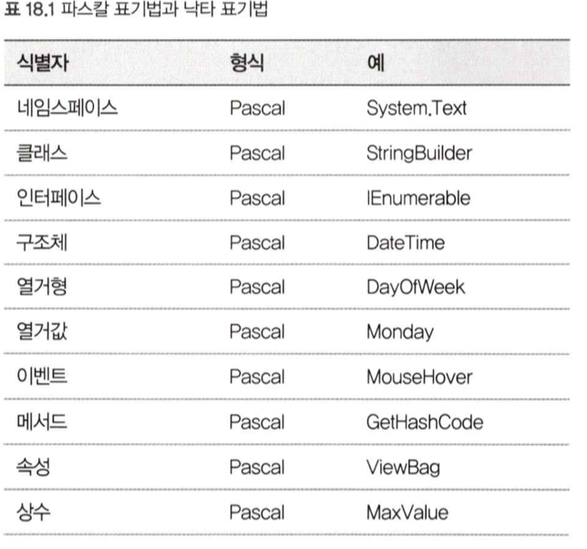
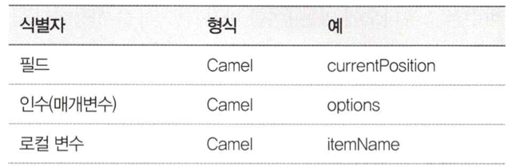

# 18. 스타일, 네이밍, 주석

## 1. 스타일에 관한 지침
- 중요한 것은 스타일에 **일관성**을 부여하는 것이다.

### 구조를 들여쓰기에 반영한다.
- 가독성을 위해 들여쓰기는 중요하다.

### 괄호를 사용해 정리한다.
- 우선순위 고려를 하지말고, 괄호를 사용하자.

### 공백을 일관성 있게 유지한다.
- 이 책에서 사용한 공백 기준
1. `if`나 `for`같은 제어 흐름 키워드 뒤에는 한 개의 공백을 둔다.
2. 클래스를 정의할 때 콜론 앞뒤에 한 개의 공백을 둔다.
3. 콤마 뒤에는 한 개의 공백을 둔다.
4. `for` 문 안에 있는 세미콜론 뒤에 한 개의 공백을 둔다.
5. `+`나 `*` 같은 연산자의 앞뒤에 한 개의 공백을 둔다.
6. `{}`의 앞뒤에 코드를 쓸 경우에는 `{}`의 앞뒤에 한 개의 공백을 둔다.

### 한 행에 모든 것을 넣지 않는다.
- 한 행에 모든것을 우겨넣으면 가독성이 매우 떨어진다.

 

## 2. 네이밍에 관한 지침
### 파스칼 표기법과 낙타 표기법을 적절히 사용한다.

- 필드 이름을 언더바로 시작하면 지역 변수와 명확히 구분된다.(마이크로소프트에서 이 방법 사용)

### 그것이 나타내는 것을 설명하는 이름을 지정한다.
- 누가봐도 알 수 있는 이름을 사용해야 한다.

### 정확한 철자를 사용한다.
- 가급적 줄임말을 사용하지 않는다.

### 로컬 변수의 생략형은 오해가 없는 범위 안에서 이용한다.

- 오해를 초래할 생략형 변수명은 가급적 피한다.
- 생략형 이름은 스코프를 짧게 잡아야 한다.
- 한 문자 변수를 너무 많이 사용하지 않는다.

### 변수 이름/속성 이름은 명사가 좋다.
- 컬렉션 변수나 컬렉션 속성은 복수형으로 지정하는 것이 일반적이다.

### bool 형이라는 것을 알게 해주는 이름을 지정한다.
- `true`와 `false`가 무엇을 나타내는지 명확하게 알 수 있는 변수명을 사용한다.
- `isEmpty`, `canSave`, `hasChildren`
- 부정적인 이름은 파악하기 어려우므로 피한다.(ex. `notDone`)

### 메서드 이름에는 동사를 지정한다.
- `Document` 클래스에서 `OpenDocuemnt` 같은 이름은 장확하므로, `Open`이면 충분하다.
- `bool` 반환 메서드는 `Is`, `Has`, `Can`으로 시작하는 것이 일반적이다.

### 바람직하지 않은 이름
- 식별자에 숫자를 붙인 이름
- bool형에 `flag`라는 이름을 지정한 이름
- 복수형과 단수형을 구별하지 않는 이름
- 이름에 `Info`나 `Data`, `Manager`를 붙인 이름
- 실제 수행하는 작업과 다른 메서드 이름

 

## 3. 주석에 관한 지침
- 코드와 주석이 일치하지 않는 상태는 주석이 없는 상태보다도 나쁜 상태라고 할 수 있다.

### 당연히 알고 있는 것은 주석에 쓰지 않는다.

### 클래스나 메서드에 쓰는 주석은 개요를 쓴다.
- 개요를 쓴 주석에는 구현에 관한 자세한 설명을 쓰지 않는다.

### 코드를 읽어 알 수 없는 정보를 주석에 쓴다.
- '어떻게 하는가'가 아닌 '무엇을 하는가'를 주석에 남긴다.

### 잘못된 코드에 주석을 쓰기보다는 코드를 수정한다.

### 주석은 필요한 최소한으로 제한한다.
- 주석에 노력을 기울이는 것 보다는 쉬운 코드를 작성하는 것이 훨씬 건설적이다.

### 주석 처리한 코드를 방치하지 않는다.

### 겉모습을 중시한 주석은 쓰지 않는다.
- 수고스러움에 비해 생산성이 적다.
