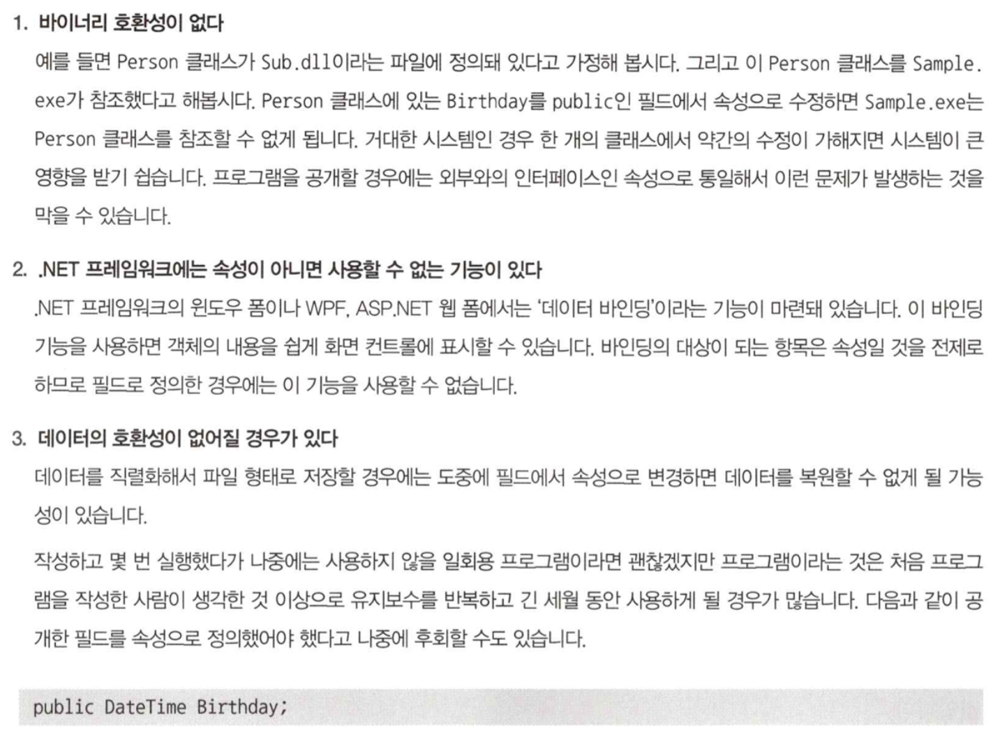
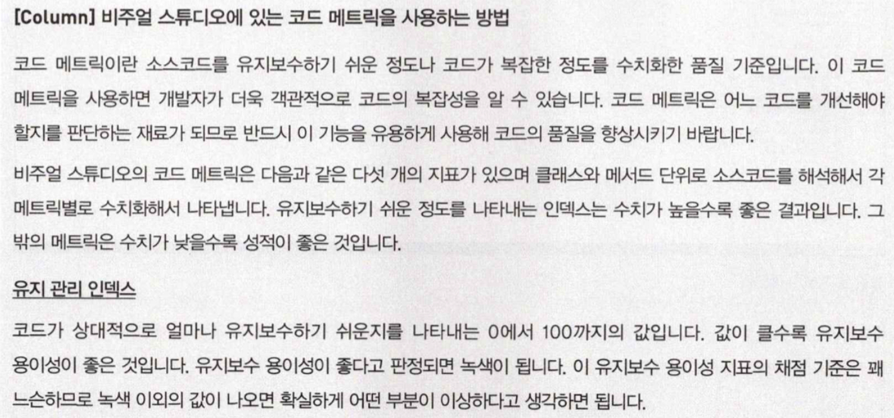
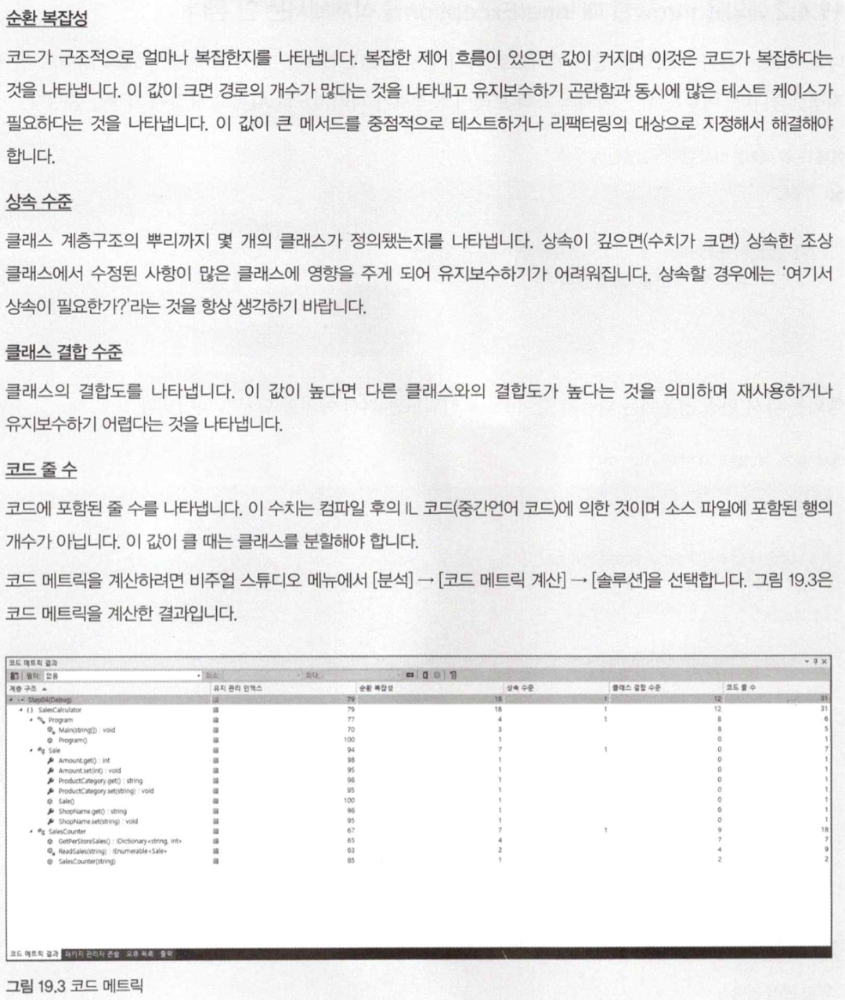
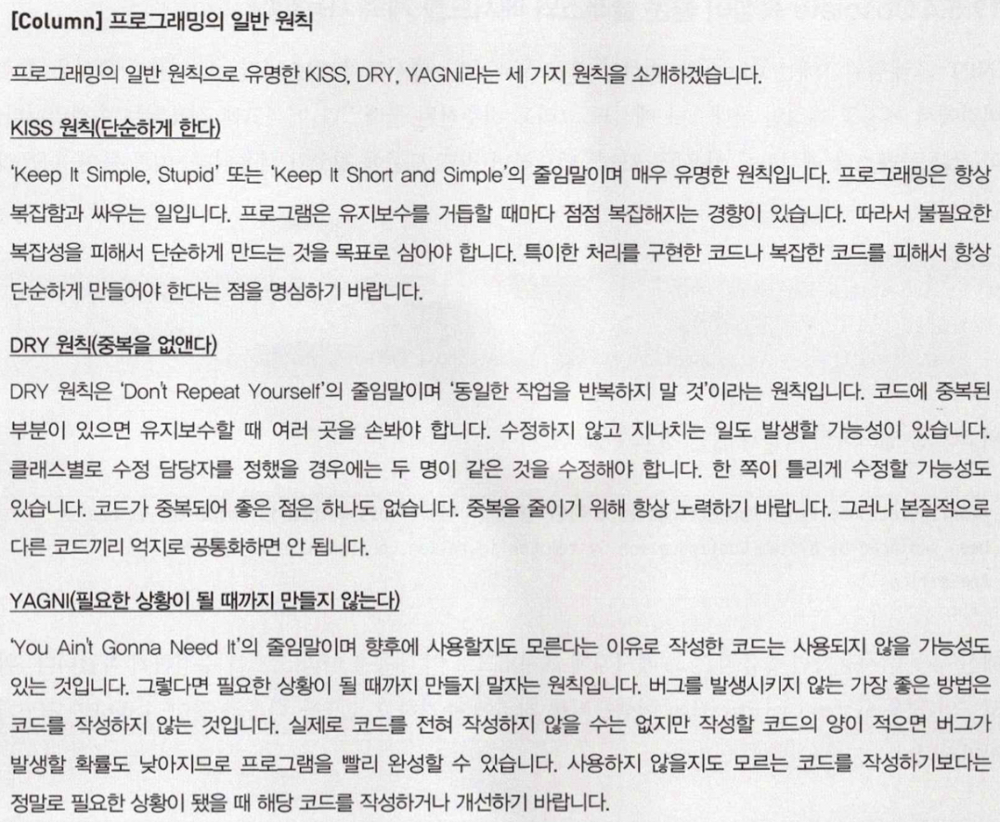

# 19. 좋은 코드를 작성하기 위한 지침
## 1. 변수에 관한 지침
### 변수의 스코프는 좁게 정한다.
- 변수는 처음 이용되는 장소에서 가까운 곳에 선언하고 초기화해야 한다는 것이 철칙이다.
- 스코프가 좁으면 한 번에 주의해야 할 사항이 줄고, 수정에 대한 위험도 감소한다.
- 나중에 코드의 일부를 메서드로 추출하기도 편하다.

### 매직 넘버를 사용하지 않는다.
- `const`나 `readonly`같은 다른 수단을 사용한다.
- 수정될 가능성이 있다면 `static readonly`를 사용한다.

### 한 변수를 계쏙 쓰면 안 된다.
- 변수를 돌려쓰면 읽는 사람이 착각하기 쉽고 유지보수하기 어렵다.

### 한 변수에 여러 개의 값을 넣으면 안 된다.
- 변수 공간을 절약해봤자 거기서 얻는 장점은 거의 없다.

```c#
// 나쁜 예시
int year = GetYear();
int month = GetMonth();
int yearmonth = isError ? -1 : year * 100 + month;
```

### 변수 선언은 최대한 늦춘다.
- 변수를 모아서 선언하지 말자.
- 프로그램을 파악하는 데 방해되고 버그 발생 위험이 커진다.

### 변수의 개수는 적을수록 좋다.
- 동시에 취급하는 변수의 개수가 많으면 코드를 이해하는 데 시간이 걸린다.

</br>

## 2. 메서드에 관한 지침
### 중첩은 얕아야 한다.
- 많아야 3층 정도로 제한하는 것이 바람직하다.
- 중첩이 깊으면
  - 코드를 파악하는 데 시간이 걸린다.
  - 코드에 문제가 있을 경우에는 디버깅에 시간이 걸린다.
  - 유지보수에 시간이 걸린다.
  - 기능을 추가할 때 버그가 발생하기 쉽다.
  - 기능을 추가할 때 코드가 더욱 복잡해지기 쉽다.

### return 문을 한 개로 정리하려고 애쓰면 안 된다.

```c#
// 좋은 예
if (number == 1)
    return false;
if (number == 2)
    return false;
if (number == 3)
    return true;
```

### 실행 결과의 상태를 int 형으로 반환하면 안 된다.
- 사용하는 쪽은 0이 정상인지 1이 정상인지 판단하기 어렵다.
- `book`값을 반환하게 하라.

### 메서드는 단일 기능으로 구현한다.
- 단일 기능 메서드로 구현할 때 장점
  - 코드를 파악하기 쉽다.
  - 코드를 유지보수하기 쉽다.
  - 코드를 재사용하기 쉽다.
  - 메서드에 좋은 이름을 지정하기 쉽다.
  - 테스트하기 쉽다.

### 메서드를 짧게 구현한다.
- 짧은 메서드는 이해하기 쉬워 버그가 발생할 위험이 적다.
- 50행을 크게 넘어가면 위험한 상태라고 판단하고 리팩토링을 하는 것이 좋다.

### 만능 메서드를 만들지 않는다.
- 시간이 지남에 따라 더욱 복잡해질 가능성이 있다.

### 메서드 인수의 개수는 적을수록 좋다.
- 인수가 많으면 코드를 파악하기 힘들고 사용하기도 불편하다.
- 세 개 이하 정도가 바람직하다.
- 너무 인수가 많은 경우에는 여러 매개변수를 정리한 옵션 매개변수용 클래스를 정의해서 인수의 개수를 줄이는 것이 좋다.

### 인수에 ref 키워드를 붙인 메서드는 정의하지 않는다.
- `ref` 키워드를 사용한 메서드는 거의 틀림없이 엉터리 메서드이다.
- 사용하는 쪽의 입장을 고려하면 매우 사용하기 힘든 메서드다.
- 유지보수하는 사람의 입장에서도 파악하기 힘든 코드다.

### 인수에 out 키워드를 붙은 메서드는 최대한 정의하지 않는다.
- 인수에 `out` 키워드가 있으면, 거의 설계착오이다.
- 인수를 경유해서 값을 반환하면 안 된다.
- 유일하게 `TryParse`계통의 메서드만 허락된다.

</br>

## 3. 클래스에 관한 지침
### 필드는 비공개로 지정한다.
- 필드는 내부 데이터이고, 속성은 외부와의 인터페이스이다.
- C#에서는 필드는 공개하지 않고 공개해야 할 경우 속성으로 지정할 것을 권장한다.
- 필드와 속성의 차이


### 쓰기 전용 속성은 정의하지 않는다.
- 속성으로서 의미가 없다.
- 예를들면, `public string Text { set {} }`

### 연속해서 참조할 때마다 다른 값을 반환하는 속성을 정의하면 안 된다.
- 속성이 아니고 메서드로 정의하면 호출할 때마다 다른 값이 반환돼도 사용자가 이해할 수 있다.

### 비용이 드는 처리는 속성이 아닌 메서드로 정의한다.
- 예를들면, 속성을 참조할 때마다 파일에 접근하는 코드를 작성하면 안 된다.

### 객체가 저장하고 있는 다른 객체를 외부에 노출시키면 안 된다.
- 다른 클래스와의 결합도가 높아져 유지보수하기 어려워진다.

### 기저 클래스에 유틸리티 메서드를 포함시키면 안 된다.
- 메서드를 정의할 때는 본래 어느 클래스에 있어야 할 메서드인지 잘 생각해야 한다.
- 기저 클래스가 유틸리티 메서드를 포함하게 되면, 클래스는 거대해지고 유지보수하기 어려워진다.
- 그리고 서브 클래스와의 결합도도 높아진다.

### 속성을 인수 대신 사용하면 안 된다.
- 클래스의 속성을 메서드의 인수 대신 사용하지 말자.

### 거대한 클래스를 작성하지 않는다.
1. 공개할 메서드가 많은 경우
   1. 이 클래스를 이용하고 있는 클래스가 많다는 것이다.
   2. 유지보수하기 어려운 클래스가 된다.
2. 공개할 메서드의 수는 적고 private 메서드가 많다.
   1. 클래스가 제대로 분해되어 있지 않다는 것이다.
   2. 추상화가 제대로 되어있지 않다는 것이다.
3. 일부 메서드가 너무 크다
   1. 만능 메서드가 많다는 얘기다.

### new 수식자를 사용해 상속하는 부모 쪽 메서드를 대체하면 안 된다.
- `new` 수식자로 대체한 메서드는 다형성을 적용할 수 없다.

```c#
// 나쁜 예
class MyBookList : List<Book> {
    private List<Book> _deleted = new List<Book>();
    ...
    public new book Remove(Book item) {
        _deleted.Add(item);
        return base.Remove(item);
    }
}
```

- 상속이 아닌 위임을 사용한다.
```c#
// 위임을 사용한 예
class MyBookList : List<Book> {
    private List<Book> _books = new List<Book>();
    private List<Book> _deleted = new List<Book>();

    public int Count {
        get { return ((ICollection<Book>)_books).Count;}
    }

    public void Add(Book item) {
        ((ICollection<Book>)_books).Add(item);
    }

    public bool Remove(Book item) {
        _deleted.Add(item);
        return ((ICollection<Book>)_books).Remove(item);
    }
}
```

</br>

## 4. 예외 처리에 관한 지침
### 예외를 대충 해결하면 안 된다.
### 예외를 throw 할 때 InnerException을 삭제해서는 안 된다.
- 예외의 스택 트레이스 정보가 사라지게 된다.
- `throw` 키워드만 써서 예외를 던진다.

```c#
// 아래와 같이 쓰지 않는다.
try {

} catch (FileNotFoundException ex) {
    throw ex;
}

// 아래와 같이 사용한다.
try {

} catch (FileNotFoundException ex) {
    throw;
}
```




</br>

## 5. 그 밖의 바람직하지 않은 프로그래밍
### const를 오용한다.
- 아래와 같은 경우, `const` 보다는 `enum`을 사용한다.

```c#
class FontStyle {
    public const int Normal = 1;
    public const int Bold = 1;
}

enum FontStyle {
    Normal = 0,
    Bold = 1,
}
```

### 중복된 코드
- 같은 코드가 있다면 메서드 형태로 추출하거나 해서 중복을 제거한다.
- 주의할 점은 본질적으로 다른 작업을 하는 코드를 억지로 공통화해서는 안 된다.
- 비주얼 스튜디오의 상위 에디션에는 '코드 클론 분석'이라는 기능이 있는데 이를 활용하면 중복된 코드를 간단히 찾아낼 수 있다.

### 복사/붙여넣기 프로그래밍

### Obsolete 속성이 붙은 클래스와 메서드를 계속 사용한다.
- `Obsolete` 속성은 향후 버전에서 폐지될 예정인 클래스나 메서드 그리고 비추천된 클래스나 메서드에 적용되는 속성이다.

### 필요없는 코드를 그대로 남겨둔다.
- 유지보수 할 수 없는 코드가 만들어진다.

</br>

## 프로그래밍의 일반 원칙


