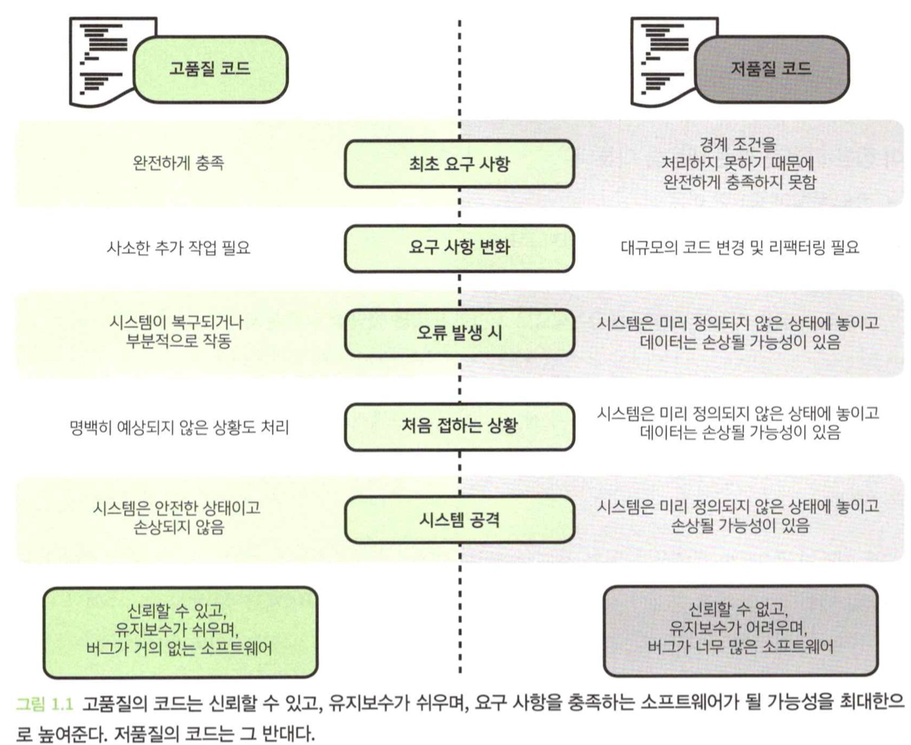
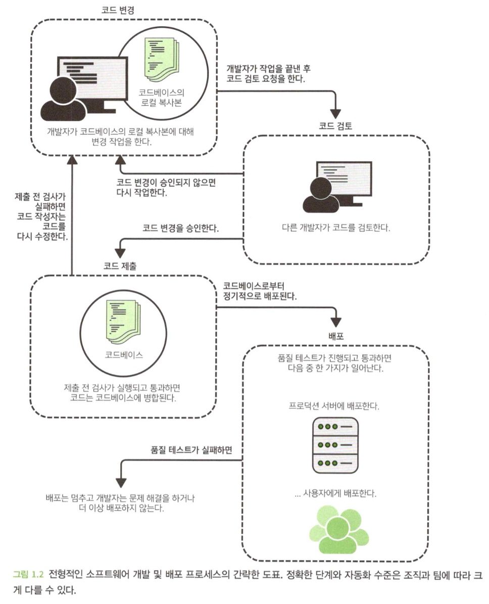
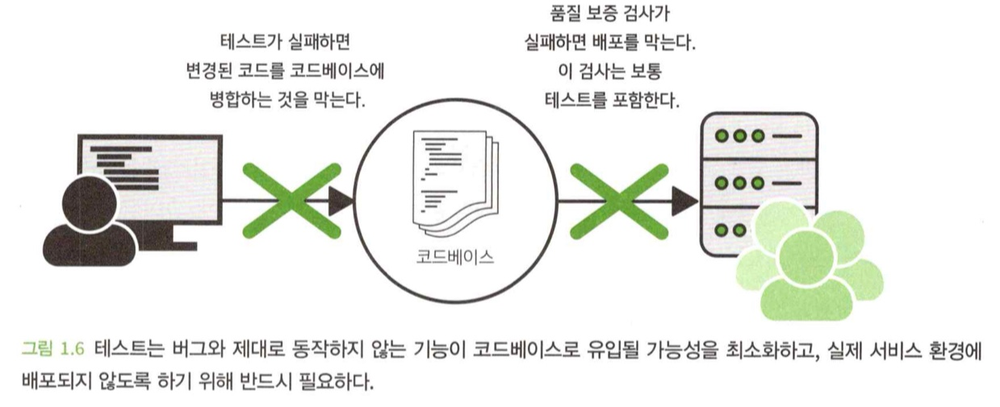

- 이 장에서 다루는 내용
1. 코드 품질이 중요한 이유
2. 고품질의 코드가 이루고자 하는 네 가지 목표
3. 고품질의 코드 작성을 위한 높은 수준에서의 여섯 가지 전략
4. 고품질의 코드 작성이 어떻게 중장기적으로 시간과 노력을 절약할 수 있는지

 

# 0. Intro
- 고품질의 코드는 일반적으로 좀 더 **신뢰**할 수 있고, **유지보수**가 쉬우며, **버그가 적은 소프트웨어**를 생산한다.

- **좋은 코드**가 좋은 소프트웨어를 만들기 위한 유일한 조건은 당연히 아니지만, 중요한 조건 가운데 하나다.

 

# 1. 코드는 어떻게 소프트웨어가 되는가
- 소프트웨어는 코드로 만들어진다.
- 코드는 엔지니어가 작성하고, 코드가 의도한 대로 작동하고 기존의 기능이 여전히 잘 작동한다고 확신하기 위한 **다양한 과정**과 **점검**이 이루어진다.
- 위와 같은 과정을 **소프트웨어 개발 및 배포 프로세스**라고 부른다.
### 코드로부터 실제 서비스되는 환경에서 실행되는 소프트웨어가 되기까지의 과정
1. 개발자가 코드베이스의 로컬 복사본을 가지고 작업하면서 코드를 변경한다.
2. 작업이 끝나면 코드 검토를 위해 변경된 코드를 가지고 병합 요청을 한다.
3. 다른 개발자가 코드를 검토하고 변경을 제안할 수 있다.
4. 작성자와 검토자가 모두 동의하면 코드가 코드베이스에 병합된다.
5. 배포는 코드베이스를 가지고 주기적으로 일어난다. 얼마나 자주 배포되는지는 조직과 팀마다 다를 수 있다.
6. 테스트에 실패하거나 코드가 컴파일되지 않으면 코드베이스에 병합되는 것을 막거나 코드가 배포되는 것을 막는다.

 

# 2. 코드 품질의 목표
- 고품질의 소프트웨어를 만들기 위해서는 소프트웨어가 잘 구축되어야 한다. 이것이 바로 코드 품질의 진정한 목적이다.
- 코드의 품질은 주관적인데, 이를 판단하기 위해 코드를 통해 달성하려는 것이 무엇인지 생각해보는 것이 유용하다.
- 코드의 네 가지 상위 수준의 목표는 다음과 같다.

### 코드는 작동해야 한다
- 코드는 작성된 목적대로 동작해야 한다.
- 코드는 우리가 해결하려고 하는 문제를 실제로 해결해야 한다.
- 코드는 버그가 없어야 한다.
- 코드가 '작동한다'라는 것을 정의할 때, 우리는 모든 요구사항을 파악할 필요가 있다.

### 코드는 작동이 멈추면 안 된다
- 아래와 같은 상황에 대해 변경이 발생했을 때, 제대로 동작하지 않는다면 별로 유용한 코드가 아니다.
  - 의존하는 코드가 변경된다.
  - 새로운 기능이 필요하다.
  - 소비자의 선호, 비즈니스 변경 등에 의해 변경되어야 한다.
- 당장 돌아가는 코드를 만들긴 쉽지만, 변화하는 환경과 요구사항에도 불구하고 계속 작동하는 코드를 만드는 것은 훨씬 더 어렵다.
- 나중에 생각하거나 이후에 몇 가지 테스트를 추가하면 될 것이라고 가정하는 것은 효과적인 접근법이 아니다.

### 코드는 변경된 요구 사항에 적을할 수 있어야 한다
- 다행히 미리 알지 못해도, 적응성 높은 코드를 작성하기 위해 채택할 수 있는 몇 가지 일반적인 기술들이 있다.

### 코드는 이미 존재하는 기능을 중복 구현해서는 안 된다
- 이미 구현된 코드(라이브러리 등)을 활용하면 다음과 같이 좋다.
  - 시간과 노력을 절약한다.
  - 버그 가능성을 줄여준다.
  - 기존 전문지식을 활용한다.
  - 코드가 이해하기 쉽다.

 

# 3. 코드 품질의 핵심 요소
- 코드 품질의 여섯 가지 핵심 요소는 다음과 같다.

### 코드는 읽기 쉬워야 한다
- 코드를 읽을 때 아래와 같은 사항들을 이해하기 위해 노력한다.
  - 코드가 하는 일
  - 어떻게 그 일을 수행하는지
  - (입력이나 상태 등) 어떤 것을 필요로 하는지
  - 코드 실행 결과물
- 코드 가독성이 떨어지면, 읽는 개발자가 많은 시간을 사용해야 한다.
- 또한 검토 중에 버그를 발견할 가능성이 작고, 코드를 수정할 때 버그가 도입될 가능성이 크다.
- 2장(올바른 추상화 계층)과 5장에서 다룬다.

### 코드는 예측 가능해야 한다

- 우리는 코드의 관행같은 단서들을 통해 코드가 어떤일을 하는지 `정신 모델`을 구축한다.
- 이 `정신 모델`과 어긋나는 일이 발생하면, 버그가 쉽게 유입될 수 있다.
- 명백하게 이상한 일이 발견되기 전까지, 시스템은 계속 비정상적으로 작동한다.
- 6장에서 다룬다.

### 코드를 오용하기 어렵게 만들라

- 코드를 오용하기 어렵게 만들면, 코드가 계속해서 잘 작동할 가능성을 극대화 할 수 있다.
- 3장과 7장에서 다룬다.

### 코드를 모듈화하라
- `모듈화`는 개체나 시스템의 구성 요소가 독립적으로 교환되거나 교체될 수 있음을 의미한다.

- 모듈화된 시스템의 주요 특징 중 하나는 인터페이스가 잘 정의되어 서로 다른 구성 요소 간 **상호작용하는 지점**이 최소화 된다는 점이다.
- 모듈화가 잘 되면, 일반적으로 이해와 추론하기 쉽다.
- 오해할 소지가 줄어들기 때문에, 처음 작동 이후에도 잘 작동할 가능성이 커진다.
- 2장과 8장에서 다룬다.

### 코드를 재사용 가능하고 일반화할 수 있게 작성하라
- **재사용성** : 문제를 해결하기 위한 무언가가 여러 가지 다른 상황에서도 사용될 수 있음을 의미한다.
- **일반화성** : 핸드 드릴은 구멍을 뚫는데 사용되지만, 나사를 박을 때도 사용된다.
- 코드가 재사용할 수 있고 일반화 할 수 있으면, 여러 가지 문제를 해결할 수 있다.
- 9장에서 다룬다.

### 테스트가 용이한 코드를 작성하고 제대로 테스트하라
- 테스트는 다음 두 가지에 대해 **방어 수단**이 된다.
  - 버그나 제대로 동작하지 않는 기능을 갖는 코드가 코드베이스에 병합되지 않도록 방지
  - 버그나 제대로 동작하지 않는 기능을 갖는 코드가 배포되지 않도록 막고 서비스 환경에서 실행되지 않도록 보장

- **테스트**
  - 단위 테스트
  - 통합 테스트 : 구성 요소와 하위 시스템을 함께 연결하는 테스트
  - 종단간 테스트 : 소프트웨어 시스템에서 작동의 흐름을 테스트
- **테스트 용이성** : 테스트 대상이 되는 코드가 얼마나 테스트하기 적합한지
- 현재 코드를 작성하면서 계속 '어떻게 테스트 할 것인가?'를 자문하는 것이 좋다.
- 코드를 다 작성하고 나서 테스트에 대해 생각해서는 안 된다.

 

# 4. 고품질 코드 작성은 일정을 지연시키는가?
- 일반적으로 고품질 코드를 작성하는 것이 중장기적으로는 개발 시간을 단축해준다.
- 코드 품질을 고려하지 않고 떠오르는 대로 코딩하면 처음은 절약하겠지만, 머지않아 이해하기 어렵고 추론할 수 없는 코드가 된다.
> 서두르지 않으면 더 빠르다.

 

# 요약
- 좋은 소프트웨어를 만들려면 고품질 코드를 작성해야 한다.
- 실제 서비스 환경에서 실행되는 소프트웨어가 되기 전에 코드는 일반적으로 여러 단계의 검사와 테스트를 통과해야 한다.
- 버그나 제대로 동작하지 않는 기능이 사용자에게 제공되거나 비즈니스에 중요한 시스템에서 실행 되는 것을 이러한 검사를 통해 막을 수 있다.
- 테스트는 코드를 작성하는 모든 단계에서 고려하는 것이 좋다. 코드를 다 작성하고 난 후에 고려하는 것이 아니다.
- 고품질의 코드를 작성하면 처음에는 시간이 오래 걸리지만, 중장기적으로는 개발 시간이 단축되는 경우가 많다.
