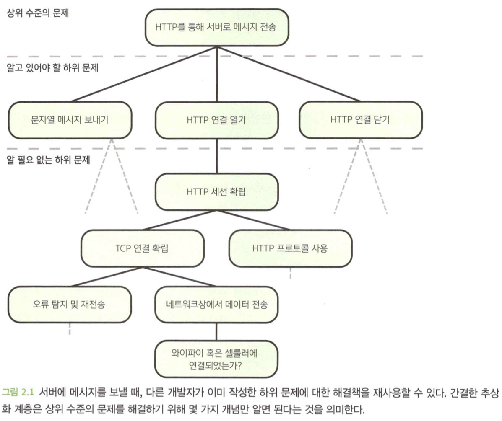
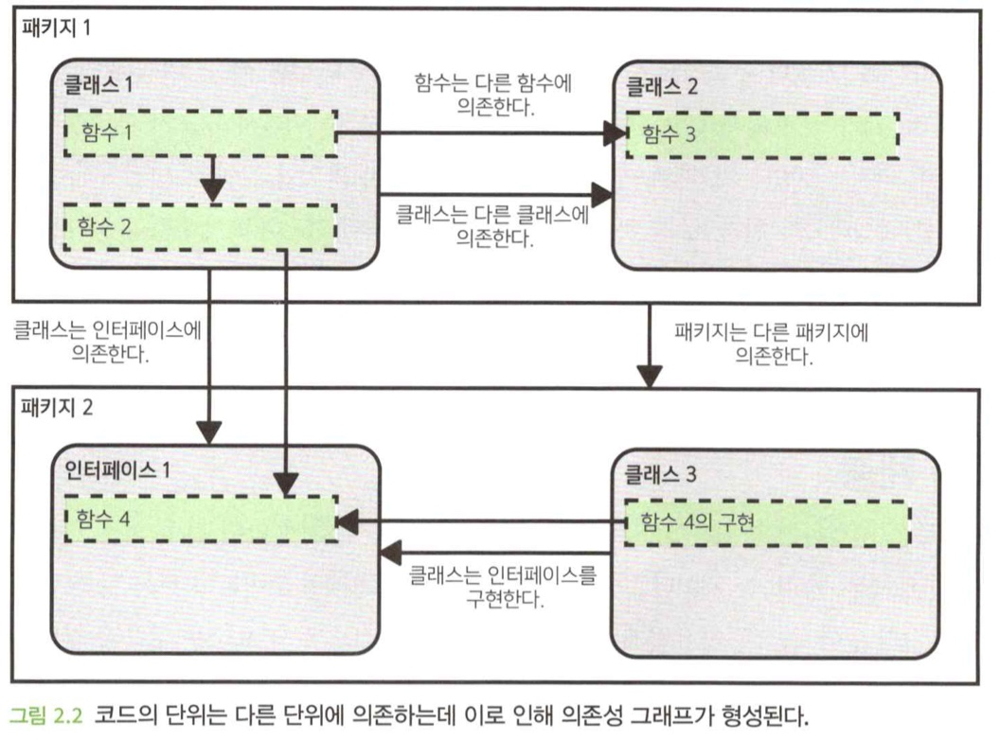
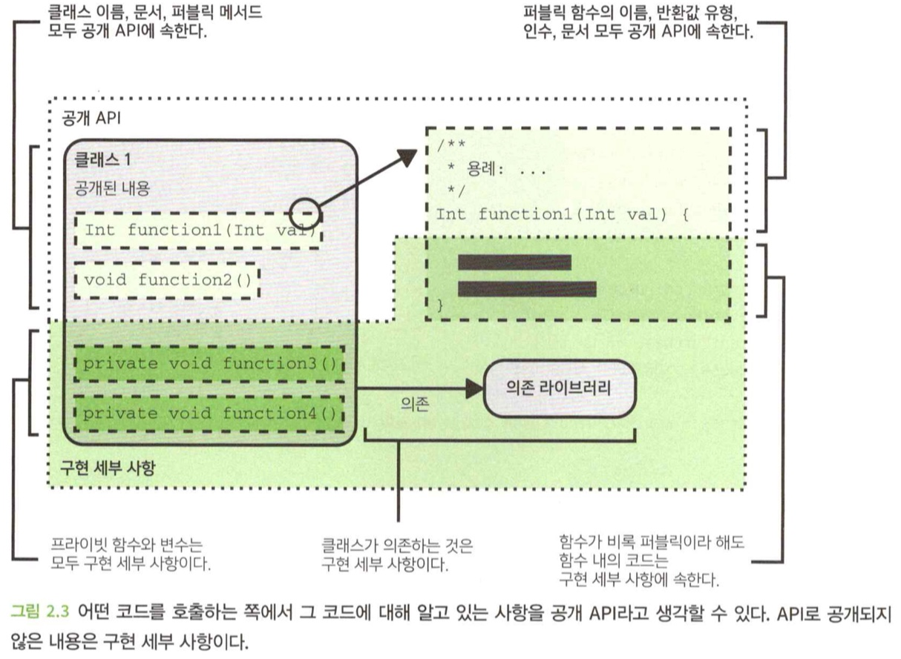
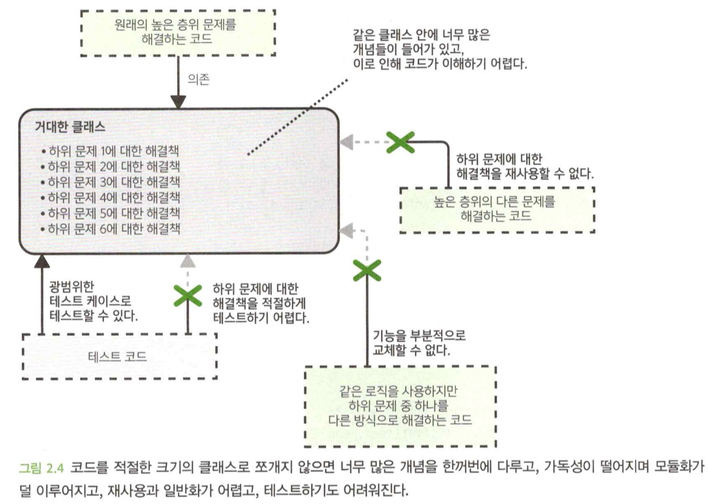
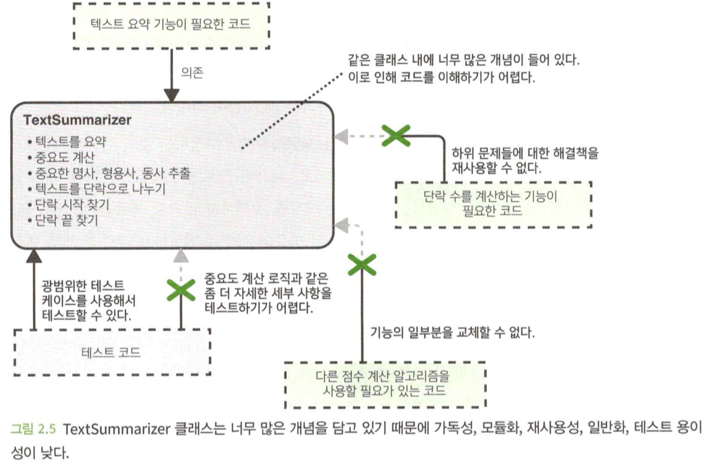
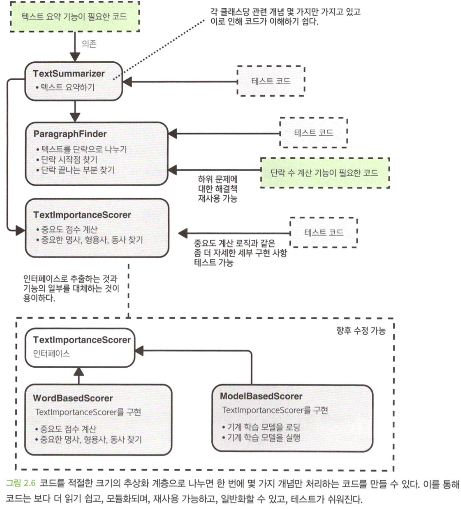
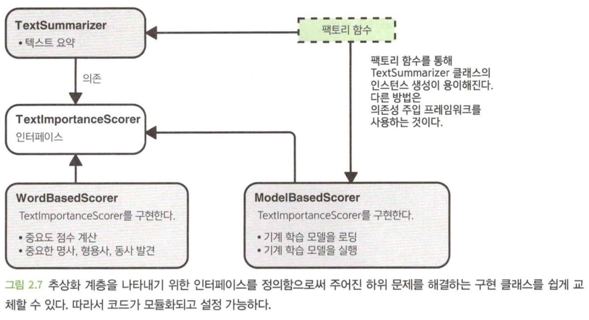

- 이 장에서 다루는 내용
  1. 깔끔한 추상화 계층을 통해 문제를 하위 문제로 세분화하는 방법
  2. 추상화 계층이 코드 품질의 요소를 달성하는 데 어떻게 도움이 되는지
  3. API 및 구현 세부 사항
  4. 함수, 클래스 및 인터페이스를 사용해 코드를 추상화 계층으로 나누는 방법

</br>

# 0. Intro
- 코드 작성의 목적은 **문제 해결**이다.
- 상위 문제를 풀 때 우리는 보통 문제를 여러 개의 작은 하위 문제들로 나눈다.
- **코드를 잘 구성**한다는 것은 **간결한 추상화 계층**을 만드는 것으로 귀결될 때가 많다.

</br>

# 1. 널값 및 의사코드 규약
- `Null`값은 믿을 수 없을 정도로 유용하면서 동시에 믿을 수 없을 정도로 문제가 많다.
- 최근 몇 년간 새로 등장한 중요한 언어들 대부분은 **널 안정성**을 지원한다.(지원한다면 최대한 사용해라.)
- 지원하지 않는 언어를 사용한다면, `Optional`타입을 사용하는 것이 좋다.
- 이 책에서는 **널 안정성**이 있다고 가정하고, 의사코드를 작성한다.

</br>

# 2. 왜 추상화 계층을 만드는가?
- 어떤 장치에서 실행되면서 서버에 메시지를 보내느 코드를 작성한다고 가정해보자.
```java
HttpConnection connection = HttpConnection.connect("http://example.com/server");
connection.send("Hello server");
connection.close();
```
- 내부에선 매우 복잡한 일들이 일어난다.
> 문자열 직렬화, HTTP 프로토콜 동작, TCP연결, 데이터 전송 요류 및 수정 등...
- 하나의 문제가 있을 때, 이 문제와 하위 문제에 대한 해결책이 일련의 층을 형성하고 있는 것으로 생각할 수 있다.
- HTTP 연결을 추상적인 개념으로 생각할 수 있는데, 이것을 **추상화 계층**이라고 한다.
- **추상화 계층**이 잘 나뉘어져 있다면, 같은 층에서는 몇 개의 개념만 다루기 때문에 복잡하지 않고 이해하기 쉽다.
- 소프트웨어 엔지니어는 문제가 복잡할지라도 하위 문제들을 식별하고 올바른 추상화 계층을 만듦으로써 그 복잡한 문제를 쉽게 다뤄야 한다.


## 2.1 추상화 계층 및 코드 품질의 핵심 요소
- 깨끗하고 뚜렷한 추상화 계층을 구축하면, 코드 품질의 네 가지 핵심 요소를 달성할 수 있다.

### 가독성
- 깨끗하고 뚜렷한 추상화 계층은 개발자가 한 번에 한 두개의 개념만 다루게 되므로, 가독성이 향상된다.

### 모듈화
- 추상화 계층으로 구현 세부 사항이 외부로 노출되지 않게 보장한다.
- 그렇게 되면 계층 내부에서만 구현을 변경하기 쉬워진다.

### 재사용성 및 일반화성
- 하위 문제에 대한 해결책을 재사용하기가 쉬워진다.
- 문제가 적절하게 추상화된 하위 문제르 세분화된다면, 해결책은 여러 가지 다른 상황에서 유용하게 일반화될 가능성이 크다.

### 테스트 용이성
- 코드가 추상화 계층으로 깨끗하게 분할되면, 각 하위 문제에 대한 해결책을 완벽하게 테스트하는 것이 쉬워진다.

</br>

# 3. 코드의 계층
- 실제로 추상화 계층을 생성하는 방법은 코드를 서로 다른 단위로 분할하여 단위 간의 의존 관계를 보여주는 **의존성 그래프**를 생성하는 것이다.


## 3.1 API 및 구현 세부 사항
- 코드를 작성할 때 고려해야 할 측면 두 가지
  - 코드를 호출할 때 볼 수 있는 내용
    - `public class`, `interface`, `method`
    - 이름, 매개변수, 반환 유형이 표현하고자 하는 개념
    - 코드 호출 시 올바르게 사용하기 위해 알아야 하는 추가 정보
  - 코드를 호출할 때 볼 수 없는 내용
    - 구현 세부사항
- API는 서비스를 사용할 때 알아야 할 것들에 대한 개념을 형식화하고, 서비스의 모든 구현 세부 사항은 이 API 뒤에 감춘다.


## 3.2 함수
- 아래는 이해하기 어려운 함수(수도 코드)의 예시이다.

```java
SentConfirmation? sendOwnerALetter(Vehicle vehicle, Letter letter) {
    Address? ownersAddress = null;
    if (vehicle.hasBeenScraped()) {
        ownersAddress = SCRAPYARD_ADDRESS;
    } else {
        Purchase? mostRecentPurchase = vehicle.getMostRecentPurchase();
        if (mostRecentPurchase == null) {
            ownersAddress = SHOWROOM_ADDRESS;
        } else {
            ownersAddress = mostRecentPurchase.getBuyersAddress();
        }
    }
    if (ownersAddress == null) {
        return null;
    }
    return sendLetter(ownersAddress, letter);
}
```

- 너무 많은 개념을 다루는 함수는 이해하기 어렵다.
- 함수가 하는 일을 다음 중 하나로 제한하면, 이해기 쉽고 단순한 함수를 위한 좋은 전략이 될 수 있다.
  - 단일 업무 수행
  - 잘 명명된 다른 함수를 호출해서 더 복잡한 동작 구성
- 일단 함수를 작성했으면, 작성된 코드를 문장으로 만들어보면 좋다.
- 문장을 만들기 어렵거나 너무 어색하면 함수가 너무 길다는 것을 의미한다.
- 함수를 작게 만들고 수행하는 작업을 명확하게 하면 코드의 가독성과 재사용성이 높아진다.

```java
SentConfirmation? sendOwnerALetter(Vehicle vehicle, Letter letter) {
    Address? ownersAddress = getOwnersAddress(vehicle);
    if (ownersAddress == null) {
        return null;
    }
    return sendLetter(ownersAddress, letter);
}

private Address? getOwnersAddress(Vehicle vehicle) {
    if (vehicle.hasBeenScraped()) {
        return ownersAddress = SCRAPYARD_ADDRESS;
    }
    Purchase? mostRecentPurchase = vehicle.getMostRecentPurchase();
    if (mostRecentPurchase == null) {
        return SHOWROOM_ADDRESS;
    } 
    return mostRecentPurchase.getBuyersAddress();
}
```

## 3.3 클래스
- 단일 클래스의 이상적인 크기는 다음과 같은 것들로 고려될 수 있다.
  - `number of lines` : 필자의 경험 상 300줄 이상이 된다면, 고려해 보는 것이 좋다.(항상은 아님)
  - `응집력` : 한 클래스 내에 모든 요소들이 얼마나 잘 속해 있는지를 보여주는 척도
    - `순차적 응집력` : 한 요소의 출력이 다른 요소에 대한 입력으로 필요할 때 발생
    - `기능적 응집력` : 몇 가지 요소들이 모여서 하나의 일을 성취하는 데 기여할 때 발생
  - `관심사의 분리` : 시스템이 각각 별개의 문제를 다루는 개별 구성 요소로 분리되어야 한다고 주장하는 설계 원칙
- 우리가 근본적으로 성취하려고 하는 것에 대해서도 신중하게 생각할 필요가 있다.
  - `코드 가독성`
    - 단일 클래스에 많은 개념이 담겨있으면, 가독성은 저하된다.
    - 가독성이 저하되면, 다른 개발자가 읽을 때 시간이 늘어나고 잘못 이해 할 가능성이 커진다.
  - `코드 모듈화`
    - 클래스 및 인터페이스의 사용은 코드 모듈화를 위한 좋은 방법 중 하나다.
  - `코드 재사용성 및 일반화`
    - 두 가지 해결책을 한 클래스에 묶어두면, 다른 누군가가 그 중 한가지 해결책을 재사용할 기회가 줄어든다.
  - `테스트 용이성 및 적절한 테스트`
    - 로직이 여러 클래스로 나누어지면 각 부분을 적절하게 테스트하기가 훨씬 쉬워진다.


- 너무 큰 클래스 예시(텍스트를 요약하는 클래스)

```java
class TextSummarizer {
    //...
    String summarizeText(String text) {
        return splitIntoParagraphs(text)
            .filter(paragraph -> calculateImportance(paragraph) >=
                IMPORTANT_THREDHOLD)
            .join("\n\n");
    }

    private Double calculateImportance(String paragraph) {
        List<String> nouns = extractImportantNouns(paragraph);
        List<String> verbs = extractImportantVerbs(paragraph);
        List<String> adjectives = extractImportantAdjectives(paragraph);
        ... a complicated equation ...
        return importanceScore;
    }
    private List<String> nouns = extractImportantNouns(String text) {...};
    private List<String> verbs = extractImportantVerbs(String text) {...};
    private List<String> adjectives = extractImportantAdjectives(String text) {...};

    private List<String> splitIntoParagraphs(String text) {
        List<String> paragraphs = [];
        Int? start = detectParagraphStartOffset(text, 0);
        while(start != null) {
            Int? end = detectParagraphEndOffset(text, start);
            if (end == null) {
                break;
            }
            paragraphs.add(text.subString(start, end));
            start = detectParagraphStartOffset(text, end);
        }
        return paragraphs;
    }

    private Int? detectParagraphStartOffset(String text, Int fromOffset) {...}
    private Int? detectParagraphEndOffset(String text, Int fromOffset) {...}
}
```
- 위 코드는 가독성, 모듈화, 재사용성, 일반화, 테스트 용이성이 모두 낮다


### 코드 개선 방법
- **의존성 주입**을 사용한다.

```java
class TextSummarizer {
    private final ParagraphFinder paragraphFinder;
    private final TextImportanceScorer importanceScorer;

    TextSummarizer(ParagraphFinder paragraphFinder, TextImportanceScorer importanceScorer) {
        this.paragraphFinder = paragraphFinder
        this.importanceScorer = importanceScorer;
    }

    static TextSummarizer createDefault() {
        return new TextSummarizer(new ParagraphFinder(), new ParagraphFinder());
    }

    String summarizeText(String text) {
        return splitIntoParagraphs(text)
            .filter(paragraph -> importanceScorer.isImportant(paragraph))
            .join("\n\n");
    }
}

class ParagraphFinder {
    List<String> find(String text) {
        List<String> paragraphs = [];
        Int? start = detectParagraphStartOffset(text, 0);
        while(start != null) {
            Int? end = detectParagraphEndOffset(text, start);
            if (end == null) {
                break;
            }
            paragraphs.add(text.subString(start, end));
            start = detectParagraphStartOffset(text, end);
        }
        return paragraphs;
    }

    private Int? detectParagraphStartOffset(String text, Int fromOffset) {...}
    private Int? detectParagraphEndOffset(String text, Int fromOffset) {...}
}

class TextImportanceScorer {
    ...
    Boolean isImportant(String text) {
        return calculateImportance(text) >= IMPORTANCE_THRESHOLD;
    }

    private Double calculateImportance(String paragraph) {
        List<String> nouns = extractImportantNouns(paragraph);
        List<String> verbs = extractImportantVerbs(paragraph);
        List<String> adjectives = extractImportantAdjectives(paragraph);
        ... a complicated equation ...
        return importanceScore;
    }

    private List<String> extractImportantNouns(String text) {...};
    private List<String> extractImportantVerbs(String text) {...};
    private List<String> extractImportantAdjectives(String text) {...};
}
```


## 3.4 인터페이스
- 어떤 함수를 외부로 노출할 것인지 인터페이스를 통해 결정할 수 있다.
- 그리고 이를 통해 계층 사이를 뚜렷이 구분하고, 세부 사항이 계층 사이에 유출되지 않도록 할 수 있다.
- 상위 계층은 인터페이스에 의존할 뿐 로직을 구현하는 구체적인 클래스에 의존하지 않는다.
- 하나의 추상화 계층에 대해 두 가지 이상의 다른 방식으로 구현을 하거나 향후 다르게 구현할 것으로 예상되는 경우 인터페이스를 정의하는 것이 좋다.


```java
interface TextImportanceScorer {
    Boolean isImportant(String text);
}

class WordBasedScorer implements TextImportanceScorer {
    ...
    override Boolean isImportant(String text) {
        return calculateImportance(text) >= IMPORTANCE_THRESHOLD;
    }

    private Double calculateImportance(String text) {
        List<String> nouns = extractImportantNouns(text);
        List<String> verbs = extractImportantVerbs(text); 
        List<String> adjectives = extractImportantAdjectives(text);
        ... a complicated equation ...
        return importanceScore;
    }

    private List<String> extractImportantNouns(String text) {...};
    private List<String> extractImportantVerbs(String text) {...};
    private List<String> extractImportantAdjectives(String text) {...};
}

class ModelBasedScorer implements TextImportanceScorer {
    private final TextPredictionModel model;
    ...

    static ModelBasedScorer create() {
        return new ModelBasedScorer(TextPredictionModel.load(MODEL_FILE));
    }

    Boolean isImportant(String text) {
        return calculateImportance(text) >= IMPORTANCE_THRESHOLD;
    }
}
```

- 팩토리 함수

```java
TextSummarizer createWordBasedSummarizer() {
    return new TextSummarizer(new ParagraphFinder(), new WordBasedScorer());
}

TextSummarizer createModelBasedSummarizer() {
    return new TextSummarizer(new ParagraphFinder(), new ModelBasedScorer());
}
```

### 모든 것을 위한 인터페이스?
- 향후 다른 구현을 추가할 계획이 없더라도 여전히 인터페이스를 통해 추상화 계층을 표현해야 하는가는, 여러분과 여러분의 팀이 결정할 사안이다.
- 몇 소프트웨어 공학 철학은 이 상황에서도 여전히 인터페이스를 사용할 것을 권고한다.
- 하나의 인터페이스 및 단일 구현일 경우
  ```java
  interface TextSummarizer {
    String summerizeText(String text);
  }

  class TextSummarizerImpl implements TextSummarizer {
    ...

    override String summarizeText(String text) {
        return splitIntoParagraphs(text)
            .filter(paragraph -> importanceScorer.isImportant(paragraph))
            .join("\n\n");
    }
  }
  ```
  - 장점
    - 퍼블릭 API를 매우 명확하게 보여준다.(인터페이스로 기능에 혼동이 없음)
    - 한 가지 구현만 필요하다고 잘못 추측한 것일 수 있다.(구현할 때의 맹점)
    - 테스트를 쉽게 할 수 있다.
    - 같은 클래스로 두 가지 하위 문제를 해결할 수 있다.(두 가지 인터페이스를 구현)
  - 단점
    - 더 많은 작업이 필요하다.
    - 코드가 복잡해질 수 있다.

> 저자의 개인적인 경홈으로 볼 때 모든 클래스에 인터페이스를 붙이는 극단적인 입장의 코드는 종종 통제가 불가능하고, 불필요하게 복잡해지며, 이해와 수정이 어렵다. 
> 인터페이스를 사용할 경우 그 장점이 확실한 상황에서는 인터페이스를 사용하되, 인터페이스만을 위한 인터페이스를 작성해서는 안 된다.

## 3.5 층이 너무 얇아질 때
- 코드의 계층 세분화는 다음과 같은 추가 비용이 발생한다.
  - 반복적으로 사용하는 코드로 인해 코드의 양이 늘어난다.
  - 코드를 이해하기 위해 계층을 따라가야 하므로 더 많은 노력이 필요하다.
  - 계층의 숨겨진 구현을 파악하는데 더 많은 노력이 필요하다. 이로 인해 로직 이해와 디버깅이 더 어려워 진다.
- 장점에 비해 비용이 낮은 단점들이지만, 분할을 위한 분할은 의미는 것을 명심해야 한다.
- 코드베이스에 의미 있는 추상화 계층이 없으면 전혀 관리할 수 없는 코드가 된다.
- 반면, 계층이 너무 얇으면 불필요한 복잡성을 초래할 수 있다.
- 일반적으로 너무 많은 일을 하는 계층은 너무 적은일을 하는 계층보다 더 문제가 될 수 있다.
- 따라서 어떤 것이 더 나을지 확실하지 않다면, 너무 많은 계층을 남용하는 결과를 가져오더라도 계층을 여러개로 나누는 것이 한 계층 안에 모든 코드를 집어넣는 것 보다는 낫다.

</br>

# 4. 마이크로서비스는 어떤가?
- 마이크로서비스는 일반적으로 꽤 간결한 추상화 계층을 제공한다.
- 대개 크기와 범위를 기준으로 마이크로서비스를 나누기 때문에, 여전히 그 내부에서 적절한 추상화 계층을 고려하는 것이 유용하다.
- 서비스를 구현하기 위해 여러 하위 문제를 해결해야 한다는 사실은 바뀌지 않는다.

</br>

# 요약
- 코드를 깨끗하고 뚜렷한 추상화 계층으로 세분화하면 가독성, 모듈화, 재사용, 일반화 및 테스트 용이성이 향상된다.
- 특정 언어에 국한된 기능뿐만 아니라 함수, 클래스 및 인터페이스를 사용하여 코드를 추상화 계층으로 나눌 수 있다.
- 코드를 추상화 계층으로 분류하는 방법을 결정하려면 해결 중인 문제에 대한 판단과 지식을 사용해야 한다.
- 너무 비대한 계층 때문에 발생하는 문제는 너무 얇은 계층 때문에 발생하는 문제보다 더 심각하다. 확실하지 않은 경우에는 남용의 위험에도 불구하고 계층을 얇게 만드는 것이 좋다.
