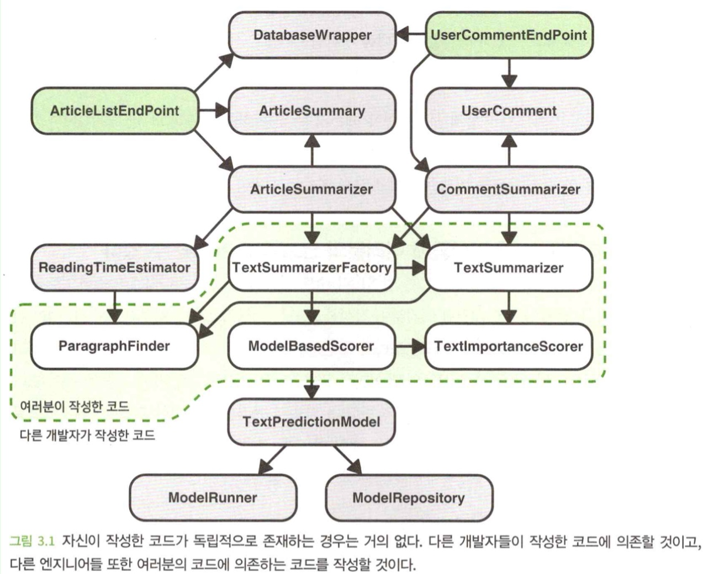
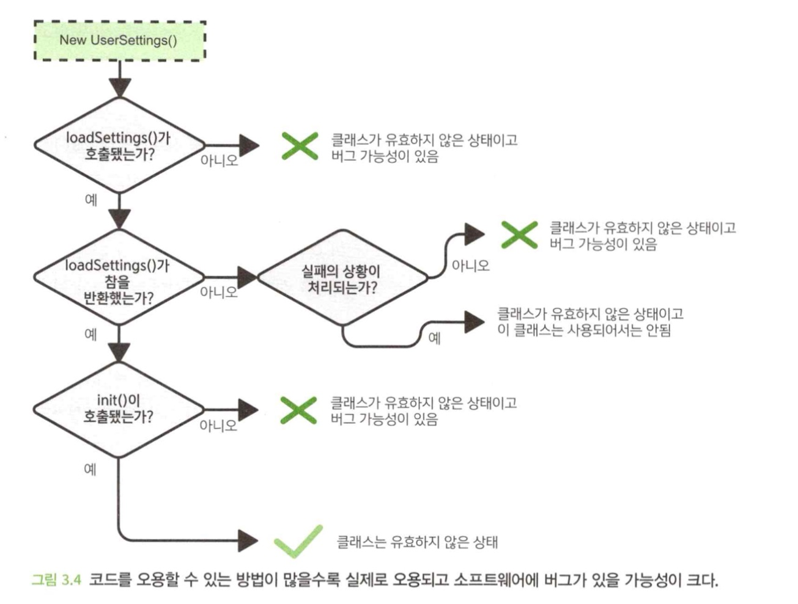
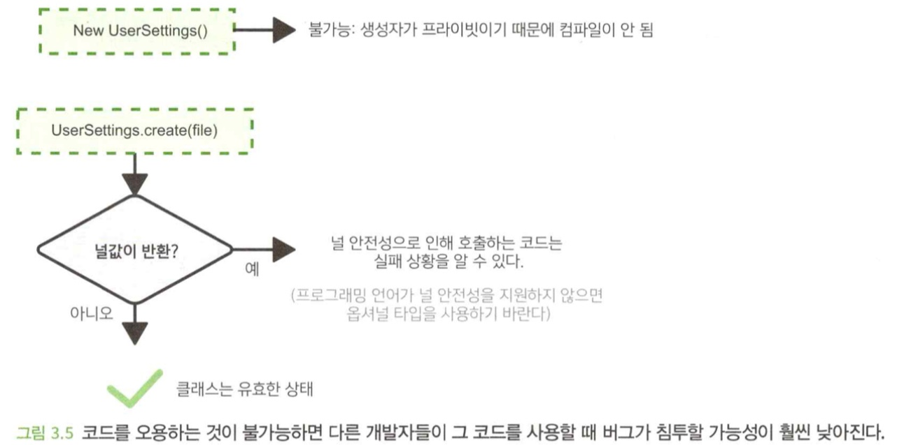

- 이 장에서 다루는 내용
  1. 다른 개발자들이 코드와 어떻게 상호작용하는지
  2. 코드 계약과 코드 계약의 세부 조항
  3. 세부 조항을 최소화하는 것이 어떻게 오용과 예측을 벗어나는 코드를 예방하는 데 도움이 되는지
  4. 세부 조항을 피할 수 없다면 체크와 어서션을 어떻게 사용할 수 있는가?

</br>

# 1. 자신의 코드와 다른 개발자의 코드
- 내가 작성한 코드가 여러 곳에서 **재사용** 될 수 있다.
  - 아래 그림은 텍스트 요약 코드가 어떻게 소프트웨어에 사용되는지 보여주는데, 여러 곳에서 재사용 되고 있다.



- **요구사항**은 항상 변하고 있다.
- 부서지기 쉬운 물건(코드)은 바쁜 장소(활동이 활발하게 일어나는 코드 베이스)에 둘 수 없다.
  - 다른 개발자들이 활발하게 코드를 변경하더라도, 코드의 품질이 유지되려면 **코드가 튼튼하고 사용하기 쉬워야 한다**.
  - **고픔질 코드**를 작성할 때 가장 중요한 고려 사항 중 하나는 다른 개발자가 **변경**하거나 코드와 **상호작용**할 때 발생할 수 있는 문제는 없는지, 또 발생한다면그 문제를 어떻게 완화할 수 있을지를 이해하고 선제적으로 조치하는 것이다.
- 다른 개발자들을 고려하지 않고는 고품질의 코드를 작성할 수 없다.
- 아래 세 가지는, 코드를 작성할 때 고려하면 유용한 것들이다.

## 1.1 자신에게 분명하다고 해서 다른 사람에게도 분명한 것은 아니다.
- 자신의 로직에 너무 익숙해서, 로직에 대해 모든것이 보일 수 있다.
- 하지만 어느 시점에 이르면 다른 개발자가 여러분이 작성한 코드와 상호작용하거나, 여러분의 코드를 변경하거나, 여러분의 코드가 의존하고 있는 코드를 변경해야 할 수도 있다는 것을 기억해야 한다.
- 이것을 항상 고려하고 코드가 어떻게 사용되어야 하는지, 무엇을 하는지, 그리고 왜 그 일을 하고 있는지 설명하는 것이 유용하다.

## 1.2 다른 개발자는 무의식중에 여러분의 코드를 망가뜨릴 수 있다.
- 여러분이 작성한 코드는 독립적으로 존재하지 않는다.
- 여러분의 코드를 기반으로 계속해서 변화하는 코드 역시 끊임없이 작성된다.
- 코드의 사용자는 그 코드가 왜 존재하는지, 혹은 무슨 일을 수행하는지에 대한 **사전 지식**을 가지고 있지 않을 수 있다.
- 다른 개발자의 코드 변경으로 인해 여러분 자신의 코드가 작동하지 않거나 오용하는 결과를 가져온다면, 그 코드는 이 문제가 해결되기 전까지 코드베이스에 병합되면 안 된다.

## 1.3 시간이 지나면 자신의 코드를 기억하지 못한다.
- 1~2년 전에 작성한 코드를 다시 들여다보는 일은 다른 사람이 작성한 코드를 보는 것과 크게 다르지 않다.

</br>

# 2. 여러분이 작성한 코드의 사용법을 다른 사람들은 어떻게 아는가?
- 여러분의 코드를 사용하거나, 여러분의 코드에 의존하는 코드를 수정할 때 다음과 같은 사항을 이해할 필요가 있다.

1. 여러 가지 상황에서 어떤 함수를 호출해야 하는지
2. 클래스가 무엇을 나타내는지 그리고 언제 사용되어야 하는지
3. 어떤 값을 인수로 사용해야 하는지
4. 코드가 수행하는 동작이 무엇인지
5. 어떤 값을 반환하는지

- 여러분이 작성한 코드를 어떻게 사용해야 하는지 알아내기 위해 다른 개발자가 할 수 있는 일은 다음과 같다.

1. 함수, 클래스, 열거형 등의 이름을 살펴본다.
2. 함수와 생성자의 매개변수 유형 또는 반환값의 유형 같은 데이터 유형을 살펴본다.
3. 함수/클래스 수준의 문서나 주석문을 읽어본다.
4. 직접 와서 묻거나 채팅/이메일을 통해 문의한다.
5. 여러분이 작성한 함수와 클래스의 자세한 구현 코드를 읽는다.

## 2.1 이름 확인
- 패키지, 클래스, 함수의 이름을 **책의 목차**라고 생각할 수 있다.
- 자신의 코드를 다른 개발자가 어떻게 사용해야 하는지에 대해 가장잘 전달할 수 있는 방법 중 하나는 **이름을 잘 짓는 것**이다.

## 2.2 데이터 유형 확인
- 컴파일이 필요한 정적 유형의 언어에서는 데이터 유형을 인식하고 올바르게 사용해야 한다.

## 2.3 문서 읽기
- 문서를 읽지 않을 수도 있고, 잘못 해석할수도 있고, 업데이트 되지 않을 수 있기 때문에 100% 신뢰하기 어렵다.
- 문서의 형태는 다음과 같은 것들이 있다.
  - 함수 및 클래스 수준의 비공식적인 주석문
  - 자바독(`JavaDoc`)과 같은 좀 더 공식적인 코드 내 문서
  - 외부 문서(`README.md`, 웹페이지, 지침문서 등)

## 2.4 직접 물어보기
- 코드를 작성한지 얼마 안 되었을 때만 유효한 방식이다.
- 서로의 시간이 필요하고, 설령 그 개발자가 없다면 불가능한 방식이다.

## 2.5 코드를 살펴보는 것
- 실용적이지 않고, 코드의 양이 많으면 효과를 얻기 어렵다.
- 코드를 사용하는 방법을 알기 위해 개발자가 구현 세부 사항을 읽어야 한다면, 이는 분명히 추상화 계층의 많은 이점을 부정하는 것이 된다.

</br>

# 3. 코드 계약
- `계약에 의한 프로그래밍` : 다른 사람들이 어떻게 코드를 사용할지, 코드가 무엇을 할 것으로 기대할 수 있는지에 대한 것
- 서로 다른 코드 간의 상호작용을 마치 계약처럼 생각한다.
- 코드의 계약에 대한 용어를 세 가지 범주로 나눈다.
  - `선결 조건` : 코드를 호출하기 전에 사실이어야 하는 것
  - `사후 조건` : 코드가 호출된 후에 사실이어야 하는 것
  - `불변 사항` : 코드가 호출되기 전과 후에 시스템 상태를 비교해서 변경되지 않아야 하는 사항
- 개발자가 계약의 일부 혹은 모든 조건을 알지 못하면 코드 계약에 문제가 발생한다.

## 3.1 계약의 세부 조항
- **계약의 명확한 부분**
  - 함수와 클래스 이름
  - 인자 유형
  - 반환 유형
  - 검사 예외
- **세부 조항**
  - 주석문과 문서
  - 비검사 예외
- 코드 계약에서 조건을 명백하게 하는 것이 세부 조항을 사용하는 것보다 훨씬 낫다.
- 사람들은 세부 조항을 읽지 않는 경우가 많으며, 읽더라도 대충 훑어 본다.
- 문서화는 업데이트가 잘 되지 않을 확률이 크다.

## 3.2 세부 조항에 너무 의존하지 말라
- 세부 조항에 너무 많이 의존하면 오용하기 쉬운 취약한 코드가 될 가능성이 크고, 예상과 다르게 동작하기 쉽다.
- 문서화는 좋지만, 너무 많은 의존을 하지 않는 것이 좋다.
- 세부 조항이 많으면, 이 코드의 사용자는 모든 세부 조항을 알고 있어야 하고, 코드를 오용할 수 있는 방법이 많아진다.



### 세부 조항을 제거하는 방법
- 코드가 오용되거나 잘못 설정되면 컴파일조차 되지 않도록 하는 것이 목표다.

```java
class UserSettings {
  
  private UserSettings() {...} //생성자 제한

  static UserSettings? create(File location) {
    UserSettings settings = new UserSettings();
    if (!settings.loadSettings(location)) {
      return null; //인스턴스 사용 불가
    }
    settings.init();
    return settings;
  }

  private Boolean loadSettings(File location) {...} //private 제한

  private void init() {...}

  Color? getUiColor() {...} 
  //반환 값이 null이면 사용자가 선택하지 않은 의미
}
```

- `상태`나 `가변성`이 외부로 노출되는 것을 없애는 것이 좋다.



</br>

# 4. 체크 및 어서션
- 컴파일러를 사용하여 코드 계약을 확인하는 것에 대한 대안으로, `런타임 검사`를 사용할 수 있다.
- 컴파일 타임 확인만큼 강력하지 않다.(발생하는 문제에 대한 테스트에 의존하기 때문이다.)

## 4.1 체크
- 코드 계약이 준수되었는지 확인하기 위한 추가적인 로직이며, 준수되지 않을 경우 체크는 실패를 유발하는 오류를 생성하는데, 이 실패는 명백해서 놓치고 넘어가는 것이 불가능하다.
- 체크는 시행 중인 계약 조건에 따라 다음과 같은 범주로 구분된다.
  - `전제 조건 검사` : 입력 인수가 올바르거나, 초기화가 수행되었거나, 일부 코드를 실행하기 전 시스템이 유효한지
  - `사후 상태 검사` : 반환 값이 올바르거나, 일부 코드를 실행한 후 시스템이 유요한지

```java
class UserSettings {

  UserSettings() {...}

  bool loadSettings(File location) {...}

  void init() {
    if (!haveSettingsBeenLoaded()) {
      throw new StateException("Settings not loaded");
    }
    ...
  }

  Color? getUiColor() {
    if (!hasBeenInitialized()) {
      throw new StateException("Settings not initialized");
    }
    ...
  }
  ...
}
```

- 오용을 불가능하게 만드는 해결책보다는 이상적이지 않다.
- 경우에 따라 코드 계약에서 세부 조항을 피할 수 없으며, 이때는 **계약이 준수되는지 확인**하기 위해 체크를 추가하는 것이 좋다.
- 가능하다면 처음부터 세부 조항은 피하는 것이 바람직하다.

## 4.2 어서션
- 체크와의 차이점은, 배포를 위해 빌드할 때 어서션은 **보통 컴파일에서 제외**된다는 점이며, 이는 "코드가 실제 서비스 환경에서 사용될 때 실패를 명확하게 보여주지 않는다는 것"을 의미한다.
- 배포시 컴파일하지 않는 이유는, `성능 향상을 위해`, `코드 오류 발생률을 낮추기 위해`다.

```java
class UserSettings {
  ...

  Color? getUiColor() {
    assert(hasBeenInitialized(), "UserSetting가 초기화되지 않음");
  }
}
```

</br>

# 요약
- 코드베이스는 계속 변하고 일반적으로 여러 개발자에 의해 변경된다.
- 다른 개발자가 어떻게 코드를 해석하고 오용할 수 있을지 생각해보고, 이러한 가능성을 최소화하거나 오용이 불가능하게 만드는 방식으로 코드를 작성하는 것이 유용하다.
- 코드를 작성할 때 일종의 코드 계약이 항상 만들어진다. 여기에는 명백한 항목이나 세부 조항과 같은 내용이 포함될 수 있다.
- 코드 계약의 세부 조항은 다른 개발자가 계약을 준수하도록하기 위한 방법이지만 신뢰할만한 방법은 아니다. 보통 더 나은 접근법은 명백한 항목으로 계약의 내용을 전달하는 것이다.
- 일반적으로 컴파일러를 사용하여 계약을 확인하는 것이 가장 신뢰할 수 있는 방법이다. 이것이 가능하지 않을 때, 체크나 어서션을 사용하여 실행 시간에 계약을 확인할 수 있다.
