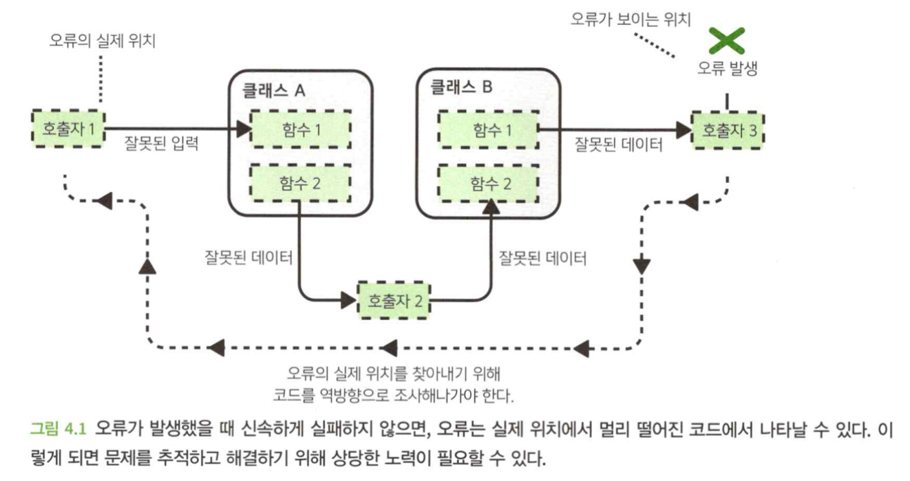
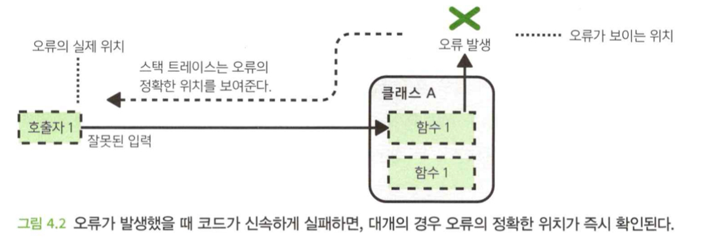
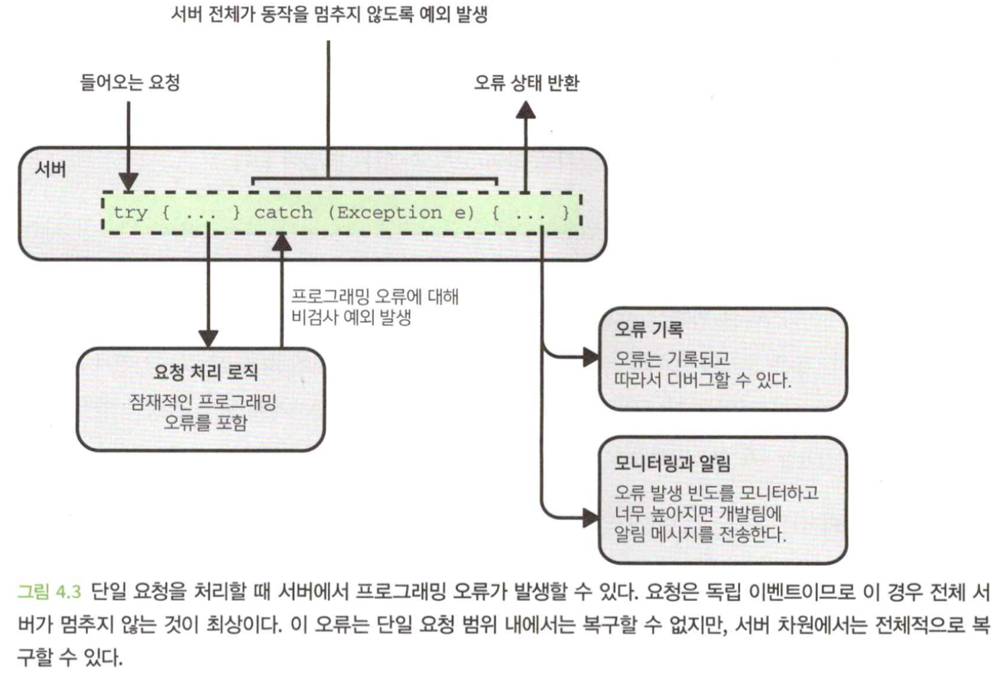
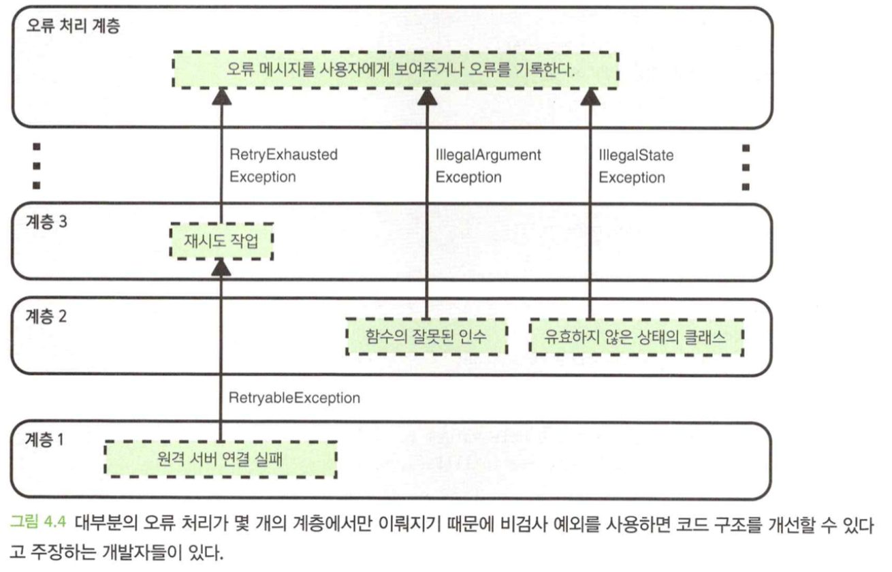
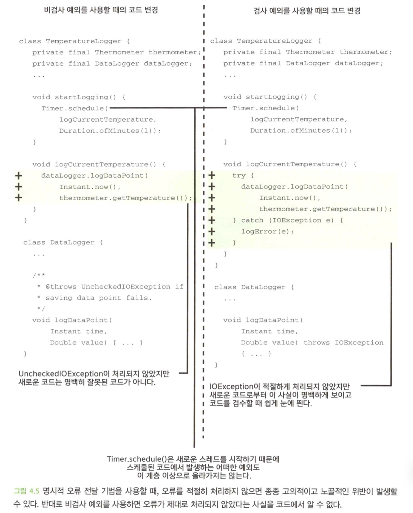

- 이 장에서 다루는 내용
  1. 시스템이 복구할 수 있는 오류와 복구할 수 없는 오류의 구분
  2. 신속하게 실패하고 분명하게 실패함
  3. 오류를 전달하기 위한 다양한 기법과 선택을 위한 고려 사항

</br>

# 0. Intro
- 코드가 실행되는 환경은 불완전하다.
- 모든 것이 잘못될 수 있고 잘못될 것이기 때문에 오류 사례를 신중하게 생각하지 않고는 견고하고 신뢰성 높은 코드를 작성할 수 없다.

</br>

# 1. 복구 가능성

## 1.1 복구 가능한 오류
- 치명적이지 않은 오류로, 오류가 발생하더라도 사용자는 알아채지 못하도록 적절하게 처리한다면 작동을 계속하 수 있는 합리적인 방법이 된다.
- `잘못된 사용자 입력` : 사용자 입력값이 유효하지 않다는 오류 메시지를 제공하고 올바른값을 입력하도록 요청한다.
- `네트워크 오류` : 의존하는 서비스와 연결할 수 없는 경우, 기다렸다 시도하거나 사용자에게 네트워크 연결 확인을 요청한다.
- `중요하지 않은 작업 오류` : 통계를 기록하는 부분에서 오류가 나면, 계속 실행해도 무방하다.
- 일반적으로 시스템 외부의 무언가에 의해 야기되는 오류는 오류가 일어날 것이라고 적극적으로 예상해야 하는 오류이기 때문에, 대부분 시스템 전체가 표나지 않고 적절하게 처리하기 위해 노력해야 한다.

## 1.2 복구할 수 없는 오류
- 오류가 발생하고 시스템이 오류를 복구할 수 있는 합리적인 방법이 없는 오류이다.
- 보통은 개발자가 코드의 어느 부분에서 뭔가를 망쳐놓았을 때 발생한다.
- 오류를 복구할 수 없다면, 유일하게 코드가 할 수 있는 합리적인 방법은 피해를 최소화하고 개발자가 문제를 발견하고 해결할 가능성을 최대화 하는 것이다.(신속한 실패, 요란한 실패)

## 1.3 호출하는 쪽에서만 오류 복구 가능 여부를 알 때가 많다.
- 대부분의 오류는 다른 코드를 호출할 때 발생하는데, 자신이 작성한 코드를 호출하는 것과 관련해 다음 사항을 신중하게 고려해야 한다.
  - 오류로부터 복구하기를 호출하는 쪽에서 원하는가?
  - 만약 그렇다면 오류를 처리할 필요가 있다는 것을 호출하는 쪽에서는 어떻게 알 수 있을까?
- 간결한 추상화 계층을 만들려면, 일반적으로 코드의 잠재적 호출자에 대한 가정을 가능한 한 하지 않는 것이 좋다.

```java
PhoneNumber getHeadOfficeNumber() {
    return PhoneNumber.parse("010aaa0101");
} //복구할 수 없는 오류

PhoneNumber getUserPhoneNumber(UserInput input) {
    return PhoneNumber.parse(input.getPhoneNumber());
} //전화번호는 프로그램이 복구할 수 있고, 복구해야 하는 오류
```

- 다음 중 하나라도 해당되는 경우, 함수에 제공된 값으로 인해 발생하는 오류는 **호출하는 쪽에서 복구하고자 하는 것으로 간주**해야 한다.
  - 함수가 어디서 호출될지 그리고 호출 시 제공되는 값이 어디서 올지 정확한 지식이 없다.
  - 코드가 미래에 재사용될 가능성이 아주 희박하다. 재사용이 된다면 코드가 어디에서 호출되고 값이 어디서 오는지에 대한 가정이 의미가 없어질 수 있음을 뜻한다.
- 특정 입력이 유효하지 않다는 사실이 코드 계약의 세부 조항에 깊이 감추어져 있다면 다른 개발자가 이를 놓칠 가능성이 크다.

## 1.4 호출하는 쪽에서 복구하고자 하는 오류에 대해 인지하도록 하라.
- 다른 코드가 자신의 코드를 호출할 경우, 호출시 오류가 발생한다는 것을 사전에 알 수 있는 실질적인 방법이 없는 경우가 많다.
- 예를들면, 코드 사용자가 전화번호에 대한 지식이 없을수도 있으므로 함수의 작성자는 이 함수에서 오류가 발생할 수 있다는 가능성을 **호출하는 쪽에서 확실하게 인지하도록** 해야 한다.


</br>

# 2. 견고성 vs 실패
- 오류가 발생할 때, 다음 중 하나를 선택해야 한다.
  - 실패. **더 높은 코드 계층이 오류를 처리**하게 하거나 **전체 프로그램의 작동을 멈추게** 한다.
  - **오류를 처리**하고 계속 진행한다.

## 2.1 신속하게 실패하라
- 코드가 이상하게 작동하거나 오류를 발생하는 것이 바로 코드가 우리에게 짖는 것이다.
- `신속하게 실패하기`는 가능한 한 문제의 실제 발생 지점으로부터 가까운 곳에서 오류를 나타내는 것이다.
- 복구할 수 있는 오류의 경우 호출하는 쪽에서 오류로부터 훌륭하고 안전하게 복구할 수 있는 기회를 최대한으로 제공하고, 복구할 수 없는 오류의 경우 개발자가 문제를 신속하게 파악하고 해결할 수 있는 기회를 최대한 제공한다.
- 두 경우 모두 소프트웨어가 의도치 않게 **잠재적으로 위험한 상태**가 되는 것을 방지한다.



- 오류를 발견하기 위해 역방향으로 코드를 찾는 노력을 많이 기울여야 한다.



- 신속하게 실패하면 상황을 상당히 개선할 수 있다.

## 2.2 요란하게 실패하라
- 버그가 있다는 사실을 알지 못하면 고칠 수 있는 방법이 없다.
- 요란한 실패는 오류가 발생하는데도 불구하고 아무도 모르는 상황을 막고자 하는 것이다.
- 코드가 실패할 때 신속하고, 요란하게 오류를 나타내면 개발 도중이나 테스트하는 동안에 버그가 발견될 가능성이 크다.
- 그렇지 않더라도 배포된 후에 오류 보고를 보기 시작할 것이고 보고 내용으로부터 버그가 발생한 위치를 정확히 알 수 있는 이점이 있다.

## 2.3 복구 가능성의 범위
- 복구할 수 있는 또는 복구할 수 없는 범위는 달라질 수 있다.
- 가장 요란스럽게 실패하는 것은 프로그램이 멈추도록 하는 것이지만, 이것은 분명 소프트웨어를 견고하지 못하게 만든다.
- 이에 대한 해결책은 프로그래밍 오류가 발견되면 개발자가 이를 알아차릴 수 있도록 프로그래밍 오류를 기록하고 모니터링하는것이다.



- 프로그램의 더 높은 계층으로 신호를 보내는 대신 모든 유형의 오류를 기록하는 것은 극도로 주의해야 한다.
- 오류를 전달하는 대신 기록만 하면오류가 숨겨져 문제가 발생할 수 있다.

## 2.4 오류를 숨기지 않음
- 독립적이지 않거나, 중요하거나, 낮은 계층에서 오류가 발생함에도 불구하고 계속 진행하면 소프트웨어가 의도한 대로 작동하지 않는 경우가 많다.
- 복구할 수 있는 오류던, 복구할 수 없는 오류던 오류를 숨기지 말아야 한다.

### 기본값 반환
- 기본값 반환의 문제점은 오류가 발생했다는 사실을 숨긴다는 것이다.
- 호출하는 쪽에선 오류가 숨어 모든 것이 정상적인 것처럼 계속 진행한다는 것을 의미한다.
- 아래 코드에선 기본값을 0으로 반환하여 오류가 숨겨지고, 고객의 잔액이 실제로 0인 경우와 구별할 수 없다.

```java
class AccountManager {
    private final AccountStore accountStore;
    ...

    Double getAccountBalanceUsd(Int customerId) {
        AccountResult result = accountStore.lookup(customerId);
        if (!result.success()) {
            return 0.0;
        }
        return result.getAccount().getBalanceUsd();
    }
}
```

### 널 객체 패턴
- 지불이 안된 송장으로 인해 이 고객은 수천달러의 미결제액이 있음에도 불구하고 감사 실행 당일 `InvoiceStore`가 다운된다면, 함수를 호출하는 쪽에서 해당 고객은 미지불된 송장이 없다고 생각한다.

```java
class InvoiceManager {
    private final InvoiceStore invoiceStore;
    ...

    List<Invoice> getUnpaidInvoices(Int customerId) {
        InvoiceResult result = invoiceStore.query(customerId);
        if (!result.success()) {
            return [];
        }
        return result
            .getInvoices()
            .filter(invoice -> !invoice.isPaid());
    }
}
```

### 아무것도 하지 않음
- 호출하는 쪽에서는 코드에서 작업이 의도대로 완료되었다고 가정하기 때문에 좋지 않다.
- 정신 모델과 코드가 실제로 수행하는 것 사이의 불일치를 일으킬 가능성이 매우 높다.

```java
class MutableInvoice {
    ...
    void addItem(InvoiceItem item) {
        if (item.getPrice().getCurrency() != this.getCurrency()) {
            return;
        }
        this.item.add(item);
    }
    ...
}
```

- 아래 코드는 다른 코드가 전달하는 오류를 적극적으로 억제하는 코드다.

```java
class InvoiceSender {
    private final EmailService emailService;
    ...

    void emailInvoice(String emailAddress, Invoice invoice) {
        try {
            emailService.sendPlainText(
                emailAddress,
                InvoiceFormat.plainText(invoice)
            );
        } catch (EmailException e) {
            //혹은 logger.logError(e);
        }
    }
}
```

</br>

# 3. 오류 전달 방법
- 오류가 발생하면 일반적으로 더 높은 계층으로 오류를 알려야 한다.
- 오류를 알리는 방법은 크게 두 가지 종류가 있다.(코드를 사용하는 개발자 관점)
  - `명시적 방법` : 코드를 직접 호출한 쪽에서 오류가 발생할 수 있음을 인자할 수밖에 없도록 한다.
  - `암시적 방법` : 코드를 호출하는 쪽에 오류를 알리지만, 호출하는 쪽에서 그 오류를 신경 쓰지 않아도 된다. 오류가 발생할 수 있음을 알기 위해 문서나 코드를 읽는 적극성이 필요하다.
- 호출하는 쪽에서 알아야 할 경우를 인지하게끔 하거나 할 수 있는 것이 아무것도 없는 상황이라면 이런 상황을 처리해야 하는 부담에서 벗어나게 하는 것이 좋다.


## 3.1 요약: 예외
- 거의 모든 언어에서 `예외`라는 용어는 일반적으로 `비검사 예외`를 의미한다.

## 3.2 명시적방법: 검사 예외
- 컴파일러는 검사 예외에 대해 호출하는 쪽에서 예외를 인지하도록 강제적으로 조치
- 호출하는 쪽에서는 예외 처리를 위한 코드를 작성하거나 자신의 함수 시그니처에 해당 예외발생을 선언해야 한다.

### 검사 예외를 사용한 오류 전달

```java
class NegativeNumberException extends Exception {
    private final Double erroneousNumber;

    NegativeNumberException(Double erroneousNumber) {
        this.erroneousNumber = erroneousNumber;
    }

    Double get ErroneousNumber() {
        return erroneousNumber;
    }
}

Double getSquareRoot(Double value) throws NegativeNumberException {
    if (value < 0.0) {
        throw new NegativeNumberException(value);
    }
    return Math.sqrt(value);
}
```

### 검사 예외 처리

```java
void displaySquareRoot() {
    Double value = ui.getInputNumber();
    try {
        ui.setOutput("Square root is : " + getSquareRoot(value));
    } catch (NegativeNumberExceptio e) {
        ui.setError("Can't get squre root of negative number: " + e.getErroneousNumber());
    }
}

void displaySquareRoot() throws NegativeNumberException {
    Double value = ui.getInputNumber();
    ui.setOutput("Square root is : " + getSquareRoot(value));
}
```

## 3.3 암시적 방법: 비검사 예외
- 다른 개발자들은 코드가 이 예외를 발생시킬 수 있다는 사실을 전혀 모를 수 있다.
- 오류를 암시적으로 알리는 방법이다.

### 비검사 예외를 사용한 오류 전달

```java
class NegativeNumberException extends RuntimeException {
    private final Double erroneousNumber;

    NegativeNumberException(Double erroneousNumber) {
        this.erroneousNumber = erroneousNumber;
    }

    Double get ErroneousNumber() {
        return erroneousNumber;
    }
}

/**
 * @throws NegativeNumberException 값이 음수일 경우 
 */
Double getSquareRoot(Double value) {
    if (value < 0.0) {
        throw new NegativeNumberException(value);
    }
    return Math.sqrt(value);
}
```

### 비검사 예외 처리

```java
void displaySquareRoot() {
    Double value = ui.getInputNumber();
    try {
        ui.setOutput("Square root is : " + getSquareRoot(value));
    } catch (NegativeNumberExceptio e) {
        ui.setError("Can't get squre root of negative number: " + e.getErroneousNumber());
    }
}

void displaySquareRoot() {
    Double value = ui.getInputNumber();
    ui.setOutput("Square root is : " + getSquareRoot(value));
}
```

## 3.4 명시적 방법: 널값이 가능한반환 유형

- 널값이 가능한 반환 유형을 사용하는 것은 오류를 전달하기 위한 명시적인 방법이다.

### 널값을 이용한 오류 전달
- 오류가 발생한 이유에 대한 정보를 제공하지 않기 때문에, 널값이 의미하는 바를 설명하기 위해 주석문이나 문서를 추가해야 한다.

```java
//제공되는 값이 음수이면 널을 반환한다.
Double? getSquareRoot(Double value) {
    if (value < 0.0) {
        return null;
    }
    return Math.sqrt(value);
}
```

### 널값 처리

```java
void displaySquareRoot() {
    Double? squreRoot = getSqureRoot(ui.getInputNumber());
    if (squreRoot == null) {
        ui.setError("Can't get squre root of a negative number");
    } else {
        ui.setOutput("Squre root is: " + squreRoot);
    }
}
```

## 3.5 명시적 방법: 리절트 반환 유형
- 리절트 유형으로 오류 정보를 전달할 수 있다.
- 아래는 간단한 리절트 유형이다.

```java
class Result<V, E> {
    private final Optional<V> value;
    private final Optional<E> error;

    private Result(Optional<V> value, Optional<E> error) {
        this.value = value;
        this.error = error;
    }

    static Result<V, E> ofValue(V value) {
        return new Result(Optional.of(value), Optional.empty());
    }

    static Result<V, E> ofError(E error) {
        return new Result(Optional.empty(), Optional.of(error));
    }

    Boolean hasError() {
        return error.isPresent();
    }

    V getValue() {
        return value.get();
    }

    E getError() {
        return error.get();
    }
}
```

### 리절트 유형을 이용한 전달

```java
class NegativeNumberError extends Error {
    private final Double erroneousNumber;

    NegativeNumberError(Double erroneousNumber) {
        this.erroneousNumber = erroneousNumber;
    }

    Double getErroneousNumber() {
        return erroneousNumber;
    }

    Result<Double, NegativeNumberError> getSquareRoot(Double value) {
        if (value < 0.0) {
            return Result.ofError(new NegativeNumberError(value));
        }
        return Result.ofValue(Math.sqrt(value));
    }
}
```

### 리절트 처리

```java
void displaySquareRoot() {
    Result<Double, NegativeNumberError> squareRoot = getSquareRoot(ui.getInputNumber());
    if (squreRoot.hasError()) {
        ui.setError("Can't get square root of a negative number: " + squreRoot.getError().getErroneousNumber());
    } else {
        ui.setOutput("Squre root is: " + squreRoot.getValue());
    }
}
```

## 3.6 명시적 방법: 아웃컴 반환 유형
- 아웃컴 반환 유형을 반환할 때 호출하는 쪽에서 반환값을 강제적으로 확인해야 한다면 이것은 오류를 알리는 명백한 방법이다.

### 아웃컴을 이용한 오류 전달

```java
Boolean sendMessage(Channel channel, String message) {
    if (channel.isOpen()) {
        channel.send(message);
        return true;
    }

    return false;
}
```

- 가능한 결과가 두 개 이상이면, 열거형을 사용하면 좋다.

### 아웃컴 처리

```java
void sayHello(Channel channel) {
    if (sendMessage(channel, "hello")) {
        ui.setOutput("Hello sent");
    } else {
        ui.setError("Unable to send hello");
    }
}
```

### 아웃컴이 무시되지 않도록 보장
- 아웃컴의 문제점 중 하나는 호출하는 쪽에서 반환값을 무시하거나 함수가 값을 반환한다는 사실조차 인식 못할 수 있다는 점이다.

```java
@CheckReturnValue
Boolean sendMessage(Channel channel, String message) {
    ...
}

void sayHello(Channel channel) {
    if (sendMessage(channel, "hello")) {
        ui.setOutput("Hello sent");
    } else {
        ui.setError("Unable to send hello");
    }
}
```

## 3.7 암시적 방법: 프로미스 또는 퓨처
- 비동기적으로 실행하는 코드를 작성할 때 `Promise`나 `Future`를 반환하는 함수를 작성하는 것이 일반적이다.
- `Promise`나 `Future`를 사용한 오류 전달은 암시적인 방법이다.

### Promise를 이용한 전달

```java
class NegativeNumberError extends Error {
    ...
}

Promise<Double> getSqureRoot(Double value) async {
    await Timer.wait(Duration.ofSeconds(1));
    if (value < 0.0) {
        throw new NegativeNumberError(value);
    }
    return Math.sqrt(value);
}
```

### Promise 처리

```java
void displaySqureRoot() {
    getSqureRoot(ui.getInputNumber())
        .then(squreRoot -> 
            ui.setOutput("Squre root is: " + squareRoot))
        .catch(error ->
            ui.setError("An error occured: " + error.toString()));
}
```

### 왜 Promise는 암묵적인 오류 전달 기법인가
- `catch()` 함수를 통해 콜백이 제공되지 않으면, 오류는 일부 상위 수준의 오류 처리 코드에 의해 포착되거나 완전히 눈에 띄지 않을 수 있다.

### Promise를 명시적으로 만들기
- 리절트 유형의 `Promise`를 반환하는 것이 한 가지 방법일 수 있다.

```java
Promise<Result<Double, NegativeNumberError>> getSqureRoot(
    Double value
) async {
    await Timer.wait(Duration.ofSeconds(1));
    if (value < 0.0) {
        return Result.ofError(new NegativeNumberError(value));
    }
    return Result.ofValue(Math.sqrt(value));
}
```

## 3.8 암시적인 방법: 매직값 반환
- 매직값이 반환될 수 있다는 것을 알려면 문서나 코드를 읽어야 하기 때문에 암시적 오류 전달 기법이다.

```java
//음수값이 입력으로 제공되면 -1을 반환한다.
Double getSqureRoot(Double value) {
    if (value < 0.0) {
        return -1.0;
    }
    return Math.sqrt(value);
}
```

</br>

# 4. 복구할 수 없는 오류의 전달
- 현실적으로 복구할 가능성이 없는 오류가 발생하면 신속하게 실패하고, 요란하게 실패하는 것이 최상의 방법이다.
  - 비검사 예외를 발생
  - 프로그램이 패닉이 되도록
  - 체크나 어서션의 사용

</br>

# 5. 호출하는 쪽에서 복구하기를 원할 수도 있는 오류의 전달
- 모범 사례와 관련해 소프트웨어 엔지니어 사이에서 일치된 의견이 없으므로 흥미로운 주제다.
- 여러분과 여러분의 팀이 동의한 철학이 다른 어떤 주장보다도 중요하다.

## 5.1 비검사 예외를 사용해야 한다는 주장

### 코드 구조 개선
- 대부분의 오류 처리가 코드의 상위 계층에서 이루어질 수 있기 때문에 비검사 예외를 발생시키면 코드 구조를 개선할 수 있다고 주장하는 개발자들이 있다.



- 이 접근법의 핵심장점은 오류를 처리하는 로직이 코드 전체에 퍼지지 않고 별도로 몇 개의 계층에만 있다는 점이다.

### 개발자들이 무엇을 할 것인지에 대해서 실용적이어야 함
- 일부에서는 개발자들이 너무 많은 명시적 오류 전달을 접하면 결국 잘못된 일을 한다고 주장한다.
- 초기에 오류가 없지만 작업의 양이 많아질 경우, 개발자들은 오류를 숨기고 예외를 숨기게 될 수 있다.

## 5.2 명시적 기범을 사용해야 한다는 주장

### 매끄러운 오류 처리
- 비검사 예외를 사용한다면 모든 오류를 매끄럽게 처리할 수 있는 단일 계층을 갖기가 어렵다.
- 암시적인 방식을 사용하면 개발자는 오류가 일어날 수 있다는 것을 알지 못하는데 하물며 그것을 어떻게 처리할 수 있을까?

### 실수로 오류를 무시할 수 없다.
- 좀 더 명확한 오류 전달 방식을 사용하면 잘못된 일이 기본적으로 혹은 실수로 인해 일어나지 않는다.



### 개발자들이 무엇을 할 것인지에 대해서 실용적이어야 함
- 비검사 예외가 코드베이스 전반에 걸쳐 제대로 문서화 된다는 보장이 없고, 개인적인 경험에 비추어 보면 문서화되지 않는 경우가 많다.
- 이는 종종 어떤 코드가 어떤 예외를 발생시킬 것인지 확실하게 알지 못한다는 것을 의미하고, 이로 인해 예외를 처리하는 것이 당황스러운 두더지 잡기 게임이 될 수 있다.
- 예외에 대해 `catch(Exception e)`처럼 모두 아우르는 방법은 바람직하지 않다.

## 5.3 필자의 의견: 명시적 방식을 사용하라
- 호출하는 쪽에서 복구하기를 원할 수도 있는 오류에 대해 비검사 예외를 사용하지 않는 것이 최상이라는 것이 필자의 의견이다.
- 문서화가 잘 되는 경우가 드물며, 오류에 대한 처리를 개발자가 확실하게 알기란 거의 불가능하다.


</br>

# 6. 컴파일러 경고를 무시하지 말라
- 컴파일러 경고는 어떤 식으로든 코드가 의심스러우면 표시를 하는데, 이것은 **버그에 대한 조기 경고**일 수 있다.
- 경고가 실제로 걱정할 것이 아닌 경우에는 일반적으로 특정 경고만 억제할 수 있는 방법을 사용한다.

</br>

# 요약
- 오류에는 크게 두 가지 종류가 있다.
  - 시스템이 복구할 수 있는 오류
  - 시스템이 복구할 수 없는 오류
- 해당 코드에 의해 생성된 오류로부터 복구할 수 있는지 여부를 해당 코드를 호출하는 쪽에서만 알 수 있는 경우가 많다.
- 에러가 발생하면 신속하게 실패하는 것이 좋고, 에러를 복구할 수 없는 경우에는 요란하게 실패하는 것이 바람직하다.
- 오류를 숨기는 것은 바람직하지 않을 때가 많으며, 오류가 발생했다는 신호를 보내는 것이 바람직하다.
- 오류 전달 기법은 두 가지 범주로 나눌 수 있다.
  - 명시적 방법 : 코드 계약의 명확한 부분. 호출하는 쪽에서는 오류가 발생할 수 있음을 인지한다.
  - 암시적 방법 : 코드 계약의 세부 조항을 통해 오류에 대한 설명이 제공되거나 전혀 설명이 없을 수도 있다. 오류가 발생할 수 있다는 것을 호출하는 쪽에서 반드시 인지하는 것은 아니다.
- 복구할 수 없는 오류에 대해서는 암시적 오류 전달 기법을 사용해야 한다.
- 잠재적으로 복구할 수 있는 오류에 대해서는
  - 명시적 혹은암시적 기법 중 어느 것을 사용할지에 대해서는 개발자들 사이에서도 일치되는 의견이 없다.
  - 필자의 의견으로는 명시적인 기법이 사용되어야 한다.
- 컴파일러 경고는 종종 코드에 문제가 있을 때 이에 대해 표시해준다. 이 경고에 주의를 기울이는 것이 바람직하다.
