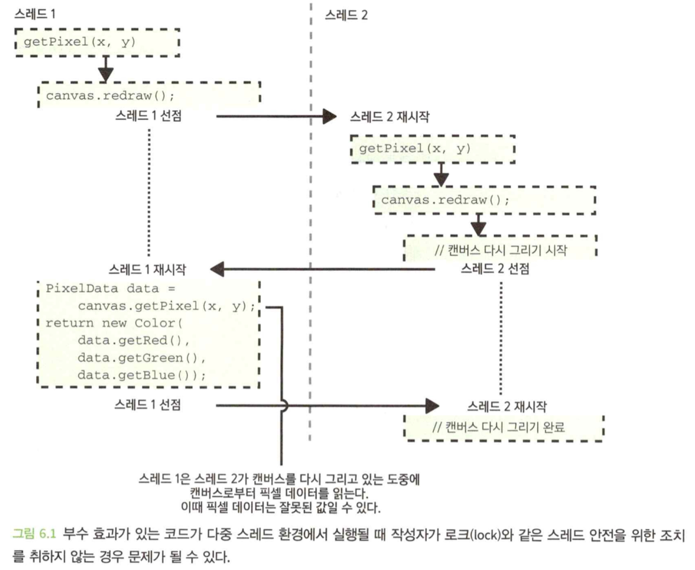

- 이 장에서 배우는 내용
  1. 코드가 어떻게 예측을 벗어나 작동할 수 있는지
  2. 소프트웨어에서 예측을 벗어나는 코드가 어떻게 버그로 이어질 수 있는지
  3. 코드가 예측을 벗어나지 않도록 보장하는 방법

</br>

# 0. Intro
- 궁극적으로 개발자는 코드를 사용하는 방법에 대한 정신모델을 구축한다.
- 코드가 실제로 하는일이 이 정신 모델과 일치하지 않는다면, 예측과 벗어나는 기분 나쁜일이 일어날 가능성이 크다.

</br>

# 1. 매직값을 반환하지 말아야 한다.
- 매직값의 일반적인 예는 값이 없거나 오류가 발생했음을 나타내기 위해 `-1`을 반환하는 것이다.
- 매직값은 함수의 정상적인 반환 유형에 들어맞기 때문에 이 값이 갖는 특별한 의미를 인지하지 못하고, 이에 대해 적극적으로 경계하지 않으면 정상적인 반환값으로 오인하기 쉽다.

## 1.1 매직값은 버그를 유발할 수 있다.
- 일반적으로 매직값을 반환하면 예측을 벗어날 위험이 있으므로 사용하지 않는것이 가장 바람직하다.

```java
class User {
    private final Int? age;

    Int getAge() {
        if (age == null) {
            return -1;
        }
        return age;
    }
}
```

- 호출자에게 명시적으로 알리지 않고 `-1`을 반환한다는 사실은 예측 못한 것이기 때문에 이 사실은 불쾌하고 놀라울 수 있다.
- 단위 테스트가 이 문제를 발견하지 못할 수 있다.

## 1.2 해결책: 널, 옵셔널 또는 오류를 반환하라.
- 함수에서 매직값을 반환할 때의 문제점은 호출하는 쪽에서 함수 계약의 세부 조항을 알아야 한다는 점이다.
- 값이 없을 수 있는 경우 이것이 코드 계약의 명백한 부분에서 확인할 수 있도록 하는 것이 훨씬 좋다.
- **널 안정성**은 호출하는 쪽에서 해당 함수가 널을 반환할 수 있다는 사실을 인식할 수밖에 없도록 만든다.

```java
class User {
    private final Int? age;

    Int? getAge() {
        return age;
    }
}
```

- 널 가능객체를 제공하는 언어에선 컴파일 시점에 오류를 발견할 수 있다.
- 널값이나 비어 있는 옵셔널을 반환하는 것의 단점은 값이 없는 이유를 명시적으로 전달하지 않는다는 점이다.

## 1.3 때때로 매직값이 우연히 발생할 수 있다.

```java
Int minValue(List<Int> values) {
    Int minValue = Int.MAX_VALUE;
    for (Int value in values) {
        minValue = Math.min(value, minValue);
    }
    return minValue;
}
```

- `Int.MAX_VALUE`를 반환할 때 적절한 기본 로직이 실행되지 않을 수도 있다.(ex. 최소점수를 계산 한 후 이 중에서 최소점수가 가장 높은 레벨이 가장 쉬운 레벨이라 결정할 때)
- 또한 `Int.MAX_VALUE`는 언어에 따라 값이 달라질 수 있다.
- 그리고 데이터베이스에 저장되는 경우 쿼리를 실행할 때 많은 혼란과 문제를 야기할 수 있다.
- 매직값보다는 널값이나 옵셔널을 반환하거나 오류 전달 기술을 사용하는 것이 간단하고 효과적인 대안이다.

</br>

# 2. 널 객체 패턴을 적절히 사용하라
- 널 객체 패턴을 사용하는 이유는 널값을 반환하는대신 유효한 값이 반환되어 그 이후에 실행되는 로직에서 널값으로 인해 시스템에 피해가 가지 않도록 하기 위함이다.
- 널 안정성을 지원하지 않는 언어를 사용하고 있다면 널 대신 옵셔널을 반환하면 된다.

## 2.1 빈 컬렉션을 반환하면 코드가 개선될 수 있다.

```java
Set<String> getClassNames(HtmpElement element) {
    String? attribute = element.getAttribute("class");
    if (attribute == null) {
        return new Set();
    }
    return new Set(attribute.split(" "));
}

Boolean isElementHighlighted(HtmlElement element) {
    return getClassNames(element).contains("highlighted");
}
```

- 호출하는 쪽의 코드는 간단해지고 코드가 예측을 벗어나는 동작을 할 가능성이 낮아진다.
- 그러나 좀 더 복잡한 상황에서는 널 객체 패턴을 사용하는 경우 예측을 벗어나는 작동을 할 위험이 커지는 반면 이점은 적어질 수 있다.

## 2.2 빈 문자열을 반환하는 것도 때로는 문제가 될 수 있다.

### 문자들의 모음으로서의 문자열
- 문자열이 단지 문자를 모아 놓은 것에 불과하고, 코드에서 그 외의 별다른 의미가 없다면 문자열이 없을 때 널 객체 패턴을 사용하는 것, 즉 널 대신 빈 문자열을 반환하는 것은 일반적으로 문제가 없다.

```java
class UserFeedback {
    private String? additionalComments;

    String getAdditionalComments() {
        if (additionalComments == null) {
            return "";
        }
        return additionalComments;
    }
}
```

### ID로서의 문자열
- 문자열이 ID로 사용되는 경우, 이런 상황에서는 문자열이 없는지를 파악하는 것이 중요할수 있는데 이에 따라 실행할 논리에 영향을 미칠 수 있기 때문이다.
- 그러므로 문자열이 없을 수 있음을 함수를 호출하는 쪽에서 명시적으로 인식하도록 하는 것이 중요하다.

```java
class Payment {
    private final String? cardTransactionId;

    String? getCardTransactionId() {
        return cardTransactionId;
    }
}
```

## 2.3 더 복잡한 널 객체는 예측을 벗어날 수 있다.
- 널 객체 패턴을 사용하는 방법을 주의하지 않으면, 물건을 샀는데 빈 상자만 사는것과 동일하다.

```java
class CoffeeMug {
    CoffeeMug(Double diameter, Double height) {...}

    Double getDiameter() {...}
    Double getHeight() {...}
}

class CoffeeMugInventory {
    private final List<CoffeeMug> mugs;

    CoffeeMug getRandomMug() {
        if (mugs.isEmpty()) {
            return new CoffeeMug(diameter: 0.0, height: 0.0);
        }
        return mugs[Math.randomInt(0, mugs.size())];
    }
}
```

- `mugs.isEmpty()`에 예상을 벗어나는 결과를 초래할 가능성이 있다.
- 무작위로 선택할 수 있는 머그잔이 없는 경우 `getRandomMug()`에서 널을 반환하는 것이 더 나을 수 있다.

```java
CoffeeMug? getRandomMug(List<CoffeeMug> mugs) {
    if (mugs.isEmpty()) {
        return null;
    }
    return mugs[Math.randomInt(0, mugs.size())];
}
```

## 2.4 널 객체 구현은 예상을 벗어나는 동작을 유발할 수 있다.
- 일부 개발자들은 널 객체 패턴에서 한 단계 더 나아가 널 객체 전용의 인터페이스나 클래스를 정의한다.

```java
interface CoffeeMug {
    Double getDiameter();
    Double getHeight();
    void reportMugBroken();
}

class CoffeeMugImpl implements CoffeeMug {
    override Double getDiameter() {return diameter;}
    override Double getHeight() {return height;}
    override void reportMugBroken() {...}
}

class NullCoffeeMug implements CoffeeMug {
    override Double getDiameter() {return 0.0;}
    override Double getHeight() {return 0.0;}
    override void reportMugBroken() {
        //아무 일도 하지 않는다.
    }
}
```

```java
CoffeeMug getRandomMug(List<CoffeeMug> mugs) {
    if (mugs.isEmpty()) {
        return new NullCoffeeMug();
    }
    return mugs[Math.randomInt(0, mugs.size())];
}
```

- 위 코드는 호출하는 쪽에서 이 내용을 확인하고 싶어할지가 전혀 명확하지 않기 때문에 그다지 큰 개선 사항은 아니다.
- 호출하는 쪽에서 `NullCoffeeMug`의 인스턴스인지 확인하도록 요구하는 것은 어색하고 널을 확인하는 것 보다 더 번거로울 수 있다.

</br>

# 3. 예상치 못한 부수 효과를 피하라.
- 부수 효과(Side Effect)는 어떤 함수의 호출이 함수 외부에 초래한 상태 변화를 의미한다.
- 예상치 못한 부수 효과를 일으키는 것을 피하는 좋은 방법 중 하나는 애초에 부수 효과가 일어나지 않도록 하는 것이다.

## 3.1 분명하고 의도적인 부수 효과는 괜찮다.

```java
class Userdisplay {
    private final Canvas canvas;

    void displayErrorMessage(String message) {
        canvas.drawText(message, Color.RED);
    }
}
```

- 오류 메시지로 캔버스를 업데이트하는 것은 호출하는 쪽에서 원하고 예상하는 바이다.

## 3.2 예기치 않은 부수 효과는 문제가 될수 있다.

```java
class UserDisplay {
    private final Canvas canvas;

    Color getPixel(Int x, Int y) {
        canvas.redraw();
        PixelData data = canvas.getPixel(x, y);
        return new Color(
            data.getRed(),
            data.getGreen(),
            data.getBlue()
        );
    }
}
```

- 위 코드는 픽셀 생상을 읽기 전에 캔버스를 다시 그리는 동작을 수행한다.(부수 효과)

### 부수 효과는 비용이 많이 들 수 있다.
- `redraw()`를 호출할 때마다 시스템이 멈춘것처럼 보일 수 있다.

### 호출한 쪽의 가정을 깨트리기
- 캔버스를 다시 그리는 것은 비용이 크지 않더라도, 이를 사용하는 개발자는 부수효과가 없을 것이라 생각하기 때문에 버그를 일으킬 수 있다.

### 다중 스레드 코드의 버그
- 스레드가 동시에 호출되면, 다른 스레드가 읽으려고 할 때 스크린샷이 끊어질 수 있다.



- 다중 스레드는 디버그하기도 힘들다.

## 3.3 해결책: 부수 효과를 피하거나 그 사실을 분명하게 하라
- 부수효과를 일으키는 코드가 정말 필요한지 생각 해 봐야 한다.
- 혹은 이름을 `redrawAndGetPixel()`처럼 부수효과가 발생할 것이라는 점을 분명히 하는 것이 좋다.
- 어떤 함수가 부수효과를 일으킨다면, 그 함수를 호출하는 쪽에서 이 사실에 대해 명백하게 알 수 있도록 하는 책임이 함수의 작성자에게있다.

</br>

# 4. 입력 매개변수를 수정하는 것에 주의하라.
