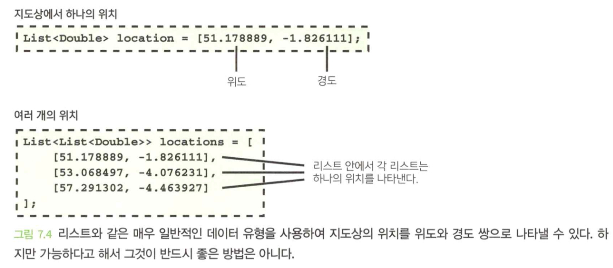
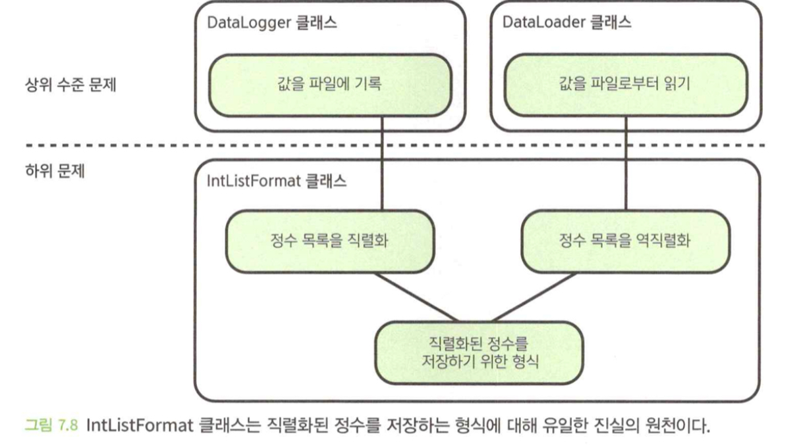

- 이 장에서 배우는 내용
  1. 코드 오남용으로 인해 버그가 발생하는 방식
  2. 코드를 오용하기 쉬운 흔한 방식
  3. 코드를 오용하기 어렵게 만드는 기술

</br>

# 1. 불변 객체로 만드는 것을 고려하라
- **가변 객체**는 다음과 같은 문제를 일으킬 수 있다.
  - 잘못된 설정이 쉽게 이루어 질 수 있다.
  - 예상을 벗어나는 동작을 초래할 수 있다.
  - 가변 객체는 추론하기 어렵다
  - 가변 객체는 다중 스레드에서 문제가 발생할 수 있다.
- 가변적인 객체는 코드의 복잡성을 늘리고 문제를 일으킬 수 있기 때문에, 기본적으로는 불변적인 객체를 만들되 필요한 곳에서만 가변적이 되도록 하는 것이 바람직하다.

## 1.1 가변 클래스는 오용하기 쉽다.
- 클래스를 가변적으로 만드는 가장 일반적인 방법은 `setter`를 제공하는 것이다.

```java
class TextOptions {
    private Font font;
    private Double fontSize;

    TextOptions(Font font, Double fontSize) {
        this.font = font;
        this.fontSize = fontSize;
    }

    void setFont(Font font) {
        this.font = font;
    }
    ...
}
```

- `TextOptions` 클래스는 가변적이기 때문에 해당 인스턴스를 전달받는 모든 코드는 이 객체를 변경할 수 있고 이로 인해 오용의 위험성이 있다.

## 1.2 해결책: 객체를 생성할 때만 값을 할당하라

```java
class TextOptions {
    private final Font font;
    private final Double fontSize;

    TextOptions(Font font, Double fontSize) {
        this.font = font;
        this.fontSize = fontSize;
    }
    ...
}
```

## 1.3 해결책: 불변성에 대한 디자인 패턴을 사용하라

### 빌더 패턴
- 빌더 패턴은 한 클래스를 두 개로 나누는 효과를 갖는다.
  - 값을 하나씩 설정할 수 있는 빌더 클래스
  - 빌더에 의해 작성된 불변적인 읽기 전용 클래스

```java
class TextOptions {
    private final Font font;
    private final Double? fontSize;

    TextOptions(Font font, Double fontSize) {
        this.font = font;
        this.fontSize = fontSize;
    }
    ...
}

class TextOptionBuilder {
    private final Font font;
    private Double? fontSize;

    TextOptionsBuilder(Font font) {
        this.font = font;
    }

    TextOptionsBuilder setFontSize(Double fontSize) {
        this.fontSize = fontSize;
        return this;
    }

    TextOptions build() {
        return new TextOptions(font, fontSize);
    }
}
```


```java
TextOptions getDefaultTextOptions() {
    return new TextOptionsBuilder(Font.ARIAL)
        .setFontSize(12.0)
        .build();
}
```

- 빌더 패턴 구현시 유지 관리를 위한 방법
  1. 더 나은 네임스페이스를 위한 내부 클래스 사용
  2. `toBuilder()` 함수를 통해 클래스에서 미리 채워진 빌더를 만들 수 있도록 클래스와 클래스 빌더 사이에 순환 의존성 생성
  3. 클래스 생성자를 비공개로 만들어 호출하는 쪽에서 빌더를 사용할 수 밖에 없도록 함
  4. 빌더의 인스턴스를 생성자의 인수로 사용하여 반복적으로 사용되는 코드 감소

### 쓰기 시 복사 패턴

```java
class TextOptions {
    private final Font font;
    private final Double? fontSize;

    TextOptions(Font font) {
        this(font, null);
    }
    
    private TextOptions(Font font, FontSize) {
        this.font = font;
        this.fontSize = fontSize;
    }

    TextOptions withFont(Font newFont) {
        return new TextOptions(newFont, fontSize);
    }

    TextOptions withFontSize(Double newFontSize) {
        return new TextOptions(font, newFontSize);
    }
    ...
}
```


```java
TextOptions getDefaultTextOptions() {
    return new TextOptions(Font.ARIAL)
        .withFontSize(12.0);
}
```

</br>

# 2. 객체를 깊은 수준까지 불변적으로 만드는 것을 고려하라.
- 멤버 변수가 가변적이면, 위험한 경우가 발생할 수 있다.

## 2.1 깊은 가변성은 오용을 초래할 수 있다.

```java
class TextOptions {
    private final List<Font> fontFamily;
    private final Double fontSize;

    TextOptions(List<Font> fontFamily, Double fontSize) {
        this.fontFamily = fontFamilt;
        this.fontSize = fontSize;
    }
    ...
}
```

- `TextOptions`는 `fontFamliy`를 참조로 가지고 있다.


### 생성된 후 수정되는 리스트

```java
List<Font> fontFamliy = [Font.ARIAl, Font.VERDANA];

TextOptions textOptions = new TextOptions(fontFamliy, 12.0);

fontFamily.clear();
fontFamily.add(Font.COMIC_SANS);
```

### 호출하는 쪽에 의해 수정된 리스트

```java
TextOptions textOptions = new TextOptions([Font.ARIAL, Font.VERDANA], 12.0);

List<Font> fontFamily = textOptions.getFontFamily();
fontFamily.clear();
fontFamily.add(Font.COMIC_SANS);
```

## 2.2 해결책: 방어적으로 복사하라.
- 클래스가 생성될 때 그리고 Getter 함수를 통해 객체가 반환될 때 객체의 복사본을 만든다.

```java
class TextOptions {
    private final List<Font> fontFamily;
    private final Double fontSize;

    TextOptions(List<Font> fontFamily, Double fontSize) {
        this.fontFamily = List.copyOf(fontFamily);
        this.fontSize = fontSize;
    }

    List<Font> getFontFamily() {
        return List.copyOf(fontFamily);
    }
    ...
}
```

- 대신 다음과 같은 단점이 있다.
  - 복사하는데 비용이 발생한다.
  - 클래스 내부에서 발생하는 변경을 막아주지 못하는 경우가 있다.

## 2.3 해결책: 불변적 자료구조를 사용하라.
- Java : Guava의 `ImmutableList`
- C# : System.Collections.Immutable의 `ImmutableList`

```java
class TextOptions {
    private final ImmutableList<Font> fontFamily;
    private final Double fontSize;

    TextOptions(ImmutableList<Font> fontFamily, Double fontSize) {
        this.fontFamily = fontFamilt;
        this.fontSize = fontSize;
    }
    ...
}
```

</br>

# 3. 지나치게 일반적인 데이터 유형을 피하라.
- 설명이 부족하고 허용하는 범위가 넓을수록 코드 오용은 쉬워진다.

## 3.1 지나치게 일반적인 유형은 오용될 수 있다.


- 리스트는 일반적인 데이터 유형이고, 코드를 오용하기 쉽다.
- 일반적인 문서는 설명이 많아지게 된다.

```java
class LocationDisplay {
    private final DrawableMap map;
    ...
    /**
     * 설명 잔뜩
     */
    void markLocationsOnMap(List<List<Double>> locations) {
        map.markLocation(location[0], location[1]);
    }
}
```


### 패러다임은 퍼지기 쉽다.
- 리스트의 저장하는 방식이 두개의 다른위치에 저장되면, 진실의 원천이 하나가 아닌 둘이 되는 일례다.
- 이와 같은 임시변통으로 작성된 코드는 다른 코드 전반에 퍼지는 경향이 있다.

```java
class MapFeature {
    private final Double latitude;
    private final Double longitude;

    List<Double> getLocation() {
        return [latitude, longitude];
    }
}
```

## 3.2 페어 유형은 오용하기 쉽다.
- 페어 데이터 유형은 요점은 동일하거나 다른 종류의 값을 두 개 저장한다는 것이다.
- 입력 매개변수를 설명하려면 여전히 상당히 복잡한 문서가 필요하며, 입력 매개변수 유형인 `List<Pair<Double, Double>>`은 무엇을 의미하는지 파악하기가 쉽지 않다는 점을 주의해서 봐야한다.

```java
class LocationDisplay {
    private final DrawableMap map;
    ...

    void markLocationsOnMap(List<Pair<Double, Double>> locations) {
        map.markLocation(
            location.getFirst(),
            location.getSecond()
        );
    }
}
```

## 3.3 해결책: 전용 유형 사용
- 무언가를 나타내기 위해 새로운 클래스(또는 구조체)를 정의하는 것은 많은 노력이 들거나 불필요한 것처럼 보일 수 있지만, 대부분 보기보다 노력이 덜 들어가고 다른 개발자가 코드를 읽을 때 이 해하고 쉽기 버그의 가능성도 줄여준다.

```java
class LatLong {
    private final Double latitude;
    private final Double longitude;

    ...
}
```


</br>

# 4. 시간 처리

- 시간은 여러가지 면에서 까다롭다.
  - "2023년 12월 28일 13:56 UTC" 같이 절대적인 시간, "5분"과 같이 상대적인 시간으로 구분될 수 있다.
  - "오븐에서 30분 굽기"처럼 시간의 양을 언급할수도 있다.
  - 표준 시간대, 일광 절약 시간, 윤년, 윤초 등의 복잡한 개념도 있다.

## 4.1 정수로 시간을 나타내는 것은 문제가 될 수 있다.

- 정수는 매우 일반적인 유형이기 때문에 시간을 나타내는 데 사용하는 경우 코드가 오용되기 쉽다.

### 한순간의 시간인가, 아니면 시간의 양인가?

```java
/**
 * @param message 보낼 메시지
 * @param deadline 데드라인은 초 단위다.
 *  데드라인이 경과하기까지 메시지가 전송
 *  되지 않으면 전송은 취소된다.
 * @return 메시지가 전송되면 참을 그렇지 않으면 거짓
 */
Boolean sendMessage(String message, Int64 deadline) { }
```

- 위 코드는 절대 순간을 나타내야 하는지, 시간의 양을 나타내야 하는지 모호하다.
- 주석문을 개선하면 도움이 도겠지만, 코드 계약 세부 조항에 많은 내용을 추가하는 것은 좋지 않다.

### 일치하지 않는 단위

```java
class UiSettings {
    ...

    /**
     * @return UI 메시지를 보여주는 초 단위 시간
     */
    Int63 getMessageTimeout() {
        return 5;
    }
}

...

/**
 * @param message 보여줄 메시지
 * @param timeoutMs 메시지를 보여주는 밀리초 단위의 기간
 */
void showMessage(String message, Int64 timeoutMs) { }
```

### 시간대 처리 오류
- 날짜와 순간의 차이는 미묘한 것일 수 있지만, 이 두가지를 다른 방식으로 다루지 않는다면 문제가 될 수 있다.


## 4.2 해결책: 적절한 자료구조를 사용하라
- 사용하는 언어에 가장 적합한 라이브러리를 찾기 위해 노력을 기울여야 한다.

### 양으로서의 시간과 순간으로서의 시간의 구분

```java
/**
 * @param message 보낼 메시지
 * @param deadline 데드라인은 초 단위다.
 *  데드라인이 경과하기까지 메시지가 전송
 *  되지 않으면 전송은 취소된다.
 * @return 메시지가 전송되면 참을 그렇지 않으면 거짓
 */
Boolean sendMessage(String message, Duration deadline) { }
```

- 위 코드에서 값은 한순간의 시간이 아니라 시간의 양을 나타낸다는 점은 너무나 명백하다. (Duration)

### 더 이상 단위에 대한 혼동이 없다.
- `Instant` 및 `Duration`과 같은 유형이 제공하는 또 다른 이점은 단위가 유형 내에 캡슐화되어 있다는 점이다.
- 따라서 어떤 단위가 사용되어야 하는지 설명하기 위한 계약의 세부 조항이 필요하지 않으며, 실수로 잘못된 단위를 제공하는 것이 불가능하다.

```java
class UiSettings {
    ...

    /**
     * @return UI 메시지를 보여주는 기간
     */
    Duration getMessageTimeout() {
        return Duration.ofSeconds(5);
    }
}

...

/**
 *  줄 메시지
 * @param timeoutMs 메시지를 보여주는 시간의 양
 */
void showMessage(String message, Duration timeout) { }
```

### 시간대 처리 개선
- 시간을 다루는 라이브러리는 날짜 및 시간을 나타낼 수 있는 방법을 제공한다.
- `LocalDateTime`이라는 클래스를 통해 이런 작업을 정확하게 수행할 수 있다.
- 이미 많은 고민이 있었기에 라이브러리는 견고하다. 따라서 라이브러리를 사용하는 것이 좋다.

</br>

# 5. 데이터에 대해 진실의 원천을 하나만 가져야 한다.

- 데이터는 종종 두 가지 형태로 제공된다.
  - 기본 데이터 : 코드에 제공해야 할 데이터
  - 파생 데이터 : 주어진 기본 데이터에 기반해서 코드가 계산할 수 있는 데이터

## 5.1 또 다른 진실의 원천은 유효하지 않은 상태를 초래할 수 있다.

```java
class UserAccount {
    private final Double credit;
    private final Double debit;
    private final Double balance;

    UserAccount(Double credit, Double debit, Double balance) {
        this.credit = credit;
        this.debit = debit;
        this.balance = balance;
    }
}
...

UserAccount account = new UserAccount(credit, debit, debit - credit);
```

- 위와 같은 코드는 계산이 잘못된 논리로 인스턴스를 생성할 수 있다.

## 5.2 해결책: 기본 데이터를 유일한 진실의 원천으로 사용하라.

```java
class UserAccount {
    private final Double credit;
    private final Double debit;
    private final Double balance;

    UserAccount(Double credit, Double debit, Double balance) {
        this.credit = credit;
        this.debit = debit;
        this.balance = balance;
    }

    ...

    Double getBalance() {
        return credit - debit;
    }
}
```

### 데이터 계산에 비용이 많이 드는 경우

- 비용이 많이 든다면, 그 값을 지연 계산한 후에 결과를 캐싱하는 것이 좋다.

```java
class UserAccount {
    private final ImmutableList<Transaction> transactions;

    private Double? cachedCredit;
    private Double? cachedDebit;


    UserAccount(ImmutableList<Transaction> transactions) {
        this.transactions = transactions;
    }

    ...

    Double getCredit() {
        if (cachedCredit == null) {
            cachedCredit = transactions
                .map(transaction -> transaction.getCredit())
                .sum();
        }
        return cachedCredit;
    }

    Double getDebit() {
        if (cachedDebit == null) {
            cachedDebit = transactions
                .map(transaction -> transaction.getEdbit())
                .sum();
        }
        return cachedCredit;
    }

    Double getBalance() {
        return getCredit() - getDebit();
    }
}
```

</br>

# 6. 논리에 대한 진실의 원천을 하나만 가져야 한다.
- 코드의 두 부분이 서로 일치하지 않으면 소프트웨어가 제대로 작동하지 않을 것이다. 그러므로 논리를 위한 진실의 원천 역시 단 하나만 존재하도록 하는 것이 중요하다.

## 6.1 논리에 대한 진실이 여러 개 있으면 버그를 유발할 수 있다.

```java
// 직렬화
class DataLogger {
    private final List<Int> loggedValues;
    ...

    saveValues(FileHandler file) {
        String serializedValues = loggedValues
            .map(value -> value.toString(Radix.BASE_10))
            .join(",");
        file.write(serializedValues);
    }
}
```

```java
// 역직렬화
class DataLoader {
    ...

    List<Int> loadValues(FileHandler file) {
        return file.readAsString()
            .split(",")
            .map(str -> Int.parse(str, Radix.BASE_10));
    }
}
```

- 한 클래스가 수정되고 다른 클래스가 수정되지 않으면 문제가 발생한다.

## 6.2 해결책: 진실의 원천은 단 하나만 있어야 한다.


```java
class IntListFormat {
    private const String DELIMITER = ",";
    private const Radix RADIX = Radix.BASE_10;

    String serialize(List<Int> values) {
        return values
            .map(value -> value.toString(RADIX))
            .join(DELIMETER);
    }

    List<Int> deserialize(String serialized) {
        return serialized
            .split(DELIMETER)
            .map(str -> Int.parse(str, RADIX));
    }
}

class DataLogger {
    private final List<Int> loggedValues;
    private final IntListFormat intListFormat;
    ...
    saveValues(FileHandler file) {
        file.write(intListFormat.serialize(loggedValues));
    }
}

class DataLoader {
    private final IntListFormat intListFormat;
    ...
    List<Int> loadValues(FileHandler file) {
        return intListFormat.deserialize(file.readAsString());
    }
}
```



- 중요한 논리에 대해 진실의 원천이 하나만 존재하도록 하면 코드가 훨씬 더 견고해진다.

</br>

# 요약
- 코드가 오용되기 쉽게 작성되고 나면 어느 시점에선가는 오용될 가능성이 크고 이것은 버그로 이어질 수 있다.
- 코드가 오용되는 몇 가지 일반적인 사례는 다음과 같다.
  - 호출하는 쪽에서 잘못된 입력을 제공
  - 다른 코드에서 일어나는 부수 효과
  - 함수 호출 시점이 잘못되거나 올바른 순서로 호출되지 않은 경우
  - 원래의 코드에 연관된 코드를 수정할 때 원래의 코드가 내포한 가정과 어긋나게 수정하는 경우
- 오용이 어렵거나 불가능하도록 코드를 설계하고 구조화하는 것이 종종 가능하다. 이를 통해 버그 발생 가능성이 크게 줄어들고 중장기적으로 개발자의 시간을 많이 절약할 수 있다.
