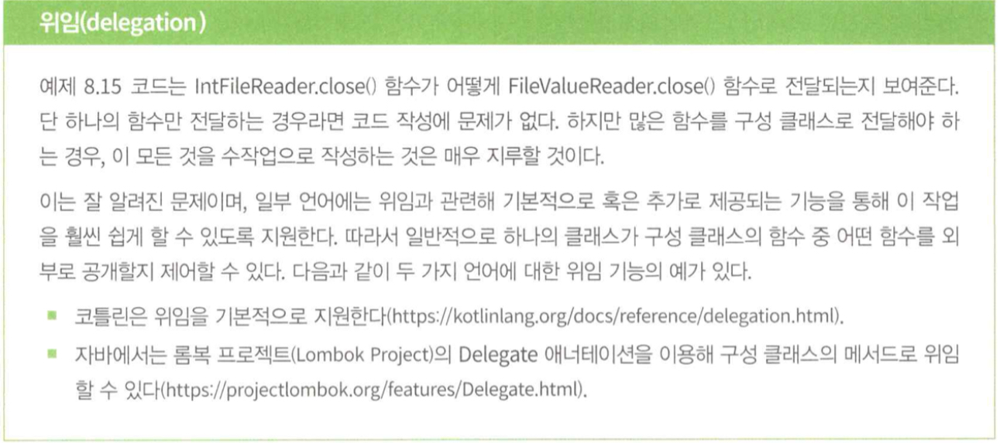
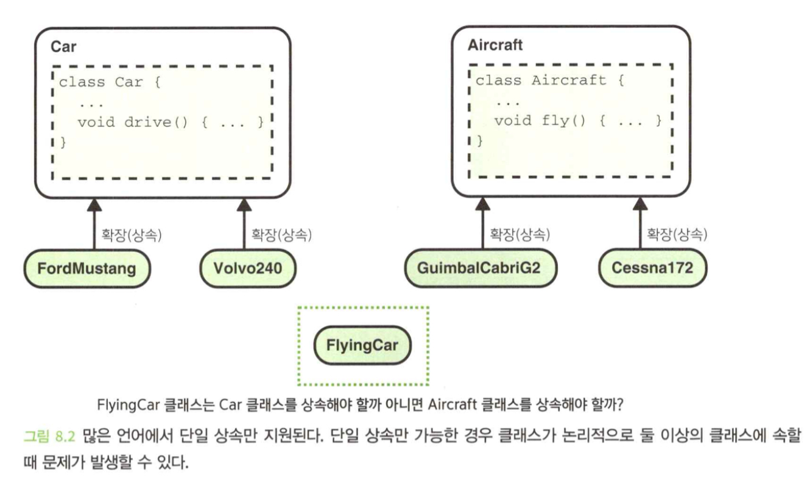
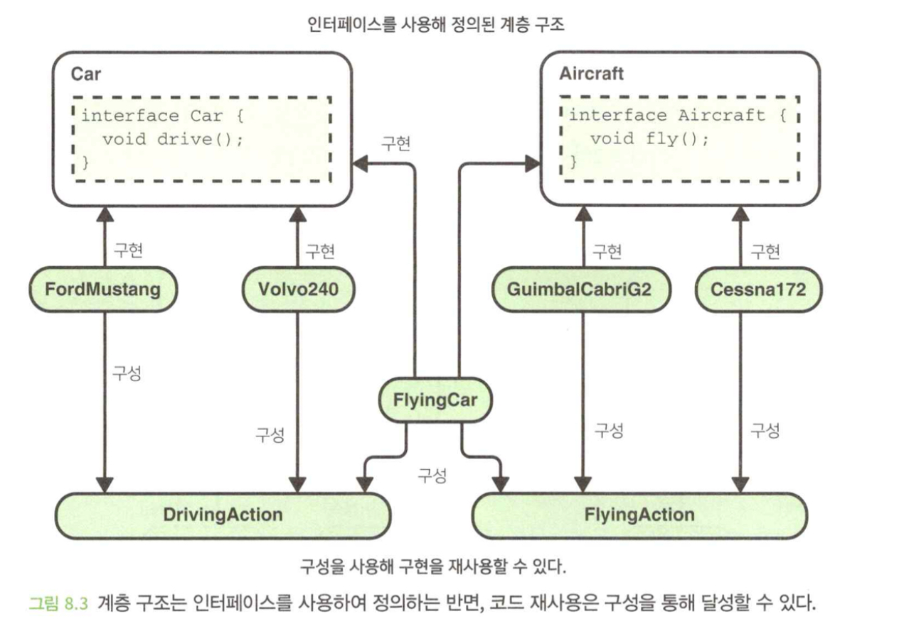

- 이 장에서 배우는 내용
  1. 모듈화된 코드의 이점
  2. 이상적인 코드 모듈화가 되지 않는 일반적인 방식
  3. 코드를 좀 더 모듈화하기 위한방법


</br>

# 0. Intro
- 요구 사항이 어떻게 바뀔지 정확히 예측하는 것은 대개 시간 낭비다.(불가능하다.)
- 하지만 요구 사항은 어떤 식이로든 바뀐다.
- 따라서 변경과 재구성이 용이한 코드를 작성해야 한다.
- 이를 달성하기 위해서는 각각의 기능이 코드베이스의 서로 다른 부분에서 구현되어야 한다.
- 모듈화된 코드는 재사용과 테스트에 더 적합하기 때문에 코드 모듈화는 많은 이점을 가지고 있다.

</br>

# 1. 의존성 주입의 사용을 고려하라.
## 1.1 하드 코드화된 의존성은 문제가 될 수 있다.

```java
class RoutePlanner {
    private final RoadMap roadMap;

    RoutePlanner() {
        this.roadMap = new NorthAmericaRoadMap();
    }

    Route planRoute(LatLong startPoint, LatLong endPoint) {
        ...
    }
}

interface RoadMap {
    List<Road> getRoads();
    List<Junction> getJunctions();
}

class NorthAmericaRoadMap implements RoadMap {
    ...
    override List<Road> getRoads() {...}
    override List<Junction> getJunctions() {...}
}
```

- `RoutePlanner`에 `NorthAmericaRoadMap` 의존성이 하드코딩 되어있다.
- 따라서 다른 지역을 여행하는데 쓸 수 없다.
- 또한 `NorthAmericaRoadMap`에 생성자가 추가될 경우, 여러가지 바뀌는 값을 넣기 어렵다.
- `RoutePlanner`의 인스턴스를 쉽게 생성할 수 있는 장점은 있다.

## 1.2 해결책: 의존성 주입을 사용하라.

```java
class RoutePlanner {
    private final RoadMap roadMap;

    RoutePlanner(RoadMap roadMap) {
        this.roadMap = roadMap;
    }
    ...
}
```

```java
RoutePlanner europeRoutePlanner = new RoutePlanner(new EuropeRoadMap());
```

- `RoadMap` 인터페이스의 구현체를 주입한다.

```java
class RoutePlannerFactory {
    ...

    static RoutePlanner createEuropePlanner() {
        return new RoutePlanner(new EuropeRoadMap());
    }

    static RoutePlanner createNorthAmericaPlanner() {
        return new RoutePlanner(new NorthAmericaRoadMap(true, false));
    }
}
```

- 팩토리 함수를 제공하여 과정을 더 쉽게 할 수 있다.

### 의존성 주입 프레임워크
- 의존성 주입과 관련된 많은 작업을 수동으로 하지 않아도 되기 때문에 개발 작업이 쉬워진다.
- 하지만 프레임워크의 어떤 설정이 코드의 어떤 부분에 적용되는지 알기 어렵다.

## 1.3 의존성 주입을 염두해 두고 코드를 설계하라.
- 코드를 작성할 때 의존성 주입을 사용할 수 있다는 점을 의식적으로 고려하는 것이 유용할 때가 있다.
- 하위 문제에 대한 해결책이 여러 개 있는 경우에는 의존성 주입이 특별히 중요할 수 있다.

</br>

# 2. 인터페이스에 의존하라.
- 클래스에 직접 의존하기보다는 인터페이스에 의존하는 것이 일반적으로 더 바람직하다.

## 2.1 구체적인 구현에 의존하면 적응성이 제한된다.

```java
interface RoaldMap {
    List<Road> getRoads();
    List<Junction> getJunction();
}

class NorthAmericaRoadMap implements RoadMap {
    ...
}

class RoutePlanner {
    private final NorthAmericaRoadMap roadMap; // NorthAmericaRoadMap에 직접의존

    RoutePlanner(NorthAmericaRoadMap roadMap) {
        this.roadMap = roadMap;
    }

    Route planRoute(LatLong startPoint, LatLong endPoint) {
        ...
    }
}
```

## 2.2 해결책: 가능한 경우 인터페이스에 의존하라.
- 더 추상적인 인터페이스에 의존하면 대개의 경우 더 간결한 추상화 계층과 더 나은 모듈화를 달성할 수 있다.

```java
class RoutePlanner {
    private final RoadMap roadMap;

    RoutePlanner(RoadMap roadMap) { // 인터페이스에 의존
        this.roadMap = roadMap;
    }

    Route planRoute(LatLong startPoint, LatLong endPoint) {
        ...
    }
}
```

</br>

# 3. 클래스 상속을 주의하라.
- 상속은 강력한 도구지만, 몇 가지 단점이 있고 상속이 야기하는 문제가 치명적일 수 있기 때문에 한 클래스가 다른 클래스를 상속하는 코드를 작성하는 것에 대해서는 신중하게 생각해봐야 한다.

## 3.1 클래스 상속은 문제가 될 수 있다.

```java
interface FileValueReader {
    String? getNextValue();
    void close();
}

interface FileValueWriter {
    void writeValue(String value);
    void close();
}

// 쉼표로 구분된 값을 가지오 있는 파일을 읽거나 씀
class CsvFileHandler implements FileValueReader, FileValueWriter {
    ...

    CsvFileReader(File file) {...}

    override String? getNextValue() {...}
    override void writeValue(String value) {...}
    override void close() {...}
}
```

```java
class IntFileReader extends CsvFileHandler {
    ...

    IntFileReader(File file) {
        super(file);
    }

    Int? getNextInt() {
        String? nextValue = getNextValue();
        if (nextValue == null) {
            return null;
        }
        return Int.parse(nextValue, Radix.BASE_10);
    }
}
```

### 상속은 추상화 계층에 방해가 될 수 있다.
- 상속하면 슈퍼클래스의 모든 기능을 상속한다.
- 상속하면 원하는 것보다 더 많은 기능을 노출할 수도 있다.
- 이로 인해 추상화 계층이 복잡해지고 구현 세부 정보가 드러날 수 있다.

```java
class IntFileReader extends CsvFileHandler {
    ...

    Int? getNextInt() {
        ...
    }

    String? getNextValue() {...}
    void writeValue(String value) {...}
    void close() {...}
}
```

- 정수만 읽는 리더가 상속받는 클래스를 전부 제공하면 이상한 일이다.

### 상속은 적응성 높은 코드의 작성을 어렵게 만들 수 있다.
- 요구 사항이 변경되어 세미콜론 구분도 추가 되었다.

```java
class SemicolonFileHandler implements FileValueReader, FileValueWriter {
    ...

    SemicolonFileHandler(File file) {...}

    override String? getNextValue() {...}
    override void writeValue(String value) {...}
    override void close() {...}
}

class SemicolonFileReader extends SemicolonFileHandler
```

- 코드 중복이 발생하고, 유지보수 비용과 버그 발생 가능성을 높이기 때문에 일반적으로 바람직하지 않다.

## 3.2 해결책: 구성을 사용하라
- 클래스를 확장하기보다는 해당 클래스의 인스턴스를 가지고 있음으로써 하나의 클래스를 다른 클래스로부터 구성한다는 것을 의미한다.

```java
class IntFileReader {
    private final FileValueReader valueReader;

    IntFileReader(FileValueReader valueReader) {
        this.valueReader = valueReader;
    }

    Int? getNextInt() {
        String? nextValue = valueReader.getNextValue();
        if (nextValue == null) {
            return null;
        }
        return Int.parse(nextValue, Radix.BASE_10);
    }

    void close() {
        valueReader.close();
    }
}
```



### 더 간결한 추상화 계층
- 상속 대신 구성을 사용하면 `IntFileReader` 클래스가 전달이나 위임을 사용하여 명시적으로 노출하지 않는 한 `CsvFileHandler` 클래스의 기능이 노출되지 않는다.

### 적응성이 높은 코드
- `IntFileReader` 클래스는 `FileValueReader` 인터페이스에 의존하며 의존성 주입을 통해 이 요구 사항을 쉽게 지원한다.
- 두 개의 팩토리 함수를 통해 적절한 설정으로 `IntFileReader` 클래스의 인스턴스를 생성하면 이 작업도 쉽게 할 수 있다.

```java
class IntFileReaderFactory {
    IntFileReader createCsvIntReader(File file) {
        return new IntFileReader(new CsvFileHandler(file));
    }

    IntFileReader createSemicolonIntReader(File file) {
        return new IntFileReader(new SemicolonFileHandler(file));
    }
}
```

## 3.3 진정한 is-a 관계는 어떤가?
- 진정한 is-a 관계가 있다 하더라도 상속은 여전히 문제가 될 수 있다.
  1. **취약한 베이스 클래스 문제** : 슈퍼클래스가 수정되면 문제가 발생할 수 있다.
  2. **다이아몬드 문제** : 다중 상속에서 동일 한 함수의 각각 다른 버전을 제공할 수 있다.
  3. **문제가 있는 계층 구조** : 어디 상속할지 모르는 경우





</br>

# 4. 클래스는 자신의 기능에만 집중해야 한다.
- 어떤 개념과 관련된 요구 사항이 변경되면 그 개념에 해당하는 단 하나의 클래스만 수정하면 된다.

## 4.1 다른 클래스와 지나치게 연관되어 있으면 문제가 될 수 있다.

```java
class Book {
    private final List<Chapter> chapters;
    ...

    Int wordCount() {
        return chapters
            .map(getChapterWordCount)
            .sum();
    }

    private static Int getChapterWordCount(Chapter chapter) {
        return chapter.getPrelude().wordCount() + 
            chapter.getSections()
                .map(section -> section.wordCount())
                .sum();
    }
}

class Chapter {
    ...

    TextBlock getPrelude() {...}
    List<TextBlock> getSections() {...}
}
```

- `getChapterWordCount()` 함수는 `Book`에 속해 있지만 `Chapter` 클래스에만 관련된 사항을 다루기 때문에 묘듈화되지 않는다.

## 4.2 해결책: 자신의 기능에만 충실한 클래스를 만들라.

```java
class Book {
    private final List<Chapter> chapters;
    ...

    Int wordCount() {
        return chapters
            .map(chapter -> chapter.wordCount())
            .sum();
    }
}

class Chapter {
    ...

    TextBlock getPrelude() {...}
    List<TextBlock> getSections() {...}

    Int wordCount() {
        return getPrelude().wordCount() + 
            getSections()
                .map(section -> section.wordCount())
                .sum();
    }
}
```


- 코드 모듈화를 위한 핵심 목적 중 하나는 요구 사항의 변경이 필요하면 해당 요구 사항과 직접 관련된 코드만 변경되고자 하는 것이다.
- 클래스는 서로에 대한 어느 정도의 지식을 필요로 할 때도 있지만, 가능한 한 이것을 최소화하는 것이 좋을 때가 많다.

</br>

# 5. 관련 있는 데이터는 함께 캡슐화하라.
- 너무 많은 것들을 한 클래스에 두지 않도록 주의해야 하지만 한 클래스 안에 함께 두는 것이 합리적일 때는 그렇게 하는 것의 이점을 놓쳐서도 안 된다.
- 서로 다른 데이터가 서로 밀접하게 연관되어 있어 그것들이 항상 함께 움직여야 할 때가 있다.

## 5.1 캡슐화되지 않은 데이터는 취급하기 어려울 수 있다.

```java
class TextBox {
    ...

    void renderText(
        String text,
        Font font,
        Double fontSize,
        Double lineHeight,
        Color textColor
    ) {
        ...
    }
}
```

- `TextBox`는 하위 수준일 가능성이 크기 때문에 `renderText`는 다른 함수에 의해 호출 될 것이다.

```java
class UiSettings {
    ...

    Font getFont() {...}
    Double getFontSize() {...}
    Double getLineHeight() {...}
    Color getTextColor() {...}
}

class UserInterface {
    private final TextBox messageBox;
    private final UiSettings uiSettings;

    void displayMessage(String message) {
        messageBox.renderText(
            message,
            uiSettings.getFont(),
            uiSettings.getFontSize(),
            uiSettings.getLineHeight(),
            uiSettings.getTextColor()
        );;
    }
}
```

- `displayMessage()`는 `UiSettings` 클래스의 일부정보를 `renderText()` 함수로 전달하는 택배기사와 약간 비슷하다.
- 택배기사는 종종 소포 안에 무엇이 들어있는지 정확히 신경 쓰지 않을 것이다.

## 5.2 해결책: 관련된 데이터는 객체 또는 클래스로 그룹화하라.
- 텍스트를 스타일링하는 방법(`TextBox`)을 알려면 스타일에 대한 모든 사항(`UiSettings`)을 다 알아야 한다.
- 이렇게 연결되어 있기 때문에 이들을 하나의 객체로 캡슐화해서 전달하는 것이 타당하다.

```java
class TextOptions {
    private final Font font;
    private final Double fontSize;
    private final Double lineHeight;
    private final Color textColor;

    TextOptions(
        Font font, Double fontSize, Double lineHeight, Color textColor
    ) {
        this.font = font;
        this.fontSize = fontSize;
        this.lineHeight = lineHeight;
        this.textColor = textColor;
    }

    Font getFont() {return font;}
    Double getFontSize() {return fontSize;}
    Double getLineHeight() {return lineHeight;}
    Color getTextColor() {return textColor;}
}
```

```java
class UiSettings {
    ...

    TextOptions getTextStyle() {...}
}

class UserInterface {
    private final TextBox messageBox;
    private final UiSettings uiSettings;

    void displayMessage(String message) {
        messageBox.renderText(
            message, uiSettings.getTextStyle()
        );
    }
}

class TextBox {
    ...

    void renderText(String text, TextOptions textStyle) {
        ...
    }
}
```

- 여러 데이터가 따로 떨어져서는 별 의미가 없을 정도로 서로 밀접하게 연관되어 있거나, 캡슐화된 데이터 중에서 일부만 원하는 경우가 아니라면 캡슐화하는 것이 합리적이다.

</br>

# 6. 반환 유형에 구현 세부 정보가 유출되지 않도록 주의하라.
- 간결한 추상화 계층을 가지려면 각 계층의 구현 세부 정보가 유출되지 않아야 한다.
- 구현 세부 정보가 유출되면 코드의 하위 계층에 대한 정보가 노출될 수 있으며, 향수 수정이나 재설정이 매우 어려워질 수 있다.

## 6.1 반환 형식에 구현 세부 사항이 유출될 경우 문제가 될 수 있다.

```java
class ProfilePictureService {
    private final HttpFetcher httpFetcher;
    ...

    ProfilePictureResult getProfilePicture(Int64 userId) {...}
}

class ProfilePictureResult {
    ...
    
    HttpResponse.Status getStatus() {...}

    HttpResponse.Payload? getImageData() {...}
}
```

- `HttpFetcher`가 사용된다는 사실을 직접적으로 유출하지는 않지만, 반환 유형을 통해 간접적으로 유출된다.
- 다른 개발자가 `ProfilePictureService` 클래스를 사용하려면 `HttpResponse`와 관련된 여러 개념을 처리해야 한다.
- `ProfilePictureService`의 구현을 변경하는 것은 매우 어렵다.(변경해야 할 코드가 많아진다.)

## 6.2 해결책: 추상화 계층에 적합한 유형을 반환하라.

```java
class ProfilePictureService {
    private final HttpFetcher httpFetcher;
    ...

    ProfilePictureResult getProfilePicture(Int64 userId) {...}
}

class ProfilePictureResult {
    ...
    enum Status {
        SUCCESS,
        USER_DOES_NOT_EXIST,
        OTHER_ERROR,
    }
    
    Status getStatus() {...}

    List<Byte>? getImageData() {...}
}
```

- 외부로 노출할 개념을 최소화하는 유형을 새로 정의해 사용하면 좀 더 모듈화된 코드와 간결한 추상화 계층을 얻을 수 있다.

</br>

# 7. 예외 처리 시 구현 세부 사항이 유출되지 않도록 주의하라.
- 호출하는 쪽에서 복구하고자 하는 오류에 대해 비검사 예외를 사용하는 경우 예외 처리 시 구현 세부 정보를 유출하는 것은 특히 문제가 될 수 있다.

## 7.1 예외 처리 시 구현 세부 사항이 유출되면 문제가 될 수 있다.
- 비검사 예외에 대한 지식은 코드 계약의 세부 조항을 통해 전달되지만 개발자가 문서화하는 것을 잊어버리면 코드 계약을 통해 전혀 전달되지 않는다.

```java
class TextSummerizer {
    private final TextImportanceScorer importanceScorer;
    ...

    String summarizeText(String text) {
        return paragraphFinder.find(text)
            .filter(paragraph =>
                importanceScorer.isImportant(paragraph))
            .join("\n\n");
    }
}

interface TextImportanceScorer {
    Boolean isImportant(String text);
}

class ModelBasedScorer implements TextImportanceScorer {
    override Boolean isImportant(String text) {
        return model.predict(text) => MODEL_THRESHOLD;
    }
    // 예외 발생
}
```

- `ModelBasedScorer.isImportant()`는 `PredictionModelException`이라는 비검사 예외를 발생시킨다.

```java
void updateTextSummary(UserInterface ui) {
    String userText = ui.getUserText();
    try {
        String summary = summarizeText(userText);
        ui.getSummaryField().seValue(summary);
    } catch(PredictionModelException e) {
        ui.getSummaryField().setError("Unable to summarize text");
    } 
    // Predict와 관련된 예외 발생(내부 예외가 드러남)
}
```

## 7.2 해결책: 추상화 계층에 적절한 예외를 만들라.
- 구현 세부 사항의 유출을 방지하기 위해 코드의 각 계층은 주어진 추상화 계층을 반영하는 오류 유형만을 드러내는 것이 이상적이다.
- 오류 처리를 위해 추가로 작성해야 되는 반복 코드가 늘어난다는 단점과, `TextSummarizer` 클래스의 동작이 예측 가능하고 모듈화가 개선된다는 장점을 비교하면, 단점을 통해 잃는 것보다는 장점을 통해 얻는 것이 훨씬 더 크다.

```java
class TextSummarizerException extends Exception {
    ...
    TextSummarizerException(Throwable cause) {...}
    ...
}

class TextSummarizer {
    private final TextImportanceScorer importanceScorer;
    ...
    String summerizeText(String text) throws TextSummaizerException {
        try {
            return paragraphFinder.find(text)
                .filter(paragraph => 
                    importanceScorer.isImportant(paragraph))
                .join("\n\n");
        } catch(TextImportanceScorerException e) {
            throw new TextSummarizerException(e);
        }
    }
}

class TextImportanceScorerException extends Exception {
    ...
    TextImportancescorerException(Throwable cause) {...}
    ...
}

interface TextImportanceScorer {
    Boolean isImportant(String text) throw TextImportanceScorerException;
}

class ModelBasedScorer implements TextImportanceScorer {
    ...
    Boolean isImportant(String text) throws TextImportanceScorerException {
        try {
            return model.predict(text) => MODEL_THRESHOLD;
        } catch (PredictionModelException e) {
            throw new TextImportanceScorerException(e);
        }
    }
    // 예외 발생
}
```

- `TextSummarizer` 클래스를 사용하는 개발자는 이제 `TextSummaizerException`만 처리하면 된다.
- 즉 `TextSummarizer` 클래스의 구현 세부 정보를 알 필요 없으며, `TextSummarizer` 클래스가 어떻게 설정되었는지, 혹은 향수 어떻게 변경되었는지와 관계없이 오류 처리는 계속 작동할 것이다.

```java
void updateTextSummary(UserInterface ui) {
    String userText = ui.getUserText();
    try {
        String summary = textSummarizer.summarizeText(userText);
        ui.getSummaryField().setValue(summary);
    } catch (TextSummaizerException e) {
        ui.getSummaryField().setError("Unable to summarize text");
    }
}
```

- 호출하는 쪽에서 오류들로부터 복구하지 않을 것이라는 점이 확실하다면, 구현 세부 정보 유출은 큰 문제가 되지 안흔다. 상위 계층에서 특정 오류를 처리하려고 시도하지 않을 것이기 때문이다.
- 그러나 호출하는 쪽에서 복구하기를 원하는 오류가 있다면, 오류 유형이 추상화 계층에 적합한지 확인하는 것이 중요하다.

</br>

# 요약
- 코드가 모듈화되어 있으면 변경된 요구 사항을 적용하기 위한 코드를 작성하기 쉽다.
- 모듈화의 주요 목표 중 하나는 요구 사항의 변경이 해당 요구 사항과 직접 관련된 코드에만 영향을 미치도록 하는 것이다.
- 코드를 모듈식으로 만드는 것은 간결한 추상화 계층을 만드는 것과 깊은 관련이 있다.
- 다음 기술을 사용하여 코드를 모듈화할 수 있다.
  - 의존성 주입
  - 구체적인 클래스가 아닌 인터페이스에 의존
  - 클래스 상속 대신 인터페이스 및 구성의 활용
  - 클래스는 자신의 기능만 처리
  - 관련된 데이터의 캡슐화
  - 반환 유형 및 예외 처리 시 구현 세부 정보 유출 방지
