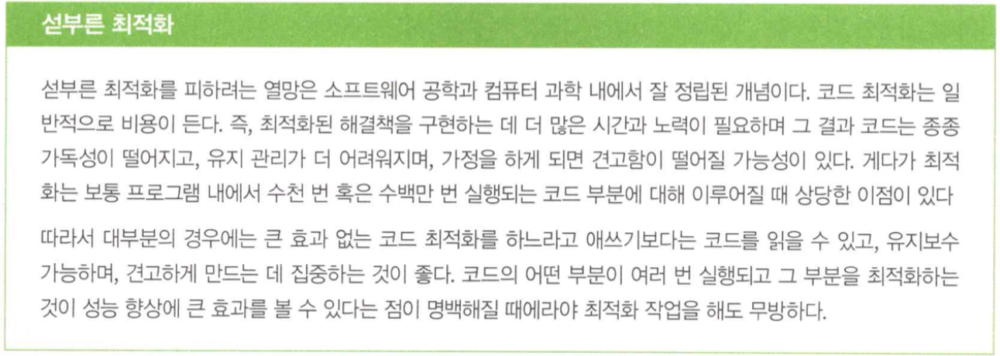
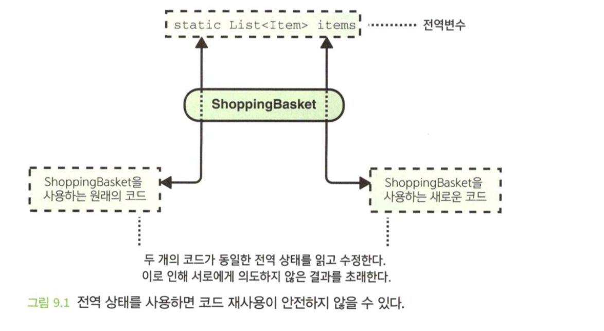
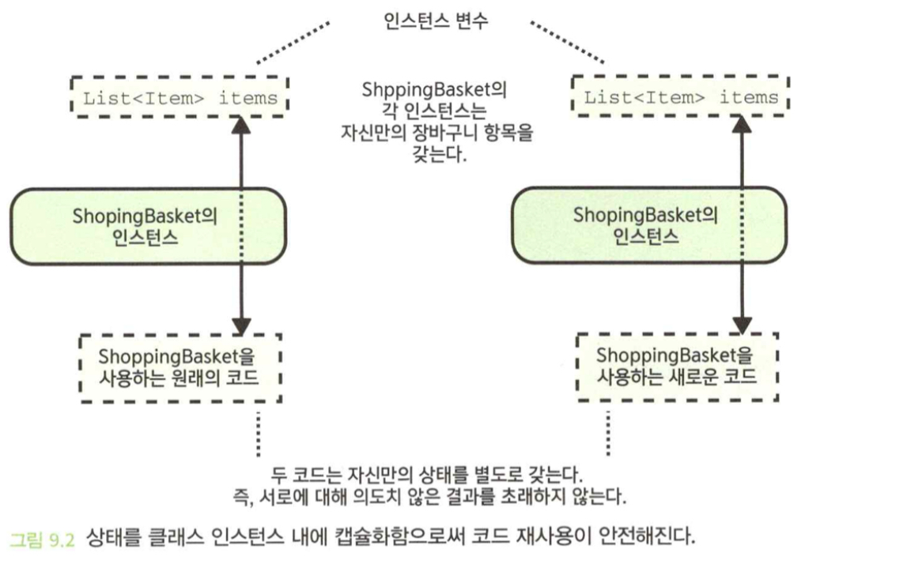
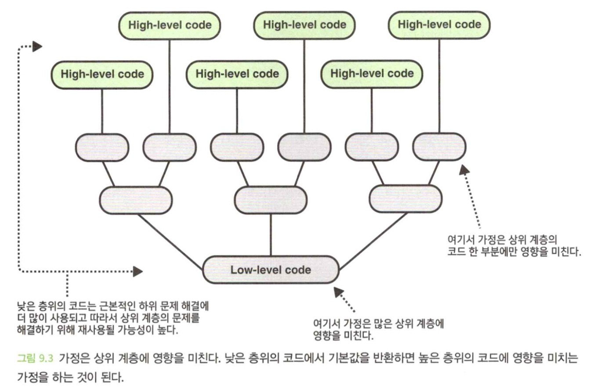
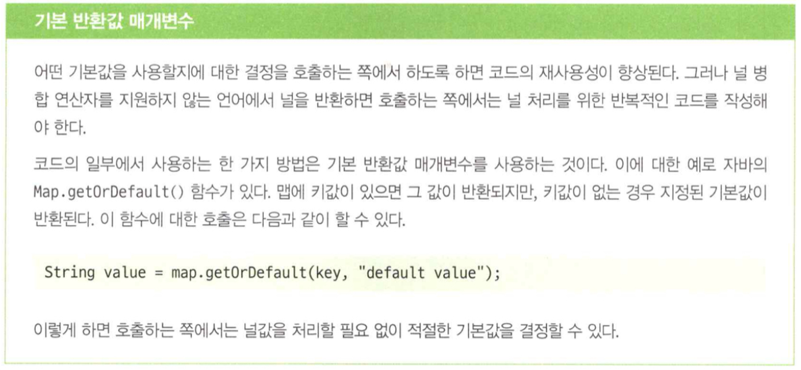

- 이 장에서 배우는 내용
  1. 안전하게 재사용할 수 있는 코드 작성 방법
  2. 다양한 문제를 해결하기 위해 일반화된 코드를 작성하는 방법

</br>

# 1. 가정을 주의하라
- 코드 작성 시 가정을 하기 전에 그 가정으로 초래될 비용과 이점을 생각해 봐야 한다.
- 코드 단순화 또는 효율성의 명백한 이득이 미비하다면 늘어난 취약성으로 인한 비용이 장점을 능가하기 때문에 가정을 하지 않는 것이 최선일 수 있다.

# 1.1 가정은 코드 재사용 시 버그를 초래할 수 있다.

```java
class Article {
    private List<Section> sections;
    ...

    List<Image> getAllImages() {
        for (Section section in sections) {
            if (section.containsImages()) {
                // 기사 내 이미지를 포함하는 섹션은
                // 최대 하나만 있다.
                return section.getImages();
            }
        }
        return [];
    }
}
```

- 이미지가 포함된 섹션이 하나만 있을 것이라고 **가정**한다.
- 가정은 주석문에 있지만, 코드를 사용하는 쪽에서는 알 수 없다.
- 이미지가 있는 섹션이 두 개 이상이라면, 모든 이미지를 반환하지 않는다.(일부만 반환한다)
- 호출하는 쪽에서는 주석문에 있는 가정을 인지할 가능성이 매우 낮다.

## 1.2 해결책: 불필요한 가정을 피하라.



```java
class Article {
    private List<Section> sections;
    ...

    List<Image> getAllImages() {
        List<Image> images = [];
        for (Section section in sections) {
            images.addAll(section.getImages());
        }
        return images;
    }
}
```

- 성능에 저하가 있을 수도 있지만, 가정이 들어가면 취약성의 측면에서도 비용을 수반한다.

## 1.3 해결책: 가정이 필요하면 강제적으로 하라.
- 때로는 가정으로 얻는 이득이 비용을 초과할 정도로 코드가 단순해질 수 있다.
- 우리가 상정한 가정으로 인해 다른 개발자들이 무의식중에 곤란을 겪지 않게 하도록 **가정을 강제적으로 시행**해야 하는데, 일반적으로 아래 두 가지 방법이 있다.

1. **가정이 깨지지 않게 만들라** : 가정이 깨질 때 컴파일 되지 않게하면 가정이 유지된다.
2. **오류 전달 기술을 사용하라** : 가정을 깨는 것이 불가능하게 만들 수 없는 경우에는 오류 전달 기술로 신속하게 실패해라.

### 문제의 소지가 있는, 강제되지 않은 가정

```java
// 가정을 포함하는 코드
class Article {
    private List<Section> sections;
    ...
    Section? getImageSection() {
        // 기사 내 이미지를 포함하는 섹션은 최대
        // 하나만 있다.
        return sections
            .filter(section -> section.containsImages())
            .first();
    }
}
```

- 위 코드는 모든 기사는 이미지를 갖는 섹션이 최대 하나만 있다고 가정한다.

```java
// 가정에 의존하는 호출자
class ArticleRenderer {
    ...

    void render(Article article) {
        ...
        Section? imageSection = article.getImageSection();
        if (imageSection != null) {
            iemplateData.setImageSection(imageSection);
        }
    }
}
```

- 만약 누군가가 이미지가 들어있는 섹션이 여러개 있는 문서를 작성한 후에 이 코드를 사용하면, 예상치 못한 방식으로 동작할 수 있다.

### 가정의 강제적 확인

```java
class Article {
    private List<Section> sections;
    ...
    Section? getOnlyImageSection() {
        List<Section> imageSections = sections.filter(section -> section.containsImages());

        assert(imageSection.size() <= 1, "기사가 여러 개의 이미지 섹션을 갖는다.");

        return imageSections.first();
    }
}
```

- 코드가 이상하게 동작하는 것 보다는 신속하게 실패하는 것이 더 낫다.

</br>

# 2. 전역 상태를 주의하라
- 전역 상태 또는 전역 변수는 실행되는 프로그램 내의 모든 콘텍스트 사이에 공유된다.
- 전역변수는 프로그램 내의 모든 콘텍스트에 영향을 미치기 때문에 전역변수를 사용할 때는 누구도 해당 코드를 다른 목적으로 재사용하지 않을 것이라는 암묵적인 가정을 전제한다.
- 가정에는 비용이 수반된다.

## 2.1 전역 상태를 갖는 코드는 재사용하기에 안전하지 않을 수 있다.

```java
class ShoppingBasket {
    private static List<Item> items = [];

    static void addItem(Item item) {
        item.add(item);
    }

    static void List<Item> getItems() {
        return List.copyOf(items);
    }
}
```

### 누군가가 이 코드를 재사용하려고 하면 어떻게 되는가?
- 알았든 몰랐든 간에 이 코드를 작성할 때 암묵적인 가정이 이루어지는데, 그것은 이 소프트웨어를 실행하는 인스턴스당 하나의 장바구니만 필요하다는 것이었다.
- 가정이 취약하고 어느 시점에 이르면 어떤 식으로든 그 가정을 깨트리는 그럴듯한 시나리오들이 충분히 있다.



## 2.2 해결책: 공유 상태에 의존성 주입하라.
- 의존성 주입은 전역 상태를 사용하는 것보다 더 통제된 방법으로 서로 다른 클래스 간에 상태를 공유하는 좋은 방법이다.

```java
class ShoppingBasket {
    private final List<Item> items = [];

    void addItem(Item item) {
        item.add(item);
    }

    void List<Item> getItems() {
        return List.copyOf(items);
    }
}
```

```java
class ViewItemWidget {
    private final Item item;
    private final ShoppingBasket basket;

    ViewItemWidget(Item item, ShoppingBasket basket) {
        this.item = item;
        this.baket = basket;
    }
    ...
}

class ViewBaksetWidget {
    ...
    ViewBasketWidget(ShoppingBasket basket) {
        this.basket = basket;
    }
}
```

- 두 장바구니는 서로 독립적이므로 간섭하지 않는다.



- 전역 상태가 사용된다는 사실을 다른 개발자는 모를 수 있기 때문에 코드를 재사용하려고 하면 이상한 동작과 버그가 발생할 수 있다.

</br>

# 3. 기본 반환값을 적절하게 사용하라
- 기본값을 제공하려면 종종 다음과 같은 두 가지 가정이 필요하다.
  - 어떤 기본값이 합리적인지
  - 더 상위 계층의 코드는 기본값을 받든지 명시적으로 설정된 값을 받든지 상관하지 않는다.

## 3.1 낮은 층위의 코드의 기본 반환값은 재사용성을 해칠 수 있다.

```java
class UserDocumentSettings {
    private final Font? font;
    ...

    Font getPreferredFont() {
        if (font != null) {
            return font;
        }
        return Font.ARIAL;
    }
}
```

- 기본 글꼴로 `ARIAL`을 원하지 않는다면, `UserDocumentSettings`의 재사용은 어렵다.
- 기본값이 반환된 것인지 구분하기 어렵다.
- 기본값을 정의하는 코드의 계층이 낮을수록 그 가정이 적용되는 상위 계층은 더 많아진다.



## 3.2 해결책: 상위 수준의 코드에서 기본값을 제공하라.

```java
class UserDocumentSettings {
    private final Font? font;
    ...

    Font? getPreferredFont() {
        return font;
    }
}
```

- 호출하는 쪽에서 원하는 방식으로 하위 문제를 해결할 수 있다(코드의 재사용성을 높여준다).

```java
// 기본값을 캡슐화
class DefaultDocumentSettings {
    ...
    Font getDefaultFont() {
        return Font.ARIAL;
    }
}
```

```java
class DocumentSettings {
    private final UserDocumentSettings userSettings;
    private final DefaultDocumentSettings defaultSettings;

    DocumentSettings(UserDocumentSettings userSettings, DefaultDocumentSettings defaultSettings) {
        this.userSettings = userSettings;
        this.defaultSettings = defaultSettings;
    }
    ...
    Font getFont() {
        return userSettings.getPreferredFont() ?? defaultSettings.getFont();
    }
}
```



</br>

# 4. 함수의 매개변수를 주목하라
- 함수가 한두 가지 정보만 필요로 할 때는 객체나 클래스의 인스턴스를 매개변수로 사용하는 것은 코드의 재사용성을 해칠 수 있다.

## 4.1 필요 이상으로 매개변수를 받는 함수는 재사용하기 어려울 수 있다.

```java
class TextBos {
    private final Element textContainer;
    ...

    void setTextStyle(TextOptions options) {
        setFont(...);
        setFontSize(...);
        setLineHeight(...);
        setTextColor(...);
    }

    void setTextColor(TextOptions options) {
        textContainer.setStyleProperty(
            "color", options.getTextColor().asHexRgb()
        );
    }
}
```

- 여기서 색상만 빨간색으로 변경해야 할 때, 너무 많은 매개변수이므로 재사용이 어려워진다.

## 4.2 해결책: 함수는 필요한 것만 매개변수로 받도록 하라.

```java
class TextBos {
    private final Element textElement;
    ...

    void setTextColor(Color color) {
      textElement.setStypeProperty("color", color.asHexRgb());
    }
}
```

- 일반적으로 함수가 필요한 것만 받도록 하면 코드는 재사용성이 향상되고 이해하기도 쉬워진다.

</br>

# 5. 제네릭의 사용을 고려하라
- 제네릭을 사용하면 아주 적은 양의 추가 작업이 있긴 하지만 코드의 일반화가 크게 향상된다.

## 5.1 특정 유형에 의존하면 일반화를 제한한다.

```java
class RandomizedQueue {
    private final List<String> values = [];
    ...
    String? getNext() {
        ...
    }
}
```

- `RandomizedQueue`는 String에 대한 의존도가 높기 때문에 다른 유형을 저장하는 데는 사용할 수 없다.

## 5.2 해결책: 제네릭을 사용하라

```java
class RandomizedQueue<T> {
    private final List<T> values = [];
    ...
    T? getNext() {
        ...
    }
}
```

- 하위 문제에 대한 해결책이 모든 데이터 유형에 쉽게 적용될 수 있을 때 특정 유형에 의존하는 대신 제네릭을 사용하더라도 추가적인 노력이 거의 들어가지 않는다.
- 이렇게 하면 코드는 보다 더 일반화되고 재사용이 가능하다는 측면에서 쉽게 효과를 볼 수 있다.

</br>

# 요약
- 동일한 하위 문제가 자주 발생하므로 코드를 재사용하면 미래의 자신과 팀 동료의 시간과 노력을 절약할 수 있다.
- 다른 개발자가 여러분이 해결하려는 문제와는 다른 상위 수준의 문제를 해결하더라도 특정 하위 문제에 대해서는 여러분이 작성한 해결책을 재사용할 수 있도록 근본적인 하위 문제를 식별하고 코드를 구성하도록 노력해야 한다.
- 간결한 추상화 계층을 만들고 코드를 모듈식으로 만들면 코드를 재사용하고 일반화하기 훨씬 쉽고 안전해진다.
- 가정을 하게 되면 코드는 종종 더 취약해지고 재사용하기 어렵다는 측면에서 비용이 발생한다.
  - 가정을 하는 경우의 이점이 비용보다 큰지 확인하라.
  - 가정을 해야 할 경우 그 가정이 코드의 적절한 계층에 대해 이루어지는 것인지 확인하고 가능하다면 가정을 강제적으로 적용하라.
- 전역 상태를 사용하면 특히 비용이 많이 발생하는 가정을 하는 것이 되고 재사용하기에 전혀 안전하지 않은 코드가 된다. 대부분의 경우 전역 상태를 피하는 것이 가장 바람직하다.
