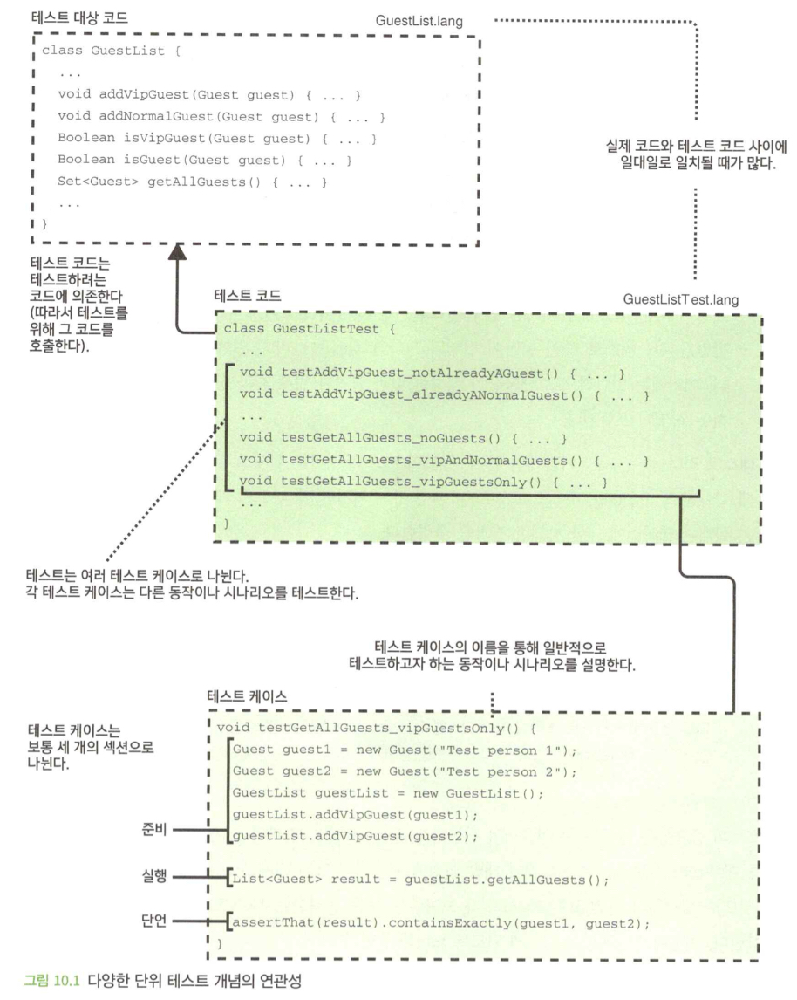
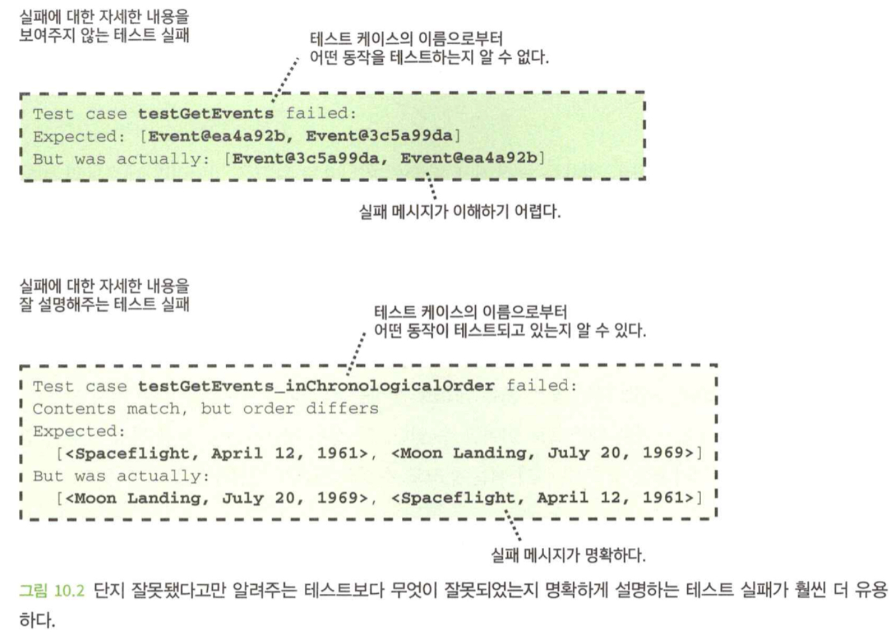
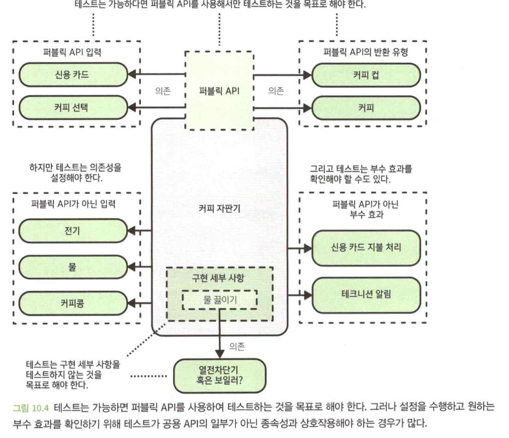
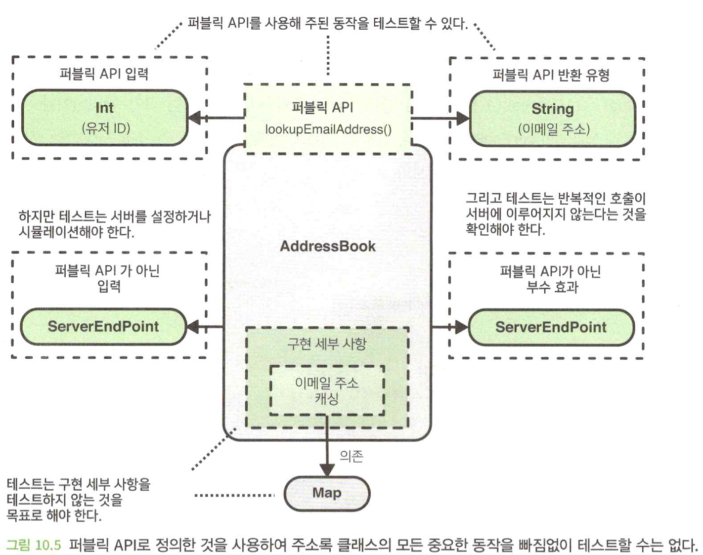
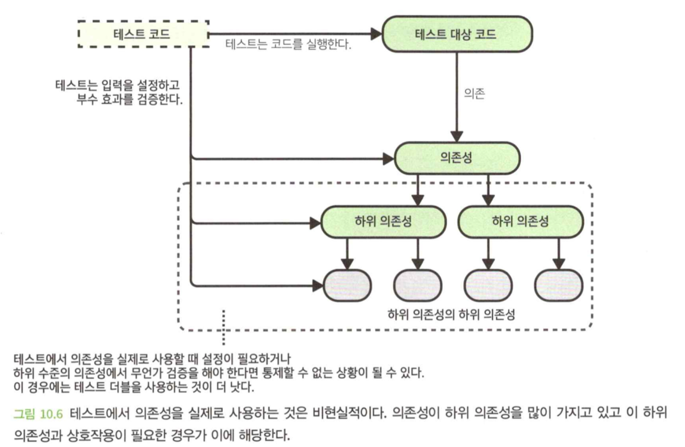
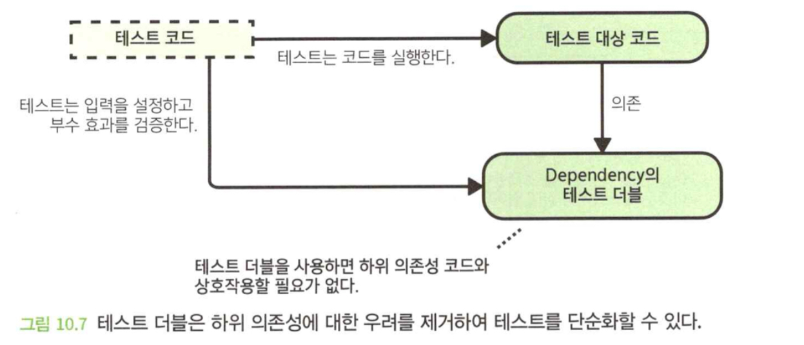
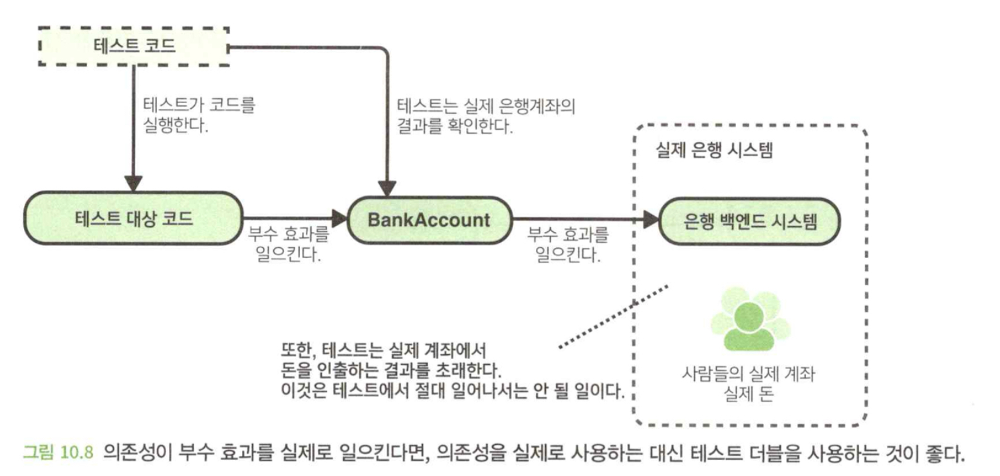
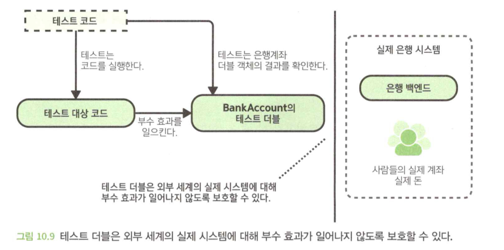
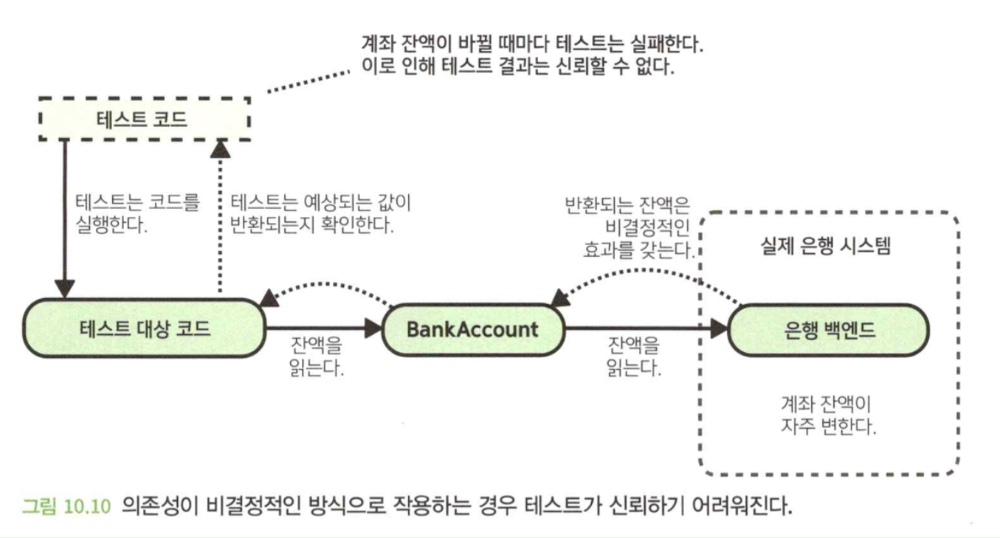
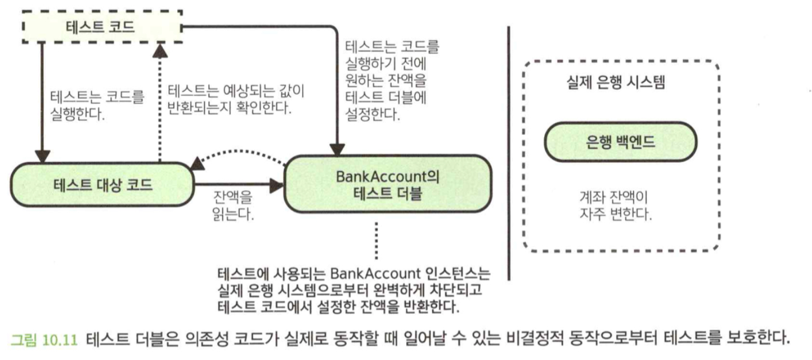

- 이 장에서 배우는 내용
  1. 단위 테스트의 기본 사항
  2. 좋은 단위 테스트가 되기 위한 조건
  3. 테스트 더블
  4. 테스트 철학

</br>

# 0. Intro
- 코드 변경은 언제나 위험하기 때문에 코드가 처음 작성될 때 그리고 수정될 때마다 코드가 의도한 대로 작동한다는 것을 스스로 확신할 수 있는 방법이 필요하다.
- 궁극적으로 중요한 것은 코드를 잘 테스트하고 이 작업을 유지보수할 수 있는 방법으로 수행하는 점이다.

</br>

# 1. 단위 테스트 기초
- `테스트 중인 코드` : 테스트의 대상이 되는 코드를 의미한다.
- `테스트 코드` : 단위 테스트를 구성하는 코드를 가리킨다.
- `테스트 케이스` : 특정 동작이나 시나리오를 테스트한다.
  - `준비(arrange)` : 테스트 전 설정을 수행한다.
  - `실행(act)` : 테스트 중인 동작을 실제로 호출하는 코드를 나타낸다.
  - `단언(assert)` : 예상값과 반환값으 비교하는 작업을 한다.
- `테스트 러너` : 실제로 테스트를 실행하는 도구이다.

</br>

- 테스트는 자주 언급되어도 부족하지 않을 정도로 중요하다.
- 훌륭한 테스트를 하기 위해서는 테스트만 있다고 되는 것이 아니라, 좋은 테스트가 필요하다.



</br>

# 2. 좋은 단위 테스트는 어떻게 작성할 수 있는가?
- 좋은 단위 테스트가 가져야 할 5가지 주요 기능

## 2.1 훼손의 정확한 감지
- 단위 테스트의 주된 목표는 코드가 훼손되지 않았는지 확인하는 것이다.
- 코드가 의도된 대로 수행하며 버그가 없는지 확인하는 것이다.
- 테스트 대상 코드가 정상임에도 불구하고, 때로는 통과하고 때로는 실패하는 테스트를 **플래키**라고 한다.
- 코드에서 어떤 부분이 훼손될 때 그리고 오직 훼손된 경우에만 테스트가 실패하도록 하는 것은 매우 중요하다.(양치기 소년 효과가 나올 수 있기 때문에)

### 코드에 대한 초기 신뢰를 준다.
- 코드에 대한 실수를 코드베이스에 합쳐지기 전에 발견할 수 있게 해준다.

### 미래의 훼손을 막아준다.
- 코드 변경으로 인해 잘 돌아가던 기능이 작동하지 않는 것을 회귀라고 하는데, 회귀를 탐지할 목적으로 테스트를 실행하는 것을 **회귀 테스트**라고 한다.

## 2.2 세부 구현 사항에 독립적
- 일반적으로 개발자가 코드베이스에 가할 수 있는 변경은 두 가지 종류가 있다.
  - `기능적 변화` : 코드가 외부로 보이는 동작을 수정
  - `리팩터링` : 내부의 구조적 변화
- 보통 기능적 변경은 코드의 동작이 수정되기 때문에 테스트도 수정되어야 한다.
- 기능 변경과 리팩터링은 같이 하는 것은 좋지 않다.
- 세세한 기능을 테스트 하는 테스트라면, 리팩터링에서 특정 테스트는 깨질 것이다.
- 세부 사항이 아닌 동작 테스트라면, 리팩터링에서 테스트는 성공할 것이 분명하다.

## 2.3 잘 설명되는 실패
- 테스트는 개발자가 변경한 코드에 의해 다른 코드에 문제가 발생했단 것을 알려준다.
- 테스트가 실패를 알려주지 않는다면, 개발자는 많은 시간을 낭비하게 된다.



- 테스트 실패가 잘 설명되도록 하는 좋은 방법은, 하나의 테스트 케이스는 한 가지 사항만 검사하고 각 테스트 케이스에 대해 서술적인 이름을 사용하는 것이다.
- 테스트가 실패하면 케이스의 이름을 통해 어떤 동작이 실패했는지 쉽게 알 수 있다.

## 2.4 이해 가능한 테스트 코드
- 개발자는 자신이 개발한 동작이 영향을 미친다는 확신을 가지기 위해, 서로 다른 케이스가 무엇을 테스트하는지 그리고 어떻게 테스트하는지 이해하고 있어야 한다.
- 너무 많은 것을 테스트하거나, 너무 많은 공유 테스트 설정을 사용하면 테스트의 이해가 어려워진다.
- 테스트 코드를 이해하기 쉽게 만들기 위해 노력해야 하는 또 다른 이유는 일부 개발자들이 테스트를 코드에 대한 일종의 사용 설명서로 사용하기 때문이다.

## 2.5 쉽고 빠른 진행
- 단우 테스트에 많은 시간이 걸린다면, 개발자들은 실행하지 않는다.
- 테스트가 느리면 힘든 작업이 되고, 하고 싶지 않은 마음이 들게 된다.

</br>

# 3. 퍼블릭 API에 집중하되 중요한 동작은 무시하지 말라
- 퍼블릭 API에 초점을 맞추면 세부 사항이 아닌 코드 사용자가 궁극적으로 신경 쓸 동작에 집중할 수밖에 없게 되는데, 세부 사항은 목적을 이루기 위한 수단일 뿐이다.
- 퍼블릭 API만을 이용한 테스트는, 테스트와 구현 세부 정보를 결합하지 않고, 호출하는 쪽에서 실제로 신경 쓰는 사항만 테스트하는 데 집중할 수 있다.

## 3.1 중요한 동작이 퍼블릭 API 외부에 있을 수 있다.
- 의존하는 코드로부터 외부 입력이 제공되거나 테스트 대상 코드가 의존하는 코드에 부수 효과를 일으킨다면 테스트의 의미가 미세하게 달라질 수 있다.



```java
class AddressBook {
  private final ServerEndPoint server;
  private final Map<Int, String> emailAddressCache;
  ...

  String? lookupEmailAddress(Int userId) { 
    // 퍼블릭 API
    String? cachedEmail = emailAddressCache.get(userId);
    if (cachedEmail != null) {
      return cachedEmail;
    }
    return fetchAndCacheEmailAddress(userId);
  }

  private String? fetchAndCacheEmailAddress(Int userId) {
    //구현 세부 사항
    String? fetchedEmail = server.fetchEmailAddress(userId);
    if (fetchedEmail != null) {
      emailAddressCache.put(userId, fetchedEmail);
    }
    return fetchedEmail;
  }
}
```

- 유저 ID로 이메일을 조회하려면, ServerEndPoint를 설정하거나 시뮬레이션(구현 세부사항)하지 않으면 테스트 할 수 없다.



- 가능하면 퍼블릭 API를 사용하여 코드의 동작을 테스트해야 한다. 이는 순전히 퍼블릭 함수의 매개변수, 반환값, 오류 전달을 통해 발생하는 동작만 테스트해야 한다는 의미다.
- 그러나 코드의 퍼블릭 API를 어떻게 정의하느냐에 따라 퍼블릭 API만으로는 모든 동작을 테스트할 수 없는 경우가 있다.
  - `서버와 상호 작용하는 코드`
  - `데이터베이스에 값을 저장하거나 읽는 코드`
- '퍼블릭 API'와 '구현 세부사항'의 정의는 주관적이고 상황에 따라 달라질 수 있다.
- 궁극적으로 중요한 것은, 코드의 모든 중요한 동작을 제대로 테스트하는 것이고, 퍼블릭 API라고 생각하는 것만으로는 이것을 할 수 없는 경우가 있다.

</br>

# 4. 테스트 더블

## 4.1 테스트 더블을 사용하는 이유
- `테스트 단순화` : 의존성을 실제로 사용하는 대신 테스트 더블을 사용하면 작업이 단순해진다.
- `테스트로부터 외부 세계 보호` : 외부 세계에 있는 시스템을 테스트의 동작으로뷰터 보호할 수 있다.
- `외부로부터 테스트 보호` : 항상 동일하게 결정적 방식으로 작동하도록 설정할 수 있다.

### 테스트 단순화





- 테스트 단순화에 대한 또 다른 동기는 테스트를 더 빠르게 실행하는 것이다.
- 의존성 코드에서 계산 비용이 많이 드는 알고리즘을 호출하거나 시간이 오래 걸리는 설정을 많이 한다면 이에 해당한다.

### 테스트로부터 외부 세계 보호





- 실제 데이터베이스를 사용하면, 다음과 같은 문제가 발생할 수 있다.
  - 사용자는 이상하고 혼란스러운 값을 볼 수 있다.
  - 모니터링 및 로깅에 영향을 미칠 수 있다.

### 외부로부터 테스트 보호
- DB를 읽거나, 난수 생성기를 사용하는 의존성을 테스트에서 사용하다 보면 테스트 결과를 신뢰하기 어려울 때가 있다.





## 4.2 목
- 테스트 대상 코드가 의존성을 통해 제공되는 함수를 호출하는지 검증하기 위해 목을 사용할 수 있다.

```java
class PaymentManager {
  ...

  PaymentResult settleInvoice(
    BankAccount customerBankAccount,
    Invoice invoice
  ) {
    customerBankAccount.debit(invoice.getBalance());
    return PaymentResult.paid(invoice.getId());
  }
}
```

- `customerBankAccount`를 위해 테스트는 이 종속성과 상호작용하여 원하는 부수 효과가 발생하는지 확인해야 한다.

```java
interface BankAccount {
  void debit(MonetaryAmount amount);
  void credit(MonetaryAmount amount);
  MonetaryAmount getBalance();
}
```

```java
void testSettleInvoice_accountDebited() {
  BankAccount mockAccount = createMock(BankAccount);
  MonetaryAmount invoiceBalance = new MonetaryAmount(5.0, Currency.USD);
  Invoice invoice = new Invoice(invoiceBalance, "test-id");
  PaymentManager paymentManager = new PaymentManager();

  paymentManager.settleInvoice(mockAccount, invoice);

  verifyThat(mockAccount.debit)
    .wasCalledOnce()
    .withArguments(invoiceBalance);
}
```

- 목을 사용하면 `BankAccount`의 구현체를 쓰지 않고도 함수를 테스트 할 수 있다.
- 외부 세계를 보호하지만, 테스트가 비현실적이고 중요한 버그를 잡지 못할 위험이 있다.

## 4.3 스텁
- 스텁은 함수가 호출되면 미리 정해 놓은 값을 반환함으로써 함수를 시뮬레이션한다.
- 테스트 대상 코드가 의존하는 코드로부터 어떤 값을 받아야 하는 경우 그 의존성을 시뮬레이션하는 데 유용하다.

```java
class PaymentManager {
  ...

  PaymentResult settleInvoice(
    BankAccount customerBankAccount,
    Invoice invoice
  ) {
    if (customerBankAccount.getBalance() // getBalance()에 의존
      .isLessThan(invoice.getBalance())) {
      return PaymentResult.insufficientFunds(invoice.getId());
    }

    customerBankAccount.debit(invoice.getBalance());
    return PaymentResult.paid(invoice.getId()); 
  }
}
```

```java
void testSettleInvoice_insufficientFundsCorrectResultReturned() {
  MonetaryAmount invoiceBalance = new MonetaryAmount(10.0, Currency.USD);
  Invoice invoice = new Invoice(invoiceBalance, "test-id");
  BankAccount mockAccount = createMock(BankAccount);
  when(mockAccount.getBalance()) // getBalance는 스텁을 통해 항상 9.99 반환
    .thenReturn(new MonetaryAmount(9.99, Currency.USD));
  PaymentManager paymentManager = new PaymentManager();

  PaymentResult result = paymentManager.settleInvoice(mockAccount, invoice);
  assertThat(result.getStatus()).isEqualTo(INSUFFICIENT_FUNDS);
}
```

## 4.4 목과 스텁은 문제가 될 수 있다.

### 목과 스텁은 실제적이지 않은 테스트를 만들 수 있다.
- 테스트 코드를 작성하는 개발자는 목이 어떻게 동작할지 결정해야 하는데, 실제 의존성이 어떻게 동작하는지 이해하지 못하면 목을 설정할 때 실수를 할 가능성이 크다.

### 목과 스텁을 사용하면 테스트가 구현 세부 정보에 유착될 수 있다.
- 테스트는 구현 세부 사항에 구애받지 않아야 한다.
- 리팩터링을 수행한 개발자는 테스트 통과를 위해 많은 테스트 케이스를 수정해야 하므로 리팩터링이 의도치 않게 동작을 변경하지 않았다는 확신을 하기 어렵다.

## 4.5 페이크
- 외부 시스템과 통신하는 대신 페이크 내의 멤버 변수에 상태를 저장한다.
- 페이크의 요점은 코드 계약이 실제 의존성과 동일하기 때문에 실제 클래스가 특정 입력을 받아들이지 않는다면 페이크도 마찬가지라는 것이다.
- 코드를 유지보수 하려면, 페이크의 코드 계약도 동일하기 유지보수 해야 한다.

```java
class FakeBankAccount implements BankAccount {
  private MonetaryAmount balance;

  FakeBankAccount(Monetary startingBalance) {
    this.balance = balance;
  }

  override void debit(MonetaryAmount amount) {
    if (amount.isNegative()) {
      throw new ArgumentException("액수는 0보다 적을 수 없음");
    }
    balance = balance.subtract(amount);
  }

  override void credit(MonetaryAmount amount) {
    if (amount.isNegative()) {
      throw new ArgumentException("액수는 0보다 적을 수 없음");
    }
    balance = balance.add(amount);
  }

  override void trabsfer(MonetaryAmount amount) {
    balance.add(amount);
  }

  override MonetaryAmount trabsfer(MonetaryAmount amount) {
    return roundDownToNearest10(balance);
  }

  MonetaryAmount getActualBalance() {
    return balance;
  }
}
```

### 페이크로 인해 보다 실질적인 테스트가 이루어질 수 있다.

```java
void testSettleInvoice_negativeInvoiceBalance() {
  FakeBankAccount fakeAccount = new FakeBankAccount(
    new MonetaryAmount(100.0, Currency.USD)
  );
  MonetaryAmount invoiceBalance = new MonetaryAmount(-5.0, Currency.USD);
  Invoice invoice = new Invoice(invoiceBalance, "test-id");
  PaymentManager paymentManager = new PaymentManager();

  paymentManager.settleInvoice(faceAccount, invoice);

  assertThat(fakeAccount.getActualBalance())
    .isEqualTo(new MonetaryAmount(105.0, Currency.USD));
}
```

### 페이크를 사용하면 구현 세부 정보로부터 테스트를 분리할 수 있다.
- 목이나 스텁 대신 페이크를 사용할 때의 또 다른 이점은 테스트가 구현 세부 사항에 밀접하게 결합하는 정도가 덜 하다는 것이다.
- (필자는) 테스트에서 의존성 코드를 실제로 사용할 수 없다면, 목이나 스텁보다는 페이크를 사용하는 것이 더 낫다고 생각한다.

## 4.6 목에 대한 의견
- `목 찬성론자(mockist)`
  - 개발자는 단위 테스트 코드에서 의존성을 실제로 사용하는 것을 피해야 하고 대신 목을 사용해야 한다고 주장한다.
  - 시험 대상 코드가 **어떻게** 하는가를 확인한다.
  - 주장
    - 단위 테스트가 더욱 격리된다.
      - 특정 코드에 문제가 있을 때 해당 코드에 대한 단위 테스트에서만 테스트 실패를 유발하며, 이 코드에 의존하는 다른 코드에 대한 테스트는 실패하지 않는다.
    - 테스트 코드 작성이 더 쉬워진다.
      - 목이나 스텁을 사용하면 실제로 의존성을 설정할 필요가 없고 하위 종속성의 설정에 대해 걱정하지 않아도 되기 떄문에 설정이 간단하다.
- `고전주의자(classicist)`
  - 실제 의존성을 사용하는 것이 가능하지 않을 때, 페이크를 사용하는 것을 선호한다.
  - 코드를 실행하는 최종 결과가 **무엇인지** 확인한다.
  - 주장
    - 많은 수의 목이나 스텁을 사용하면 코드에 문제점이 있을 때에도 테스트는 통과할 수 있다.
    - 테스트 대상 코드의 동작이 변경되었을 때에만 실패하며, 구현 사항이 변경될 때는 실패하지 않는다.

> (저자의 의견)
>
> 목은 동작을 제대로 테스트하지 않았고 코드의 리팩터링을 매우 어렵게 만들었다. 두 가지 접근법을 모두 시도해 본 결과 이제는 고전적 접근법을 강하게 선호하게 되었다.

</br>

# 5. 테스트 철학으로부터 신중하게 선택하라
- 옳다고 생각하는 바를 여러 철학에서 신중하게 선택할 자유가 있다.
- 중요한 것은 좋은 품질의 테스트 코드를 철저하게 작성하고 고품질의 소프트웨어를 생산하는 것이다.
- 테스트 철학과 방법론의 몇 가지 예
  - `테스트 주도 개발(TDD)`
    - 실제 코드를 작성하기 전에 테스트 케이스를 먼저 작성한다.
    - 실제 코드는 테스트만 통과하도록 최소한으로 작성하고 이후에 구조를 개선하고 중복을 없애기 위해 리팩터링을 한다.
  - `행동 주도 개발(BDD)`
    - 사용자, 고객, 비즈니스의 관점에서 소프트웨어가 보여야 할 행동을 식별하는데 집중한다.
  - `수용 테스트 주도 개발(ATDD)`
    - 고객의 관점에서 소프트웨어가 보여줘야 하는 동작을 식별하고 소프트웨어가 전체적으로 필요에 따라 작동하는지 검증하기 위해 자동화된 **수락 테스트**를 만드는 것을 수반한다.

</br>

# 요약
- 코드베이스에 제출된 거의 모든 '실제 코드'는 그에 해당하는 단위 테스트가 동반되어야 한다.
- '실제 코드'가 보여주는 모든 동작에 대해 이를 실행해보고 결과를 확인하는 테스트 케이스가 작성되어야 한다. 아주 간단한 테스트 케이스가 아니라면 각 테스트 케이스 코드는 준비, 실행 및 단언의 세 가지 부분으로 나누는 것이 일반적이다.
- 바람직한 단위 테스트의 주요 특징은 다음과 같다.
  - 문제가 생긴 코드의 정확한 탐지
  - 구현 세부 정보에 구애받지 않음
  - 실패가 잘 설명됨
  - 이해하기 쉬운 테스트 코드
  - 쉽고 빠르게 실행
- 테스트 더블은 의존성을 실제로 사용하는 것이 불가능하거나 현실적으로 어려울 때 단위 테스트에 사용할 수 있다. 테스트 더블의 몇 가지 예는 다음과 같다.
  - 목
  - 스텁
  - 페이크
- 목 및 스텁을 사용한 테스트 코드는 비현실적이고 구현 세부 정보에 밀접하게 연결될 수 있다.
- 목과 스텁의 사용에 대한 여러 의견이 있다. 필자의 의견은 가능한 한 실제 의존성이 테스트에 사용되어야만 한다는 것이다. 이렇게 할 수 없다면, 페이크가 차선책이고, 목과 스텁은 최후의 수단으로만 사용되어야 한다.
