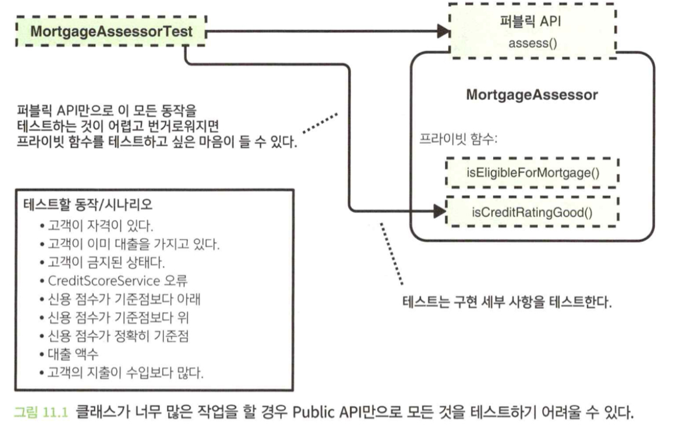
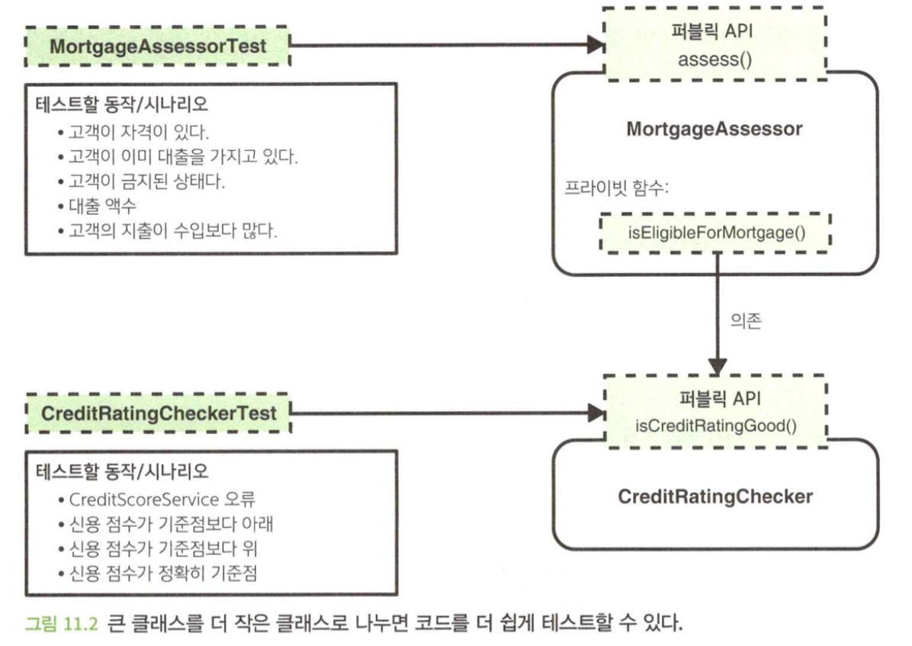
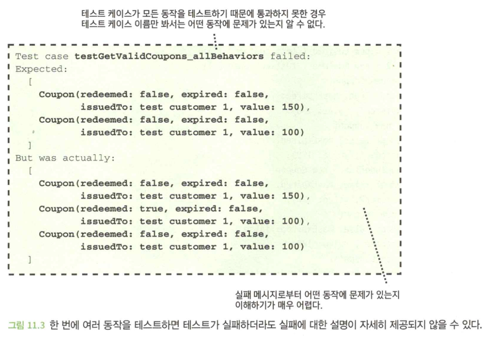
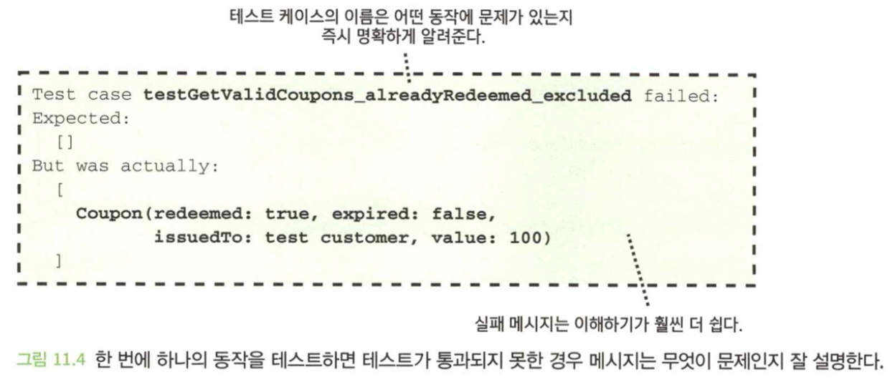
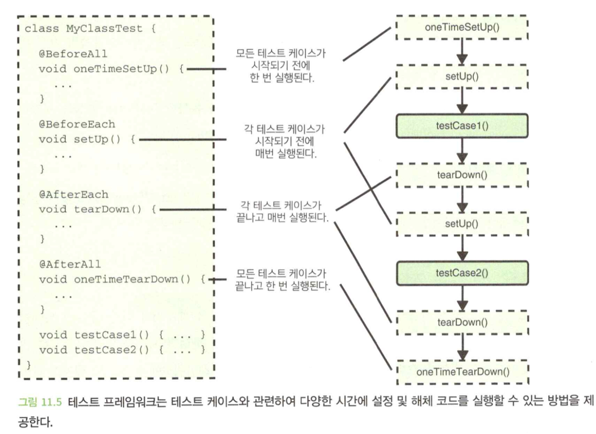
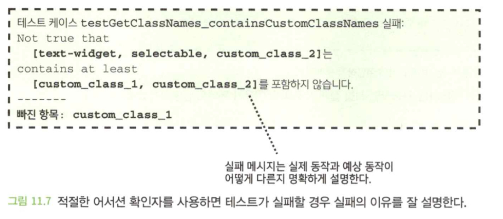

- 이 장에서 배우는 내용
  1. 코드의 모든 동작을 효고적이고 신뢰성있게 테스트하기
  2. 이해하기 쉽고 실패가 잘 설명되는 테스트 코드의 작성
  3. 의존성 주입을 사용하여 테스트가 용이한 코드의 작성

</br>

# 1. 기능뿐만 아니라 동작을 시험하라
- 단순히 눈에 보이는 대로 함수 이름을 테스트 목록에 넣기보다는 함수가 수행하는 모든 동작으로 목록을 채우는 것이 좋다.

## 1.1 함수당 하나의 테스트 케이스만 있으면 적절하지 않을 떄가 많다.

```java
class MortgageAssessor {
    private const Double MORTGAGE_MULTIPLIER = 10.0;

    MortgageDecision access(Customer customer) {
        if (!isEligibleForMortgage(customer)) {
            return MortgageDecision.rejceted();
        }
        return MortgageDecision.approve(getMaxLoanAmount(customer));
    }

    private static Boolean isEligibleForMortgage(Customer customer) {
        return customer.hasGoodCreditRating() && !customer.hasExistingMortgage() && !customer.isBanned();
    }

    private static MonetaryAmount getMaxLoanAmount(Customer customer) {
        return customer.getIncome()
            .minus(customer.getOutgoings())
            .multiplyBy(MORTGAGE_MULTIPLIER)
    }
}
```

```java
testAssess() {
    Customer customer = new Customer(
        income: new MonetaryAmount(50000, Currency.USD),
        outgoings: new MonetaryAmount(20000, Currency.USD),
        hasGoodCreditRating: true,
        hasExistingMortgage: false,
        isBannded: false
    );
    MortgageAssessor mortgageAssessor = new MortgageAssessor();

    MorgageAssessor decision = mortgageAssessor.assess(customer);

    assertThat(decision.isApproved()).isTrue();
    assertThat(decision.getMaxLoanAmount()).isEqualTo(
        new MonetaryAmount(30000, Currency.USD);
    );
}
```

- 위 테스트는 행동이 아닌 기능 테스트에 집중한 문제있는 테스트다.

## 1.2 해결책: 각 동작을 테스트하는 데 집중하라.
- 함수 자체를 테스트하는 데만 집중하면, 정작 실제로 신경 써야 할 중요한 동작을 검증하지 않는 테스트 케이스를 작성하기가 매우 쉽다.
- 테스트 코드의 양이 실제 코드의 양보다 많지 않다면, 모든 동작이 제대로 테스트되고 있지 않음을 나타내는 경고 표시일 수 있다.

### 모든 동작이 테스트되었는지 거듭 확인하라.
- 수정된 코드에 버그나 오류가 있음에도 여전히 테스트를 통과할 수 있는지 생각해보라.
- 이들 중 어느 하나에 대한 대답이 '예'라면 모든 행동이 테스트 되고 있지 못하다는 것을 의미한다.

1. 삭제해도 여전히 컴파일되거나 테스트가 통과하는 코드 라인이 있는가?
2. if문의 참 거짓 논리를 반대로 해도 테스트가 통과하는가?
3. 논리 연산자나 산술 연산자를 다른 것으로 대체해도 테스트가 통과하는가?
4. 상숫값이나 하드 코딩된 값을 변경해도 테스트가 통과하는가?

### 오류 시나리오를 잊지 말라

```java
class BankAccount {
    ...
    void debit(MonetaryAmount amount) {
        if (amount.isNegative()) {
            throw new ArgumentException("액수는 0보다 적을 수 없음");
        }
        ...
    }
}
```

```java
void testDebit_negativeAmount_throwsArgumentException {
    MonetaryAmount negativeAmount = new MonetaryAmount(-0.01, Currency.USD);
    BankAccount bankAccount = new BankAccount();

    ArgumentException exception = assertThrows(
        ArgumentException,
        () -> bankAccount.debit(negativeAmount)
    );
    assertThat(exception.getMessage())
        .isEqualTo("액수는 0보다 적을 수 없음.");
}
```

- 함수에 집중하기보다는 궁극적으로 중요한 모든 해옹을 파악하고 각각에 대한 테스트 케이스가 있는지 확인하는 것이 더 효과적이다.

</br>

# 2. 테스트만을 위해 퍼블릭으로 만들지 말라.

## 2.1 프라이빗 함수를 테스트하는 것은 바람직하지 않을 때가 많다.
- 프라이빗 함수를 퍼블릭으로 만든 후에 테스트할 때의 문제는 다음과 같다.
  - 실제로 우리가 신경쓰는 행동을 테스트 하는 것이 아니다.
  - 테스트가 구현 세부 사항에 독립적이지 못하게 된다.
  - 퍼블릭 API를 변경한 효과를 갖는다.

## 2.2 해결책: 퍼블릭 API를 통해 테스트하라.
- 이 원칙의 목적은 구현 세부 사항이 아닌 실제로 중요한 동작을 테스트하도록 개발자에게 가이드를 제공하는 것이다.

```java
testAssess_badCreditRating_mortgageRejected() {
    Customer customer = new Customer(
        ...
    );
    MortgageAssessor mortgageAssessor = new MortgageAssessor();
    MortgageDecision decision = mortgageAssessor.assess(customer);

    assertThat(decision.isApproved()).isFalse();
}
```

## 2.3 해결책: 코드를 더 작은 단위로 분할하라.



- 코드를 더 작은 계층으로 나눠라.



- 코드를 테스트 하기 위해 프라이빗 함수를 퍼블릭으로 만든다면, 이것은 실제로 신경 써야 하는 행동을 테스트하지 않는다고 경고 신호로 받아들여야 한다.
- 공개된 함수를 이용해 테스트해야 하는데, 이것이 어렵다면 클래스가 너무 크기 때문에 하위 문제를 해결하는 더 작은 클래스로의 분할을 고려해봐야 하는 시점에 이르렀음을 의미한다.

</br>

# 3. 한 번에 하나의 동작만 테스트하라

## 3.1 여러 동작을 한꺼번에 테스트하면 테스트가 제대로 안 될 수 있다.

```java
List<Coupon> getValidCoupons(
    List<Coupon> coupons, Customer customer
) {
    return coupons
        .filter(coupon -> !coupon.alreadRedeemed())
        .filter(coupon -> !coupon.hasExpired())
        .filter(coupon -> coupon.issuedTo() == customer)
        .sortBy(coupon -> coupon.getValue(), SortOrder.DESCENDING);
}
```

- 위 코드를 하나의 테스트에서 모두 테스트하면, 테스트 케이스가 무엇을 하고 있는지 이해하기 어렵다.
- 그리고 어떤 케이스에서 예외가 발생할지 모르므로, 잘 설명된 실패에 해당하지 않는다.



## 3.2 해결책: 각 동작은 자체 테스트 케이스에서 테스트하라.
- 각 테스트 케이스 이름에서 어떤 동작을 테스트 하고 있는지 정확하게 실별할 수 있으며, 테스트의 작동 방식을 이해하기 위해 코드를 파악하는 것이 비교적 쉽다.

```java
void testGetValidCoupons_validCoupon_included() {
    ...
}

void testGetValidCoupons_alreadyRedeemed_excluded() {
    ...
}

void testGetValidCoupons_exprired_excluded() {
    ...
}

void testGetValidCoupons_issuedToDifferentCustomer_excluded() {
    ...
}

void testGetValidCoupons_returnedInDescendingValueOrder() {
    ...
}
```



- 코드 중복이 많아지는 단점도 있다.

## 3.3 매개변수를 사용한 테스트
- 테스트 프레임워크 중에 매개변수를 사용해 테스트할 수 있는 기능을 제공하는 프레임워크도 있다.
  - `C#`의 `NUnit`
  - `Java`의 `JUnit`
  - `Javascript`의 `Jasmine`

```java
[TestCase(true, false, TestName="이미 사용함")]
[TestCase(false, true, TestName="유효기간 만료")]
void testGetValidCoupons_excludesInvalidCoupons(
    Boolean alreadyRedeemed, Boolean hasExpried
) {
    Customer customer = new Customer("test customer");
    Coupon coupon = new Coupon(
        alreadyRedeemed: alreadRedeemed,
        hasExpried: hasExpred,
        issuedTo: customer, value: 100
    );
    List<Coupon> validCoupons = getValidCoupons([coupon], customer);

    assertThat(validCoupons).isEmpty();
}
```

</br>

# 4. 공유 설정을 적절하게 사용하라
- `BeforeAll` : 테스트 케이스가 실행되기 전에 단 한번 실행된다.
- `BeforeEach` : 각 테스트 케이스가 실행되기 전에 매번 실행된다.
- `AfterAll` : 모든 테스트 케이스가 실행된 후 한번 실행
- `AfterEach` : 각 테스트 케이스가 실행된 후 매번 실행



- `상태공유` : 설정된 상태가 모든 테스트 간에 공유된다.
- `설정공유` : 테스트 케이스는 이 코드에 의한 모든 설정을 공유.

## 4.1 상태 공유는 문제가 될 수 있다

```java
class OrderManagerTest {
    private Database database;

    @BeforeAll
    void oneTimeSetUp() {
        data = Database.createInstance();
        databse.waitForReady();
    }
    ...
}
```

- 서로 다른 테스트 케이스 간에 가변적인 상태를 공유하면 문제가 발생하기 매우 쉽다.

## 4.2 해결책: 상태를 공유하지 않거나 초기화하라
- 가장 분명한 방법은 애초에 공유하지 않는 것이다.
- 데이터 베이스 설정이 느리지 않다면 테스트마다 매번 초기화하라.

```java
@BeforeAll
void oneTimeSetUp() {
    database = Database.createInstance();
    database.waitForReady();
}

@AfterEach
void tearDown() {
    databse.reset();
}
```

- 피할 수 있다면 일반적으로 공유하지 않는 것이 바람직하다.
- 피할 수 없다면 케이스 간에 상태를 초기화해야 한다.

## 4.3 설정 공유는 문제가 될 수 있다.
- 설정을 공유하는 것은 코드의 반복을 피하는 데는 유용하지만 일반적으로 테스트 케이스에 중요한 값이나 상태는 공유하지 않는 것이 최선이다.
- 설정을 공유하면 어떤 테스트 케이스가 어떤 특정 항목에 의존하는지 정확하게 추적하는 것은 매우 어려우며, 향후 변경 사항이 발생하면 테스트 케이스가 원래 목적했던 동작을 더 이상 테스트하지 않게 될 수 있다.

## 4.4 해결책: 중요한 설정은 테스트 케이스 내에서 정의하라.
- 헬퍼 함수를 정의해서 설정 공유의 문제를 해결할 수 있다.

```java
// 특정 항목으로 주문을 생성하기 위한 헬퍼 함수
private static Order createOrderWithItems(List<Item> items) {
    return new Order(
        customer: new Customer(
            address: new Address("Test address"),
        ),
        Item: items
    );
}
```

## 4.5 설정 공유가 적절한 경우
- 필요하면서도 테스트 케이스의 결과에 직접적인 영향을 미치지는 않는 설정이 있을 수 있다.
- 이 같은 경우에는 설정 공유를 통해 불필요한 코드 반복을 피할 수 있고 테스트는 좀 더 뚜렷한 목적을 갖고 이해하기 쉬워진다.
- 테스트 설정을 공유하는 것은 양날의 검이 될 수 있다. 코드 반복이나 비용이 많이 들어가는 설정의 반복적인 수행을 피하기 위해서는 유용하지만 테스트가 효과적이지 못하거나 파악하기 어려울 수 있다. 적절하게 사용하기 위해 심사숙고 할 필요가 있다.


</br>

# 5. 적절한 어서션 확인자를 사용하라
## 5.1 부적합한 확인자는 테스트 실패를 잘 설명하지 못할 수 있다.

```java
void testGetClassNames_containsCustomClassNames() {
    TestWidget textWidget = new TextWidget(
        ["custom_class_1", "custom_class_2"]
    );

    assertThat(textWidget.getClassNames()).isEqualTo([
        "text-widget",
        "selectable",
        "custom_class_1",
        "custom_class_2",
    ]);
}
```

- 테스트 케이스가 의도한 것보다 더 많은 것을 테스트하고 있다.
- 클래스 이름이 반환되는 순서가 변경되면 이 테스트는 실패한다.

```java
void testGetClassNames_containsCustomClassNames() {
    TestWidget textWidget = new TextWidget(
        ["custom_class_1", "custom_class_2"]
    );

    ImmutableList<String> result = textWidget.getClassNames();

    assertThat(result.contains("custom_class_1")).isTrue();
    assertThat(result.contains("custom_class_2")).isTrue();
}
```

- 테스트가 실패하는 경우 왜 실패하는지 이유를 제대로 설명해주지 않는다.


## 5.2 해결책: 적절한 확인자를 사용하라.

```java
void testGetClassNames_containsCustomClassNames() {
    TestWidget textWidget = new TextWidget(
        ["custom_class_1", "custom_class_2"]
    );

    assertThat(textWidget.getClassNames())
        .containsAtLeast("custom_class_1", "custom_class_2");
}
```



- 코드에 문제가 있을 때 테스트가 반드시 실패해야 한다는 점 외에도 테스트가 어떻게 실패할지에 대해 생각해보는 것이 중요하다.

</br>

# 6. 테스트 용이성을 위해 의존성 주입을 사용하라
- 의존성 주입을 사용하면 코드의 테스트 용이성이 크게 향상된다.

## 6.1 하드 코딩된 의존성은 테스트를 불가능하게 할 수 있다.

```java
class InvoiceReminder {
    private final AddressBook addressBook;

    InvoiceReminder() {
        this.addressBook = DataStore.getAddressBook();
    }
    ...
}
```

- 위와 같은 코드는 테스트 더블을 사용할 수 없다.

## 6.2 해결책: 의존성 주입을 사용하라.

```java
class InvoiceReminder {
    private final AddressBook addressBook;

    InvoiceReminder(AddressBook addressBook) {
        this.addressBook = addressBook;
    }
    ...
}
```

</br>

# 7. 테스트에 대한 몇 가지 결론
- 개발자로서 접하고 사용할 가능성이 큰 다른 두 가지 테스트 수준
  - `통합 테스트` : 구성 요소와 하위 시스템을 서로 연결하는 프로세스를 테스트
  - `E2E 테스트` : 처음부터 끝까지 전체 소프트웨어 시스템을 통과하는 여정을 테스트
- 알고 있으면 좋을 몇 가지 개념
  - `회귀 테스트` : 소프트웨어의 동작이나 기능이 바람직하지 않은 방식으로 변경되지 않았는지 확인하기 위해 정기적으로 수행하는 테스트
  - `골든 테스트` : 특성화 테스트라고도 하며, 일반적으로 주어진 입력 집합에 대해 코드가 생성한 출력을 스냅샷으로 저장한 것으로 기반하여 출력이 다르면 테스트 실패
  - `퍼즈 테스트` : 많은 무작위 값이나 흥미로운 값으로 코드를 호출하고 그들 중 어느 것도 코드의 동작을 멈추지 않는지 점검
- 단위 테스트가 가장 흔한 테스트 유형이지만, 단위 테스트만으로는 테스트의 모든 요구 사항을 충족할 수 없기 떄문에 다양한 테스트 유형과 수준에 대해 알아보고 새로운 툴과 기술에 대한 최신 정보를 유지하는 것이 좋다.

</br>

# 요약
- 각 함수를 테스트하는 것에 집중하다 보면 테스트가 충분히 되지 못하기 쉽다. 보통은 모든 중요한 행동을 파악하고 각각의 테스트 케이스를 작성하는 것이 더 효과적이다.
- 결과적으로 중요한 동작을 테스트해야 한다. 프라이빗 함수를 테스트하는 것은 거의 대부분 결과적으로 중요한 사항을 테스트하는 것이 아니다.
- 한 번에 한 가지씩만 테스트하면 테스트 실패의 이유를 더 잘 알 수 있고 테스트 코드를 이해하기가 더 쉽다.
- 테스트 설정 공유는 양날의 검이 될 수 있다. 코드 반복이나 비용이 큰 설정을 피할 수 있지만 부적절하게 사용할 경우 효과적이지 못하거나 신뢰할 수 없는 결과를 초래할 수 있다.
- 의존성 주입을 사용하면 코드의 테스트 용이성이 상당히 향상될 수 있다.
- 단위 테스트는 개발자들이 가장 자주 다루는 테스트 수준이지만 이것만이 유일한 테스트는 아니다. 높은 품질의 소프트웨어를 작성하고 유지하려면 여러 가지 테스트 기술을 함께 사용해야 할 때가 많다.
