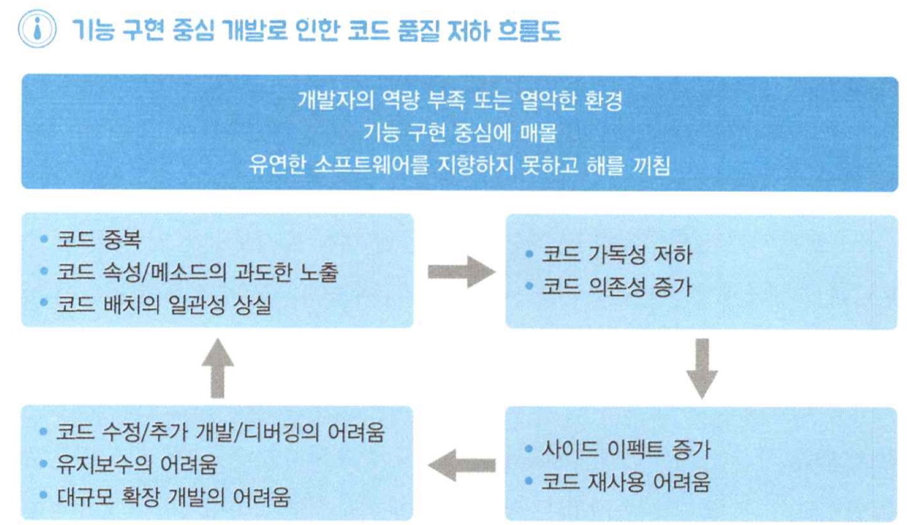
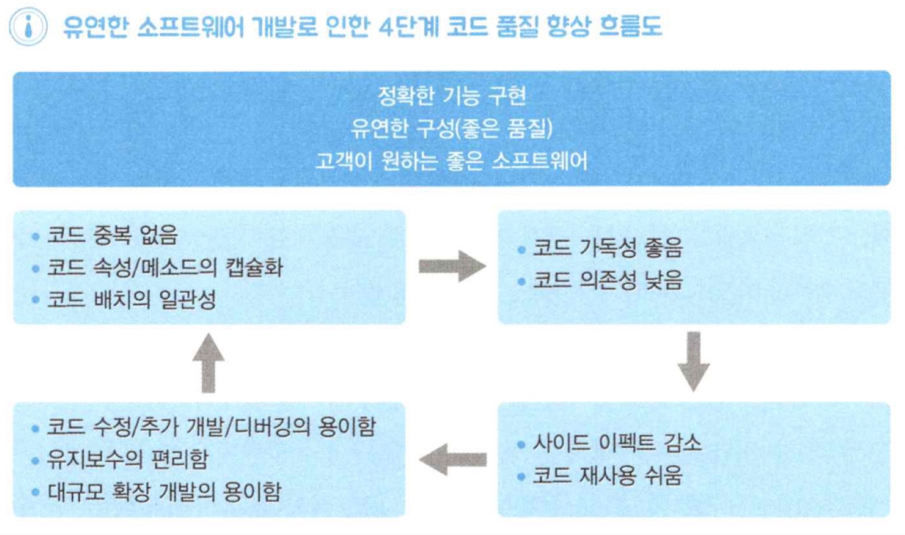

- 다음 내용을 다룬다.
    - 객체지향의 정의와 목표를 똑바로 세운다.
    - 객체지향의 잘못된 고정관념을 해소한다.
- 핵심 내용
    - 객체 지향의 구현 대상은 (보통) 새롭게 창조된 세계이다.
    - 객체지향은 현실 세계보다 (훨씬) 주도적이다.
    - 객체 하나하나를 잘 만드는 것보다 객체 간의 협력에 집중한다.
    - 기술을 완벽하게 적용할 필요까지는 없다.

 

# 객체지향의 정의와 목표의 전환
## 1. 대부분 개발자가 기능 중심 개발에 매달리는 이유
- 많은 개발자들이 `빠른 기능 구현`에만 신경을 쓰고있다.
- 중급 개발자(3년 이상)는 두 가지 분류로 나눈다.
    1. **소프트웨어의 기능 구현**만을 우선순위로 두는 개발자
    2. 객체지향의 장점을 알고 **소프트웨어 유연성**도 염두에 두는 개발자
- 프로젝트는 고객이 존재하고, 고객은 '최대한 빨리 완벽한 기능 구현'이라는 목표를 달성하기 위해 개발자를 압박한다.
- 그런 이유로, 개발자는 기능 구현 중심으로 개발 해야하는 환경에 직면한다.

 

## 2. 기능 중심 개발 -> 코드 품질 저하
- 개발자라면 더 나아가, **좋은 소프트웨어**를 만들기 위한 관심을 갖고 적절한 노력을 추구해야 할 의무가 있다.

### 기능 중심 개발이 불러오는 나비 효과
- 기능 구현에만 집착하면, 다른 중요한 것들을 보지 못하는 `매몰 현상`이 발생한다.
- 결국 **유연한 소프트웨어**를 지향하지 못하고, 소프트웨어에 해를 끼친다.

### 기능 중심 개발이 코드에 끼치는 영향

#### 코드의 중복
- 기능 구현에만 집중하다 보니 `Copy & Paste`를 하게 된다.
- 수정이 발생 시 관련 코드의 모든 수정을 초래한다.
- 시간이 지나면 이 코드들을 기억하기 어렵다.
- 유지보수 업무를 인수인계 받았다면, 더 어려워 진다.

#### 코드 속성의 과도한 노출
- 객체지향의 권장사항을 지킬 마음의 여유를 주지 않는다.
- **캡슐화**가 깨져 한 코드의 속성을 다른 코드에서 직접 접근해 조작할 수 있는 상황이 발생한다.

#### 코드 배치의 일관성 X
- 기능 구현을 위해 수단방법을 가리지 않아, 코드의 속성이나 메소드, 각종 로직 배치에 있어 **일관성**이 없다.
    - 메소드 내부에 있어야 할 지역 변수가 전역 변수로 빠져나와 있는 경우
    - 다른 메소드에 있어야 할 로직이 엉뚱한 메소드에 있는 경우
- 메소드가 해야 할 역할은 생각하지 못하고 온갖 잡다한 로직을 한 곳에 집어 넣기도 한다.

#### 코드 가독성 저하
- 기능 중심 개발에만 몰두하면, **가독성**을 지키기 어려워 진다.

#### 코드의 의존성 증가
- 코드 속성이나 메소드가 과도하게 노출되면, 다른 코드들이 지나치게 의존하게 된다.

#### 사이드 이펙트가 증가
- 하나의 코드 수정에 연결된 다른 코드가 버그를 일으킨다.

#### 코드 재사용의 어려움
- 코드 품질이 저하되면서 코드 재사용이 어려워 진다.

#### 코드 수정, 추가 개발, 디버그가 어려워 짐
- 고객의 요구 사항은 끊임없이 변하고, 수시로 기능 확장을 요청한다. 그러므로 소프트웨어는 코드 수정이 수월해야 한다.
- 코드 품질이 저하되면 사이드 이펙트의 발생 확률이 높아진다.
- 코드 재사용이 어렵기 때문에 코드를 `Copy & Paste`해 코드가 많이 중복된다.

#### 유지보수와 고도화 프로젝트에 지장
- 발전하는 기술 속도를 따라잡기 위한 고객의 요구 사항을, 유지보수 인력만으로는 감달하기 어려워 질 때가 온다.
- 기능 구현 개발에만 몰두되면, 유지보수도 어렵고 고도화 프로젝트 비용도 더 들어가게 된다.

 

## 3. 유연한 소프트웨어란 코드 품질 향상이다.

### 유연한 소프트웨어는 코드 품질이 좋다는 의미
> `고객이 원하는 좋은 소프트웨어` = 고객이 원하는 기능의 정확한 구현 + 유연한 구성

### 유연한 소프트웨어가 되었을 때의 특징

#### 코드의 중복이 거의 없다.
- 하나의 클래스는 하나의 기능을 하므로, 코드의 중복이 거의 없다.

#### 코드 속성과 메소드의 캡슐화가 잘 되어 있다.
- 캡슐화가 잘 되어 **코드의 의존성**이 낮아지고, **가독성**이 좋아진다.

#### 코드 배치의 일관성이 잘 지켜졌다.
- 메소드는 이름과 일치하는 하나의 로직만 담겨있다.
- 전역 변수, 지역 변수 배치의 일관성이 있다.
- 다른 클래스에 무질서하게 의존하지 않는다.

#### 코드 가독성이 좋다.
- 하나의 속성/메소드가 하나의 속성만 가지므로 코드의 길이가 적당 해 진다.

#### 코드 의존성이 낮다.
- 각 속성/메소드의 역할이 명확해서 의존성을 연결할 때 효과적인 방법이 눈에 잘 들어온다.
- 필요한 코드에만 의존할 수 있게 해 준다.

#### 사이드 이펙트의 감소
- 코드 의존성이 낮고 가독성이 높아 사이드 이펙트가 감소한다.

#### 코드 재사용이 쉽다.
- 코드 품질이 향상되어 모듈화하기 좋기 때문에 코드 재사용이 쉽다.

#### 코드 수정, 추가, 디버그가 수월하다.
- 코드가 유연하기 때문에, 결국 코드를 수정하는 디버깅을 하기 편해진다.

#### 유지보수와 고도화 프로젝트하기 좋다.
- 고객의 수정, 확장 요구사항을 더 빠르게 구현할 수 있다.
- 더 나은 여건으로 고도화 프로젝트를 할 수 있다.

## 4. 관계의 의존성은 낮게, 기능의 집중도는 높게
- 좋은 소프트웨어의 원칙 : "관계의 의존성은 낮게, 기능의 집중도는 높게"
- **낮은 결합도(관계의 의존성)** : 모듈의 기능을 수행하기 위해, 다른 모듈에 얼마나 적게 의존하느냐
- **높은 응집도(기능의 집중도)** : 어떤 모듈이 되도록 하나의 작업만 하도록 만들어 짐

 

## 5. 객체지향의 정의와 목표
> "객체지향은 **낮은 관계의 의존성**과 **높은 기능의 집중도**를 지향하여, **소프트웨어의 유연함을 극대화**하는 개발 기법이다."

 

# 고정관념의 전환

## 1. 객체지향의 구현 대상은 현실 세계?
- 대상이 인간에게 친숙한지 여부로 세상의 사물과 현상을 고스란히 소프트웨어로 적용한 것인지 아닌지 판단할 수 있다.
- 소프트웨어 주제는 필요에 의해 새롭게 창조된다.
> 객체지향은 현실 세계를 구현하기보다는 새로운 세계를 창조한다.

## 2. 객체지향은 현실 세계와 동일하다?
- 저자는 세상의 사물을 그대로 소프트웨어로 구현할 일은 거의 없었고, 객체와 현실 사물의 차이점을 정확하게 알지 못했다.
- 현실 세계는 외부에 **수동적**으로 작동하지만, 객체치향에서 객체들은 **주도적**이다.
> 객체지향 소프트웨어 객체 = 현실 세계의 사물 특성 + 주도성
- 개발자는 객체에 주도성을 부여하기 위해 적극적으로 노력해야 한다.
- 객체의 주도성이 높아야 객체 관례를 단순하게 만들 수 있다.
- 객체가 주도적일 경우 객체가 해야 할 일의 처리 방법을 변경해도 외부 객체는 영향을 받지 않는다.
- 객체의 주도성이 더 주어졌다는 것은 `기능의 집중도`를 높이는데 기여한다.

## 3. 객체 하나하나를 잘 만들어야 한다?
### 테스트 주도 개발 실험
- 테스트 주도 개발을 하면, 소프트웨어 개발을 바라보는 개발자의 시선이 달라진다.
    - 로직 구현보다는 객체가 외부에 노출하는 인터페이스를 잘 설계하는 것
    - 객체지향 적으로 리팩토링하면서 객체 내부와 객체 간의 관계를 깔끔하게 정리하게 함
- **일반적인 개발**은 중간중간 의식하지 않으면 개발자도 모르게 기능 중심 개발로 쏠린다.
- **테스트 주도 개발**은 의식하지 않아도 저절로 낮은 관계의 의존성과 높은 기능의 집중도(유연한 소프트웨어)를 지향한다.
- 테스트 주도 개발은, 기능보다는 외부에 노출되는 `인터페이스`의 설계에 저절로 더 신경을 쓰게 된다.

### 테스트 주도 개발이 던져준 화두
- 객체지향적으로 개발하기 위해, 객체 하나로만 해결하지 않고 **다른 역할을 하는 객체를 추가**해서 문제를 해결한다.
- '점'으로 접근하는 방법은 객체 간의 협력보다 객체 하나에만 신경을 쓰기 때문에 유연한 협력을 하지 못할 가능성이 크다.
- '선'으로 접근하는 방법은 처음부터 협력을 염두하고 객체를 설계하기 때문에 객체가 협력에 유연하게 대응해 문제를 해결할 수 있다.
> 점(객체 하나하나)보다 선(객체 간의 협력)으로 접근한다.

## 4. 기술을 완벽하게 적용해야 한다?
- 다음 이유들은 완벽한 객체지향을 적용하기 어렵게 만든다.
1. 바쁜 일정
2. 협업을 통한 객체지향 개발을 유지
3. 유연한 소프트웨어와 문제 많은 소프트웨어의 구현결과는 어쨌든 동일함
- 그러니 현장의 상황에 맞게 유연하게 대처하자.