# 객체지향 생각의 도구(관찰, 추상화 패턴인식)
## 1. 프로그래밍 언어의 사상을 배우고 따른다는 것
- 프로그래밍 언어를 배울 땐, **문법**과 **언어(사상)** 를 배운다.
- 사상이란 그 언어가 만들어진 이유이기 때문에, 이를 알면 언어의 장점을 100% 활용할 수 있다.

 

## 2. 절차지향 언어의 사상과 단점
- 객체지향 언어는 절차지향 언어의 단점을 개선하기 위해 고민한 **사상**이 담겨있다.
- 절차지향의 사상 : 어떤 기능을 함수로 모듈화 하고 이를 재사용한다.
- 절차지향의 단점 : 소프트웨어가 커지면, 전역 변수를 여기저기서 수정하여 사이드 이펙트가 생긴다.(의존성 문제)

 

## 3. 객체지향 언어의 사상과 단점
- `객체`란 데이터(속성)와 기능(행동)을 모두 포함한, 객체지향에서 독립적으로 실행할 수 있는 최소한의 단위이다.
- 개발자는 데이터를 소유한 `객체` 스스로 책임지고 관리하게 유도한다.
- 절차지향과 다르게, 객체지향은 '데이터 관리 주체'가 '데이터를 소유한 객체'로만 명확하게 지정되도록 유도한다.
- 객체지향은 속성과 기능을 소유한 객체 스스로 책임지게 유도한다.
- 결국 의존성은 낮아지고, 기능의 집중도는 올라간다.

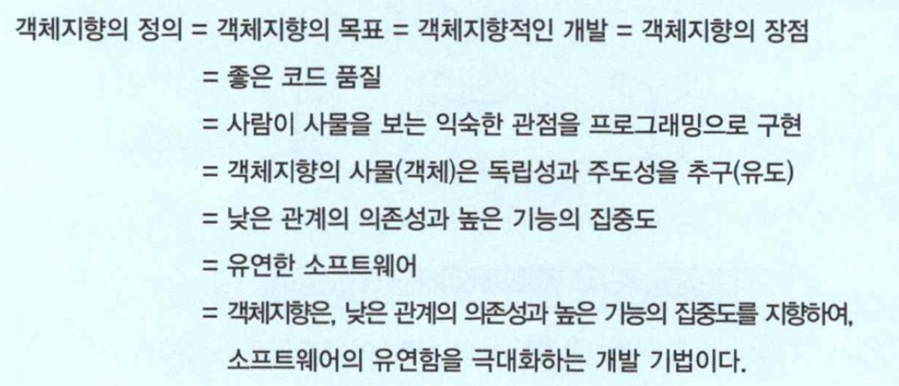

- 객제치향의 정의를 바탕으로 구체화된 생각의 전개가 필요한데, 그것이 관찰, 추상화, 패턴인식이다.

 

## 4. 관찰 -> 추상화 -> 패턴인식
### 관찰
- 사물의 중요한 특징을 누락하지 않아야 한다.
- 그러나 지나치게 과잉정보가 되어, 사물의 판단과 해석에 지장을 주어서는 안 된다.
- 이 과정에서 사물을 주의 깊게 살펴보는 사고력이 필요하다.
### 추상화
- 관찰에서 얻은 많은 데이터 중에서 의미 있는 데이터만 가려내는 사고력
### 패턴인식
- 나쁜 패턴을 버리고 좋은 패턴(관계의 의존성은 높이고, 기능의 집중도는 낮추고)을 추구해야 한다.
- 이러한 규칙과 노하우가 **디자인패턴**과 **리팩토링**이다.

 

## 5. 관찰 : 사물이나 현상을 주의하여 자세히 살펴보는 것
- 그냥 유심히 보는 수동적인 보기가 아닌, 적극적인 관찰이 되어야 한다.

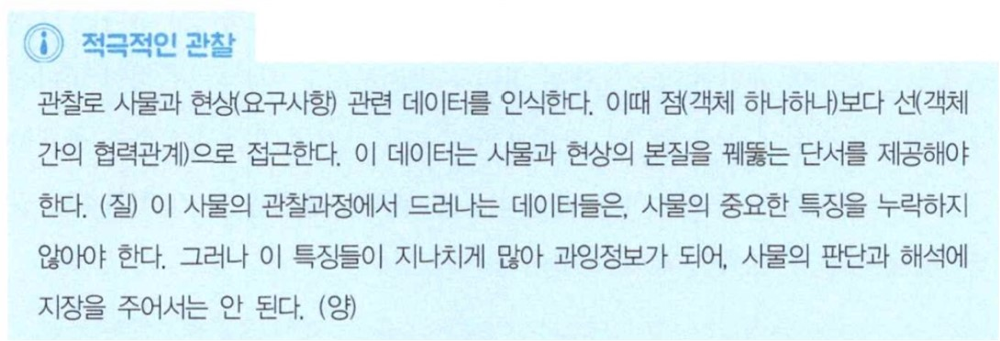

- 사물 하나하나 보다는 사물들끼리 상호작용하여 일어나는 현상을 더 유심히 관찰해야 한다.

 

## 6. 추상화
- 진정한 추상화란, 현실에서 출발하되 불필요한 부분을 도려내 가면서 사물의 중대하고 놀라운 본질을 드러나게 하는 과정이다.
- 추상화는 곧 한가지 특징만 잘 잡아내는 단순화이다.
- 점(객체 하나하나) 보다 선(객체 간의 협력)으로 접근해야 한다.
    - 점의 추상화 : 많은 데이터 중에 의미 있는 데이터만 가져오고 나머지는 버린다.
    - 선의 추상화 : 의미 있는 데이터를 모아 더 큰 단위의 의미 있는 정보로 만든다.

 

## 7. 패턴인식
- **디자인 패턴**이란,코드의 재활용이 아니라 객체 간의 관계를 재활용하는 기법이다.
- 패턴 인식에 대한 감각이 있어야 디자인 패턴을 소프트웨어 적재적소에 활용할 수 있다.
- 패턴 인식은 패턴을 발견하는 사고이다.
> 디자인패턴은 점(코드, 함수, 로직)의 재활용이 아니라 선(관계)의 재활용이다.

 

# 객체지향 표현의 도구(UML)
- 객체지향 프로그래밍의 명확한 의사소통 수단이 `UML(Unified Modeling Language)`이다.

## 1. UML 다이어그램 종류
### 유즈 케이스 다이어그램
- 책의 목차와 비슷하며, 요구분석단계에서 업무의 전체 시스템 구성을 한눈에 파악할 때 도움을 준다.

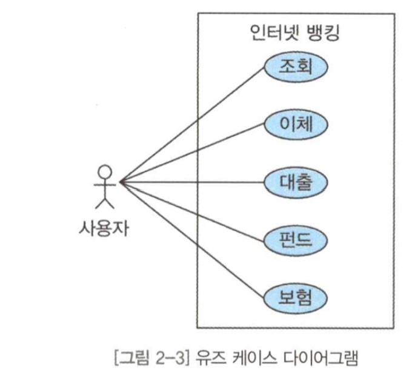

### 클래스 다이어그램
- 클래스 정보와 클래스 간의 관계를 한눈에 파악하는데 도움을 준다.

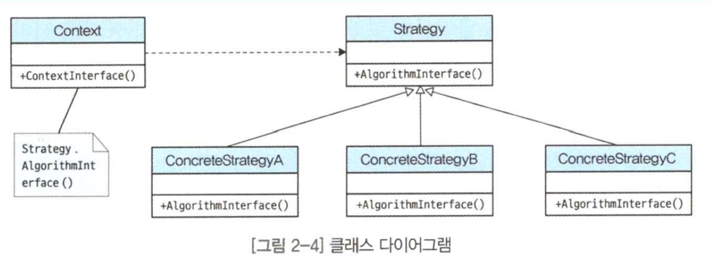

### 시퀀스 다이어그램
- 객체와 객체 사이의 메시지 흐름을 표현한다.

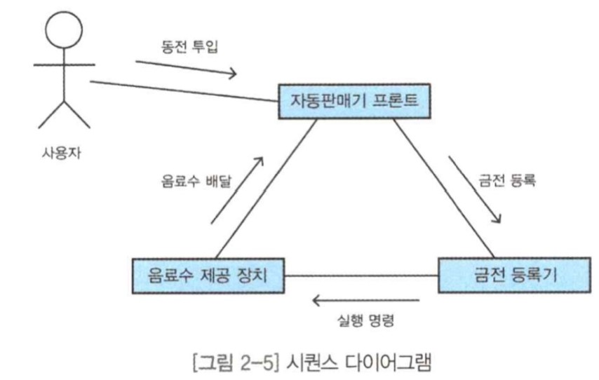

### 협력 다이어그램
- 보통 사용자가 어떤 웹서비스를 사용할 때 일어나는 메시지 흐름을 표현한다.

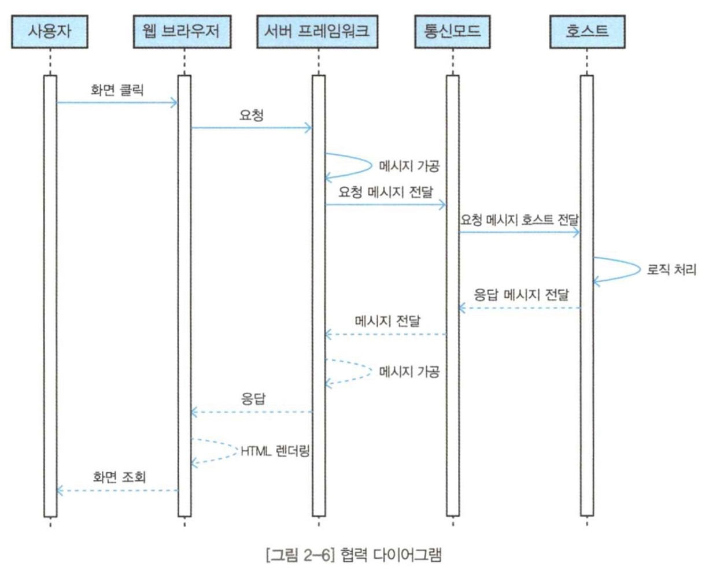

### 상태차트 다이어그램
- 객체 내부의 행동의 흐름을 그린다.

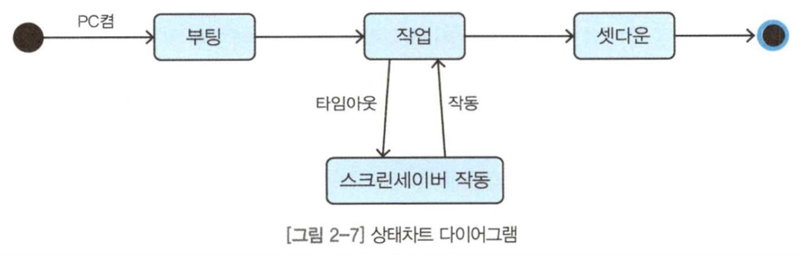

### 액티비티 다이어그램
- 객체들의 활동 순서를 파악하는데 도움을 준다.

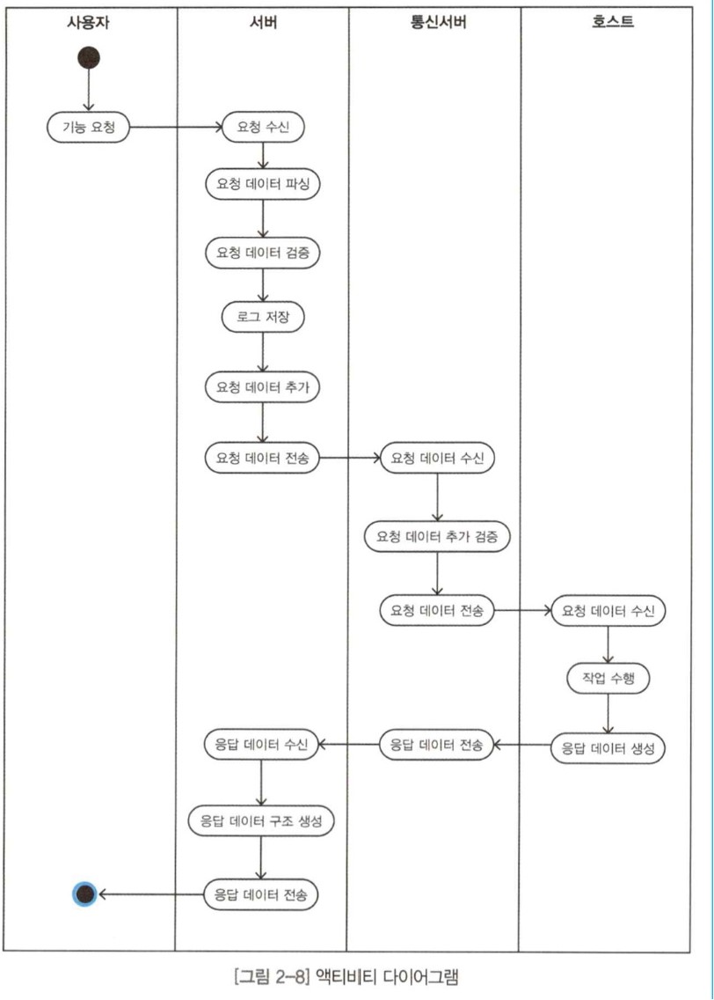

### 컴포넌트 다이어그램
- 완성된 모듈끼리 서로 어떻게 연결되는지 파악하도록 돕는다.

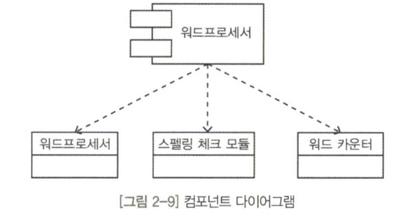

### 배포 다이어그램
- 서버 구성도, 네트워크 구성도 등의 시스템 배치 여부 확인에 많이 쓰인다.
- 배치 어플리케이션과 서버가 어떻게 배치 되었는지 보여준다.

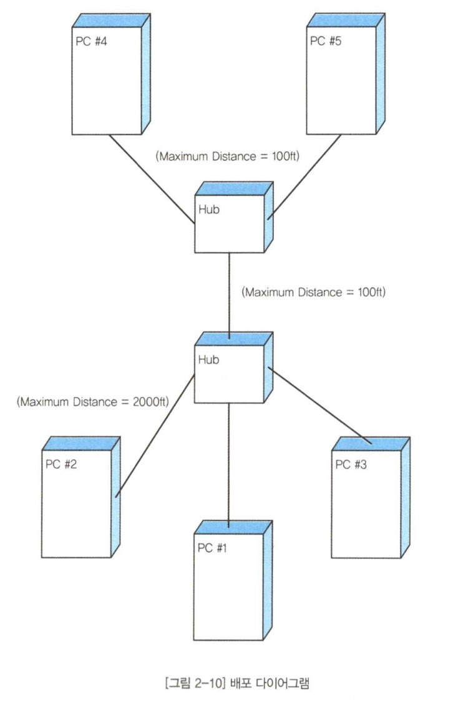

 

## 2. UML 다이어그램 활용 방법
- 어느 UML을 쓸 것인가? -> 우리가 UML을 쓰게 된 계기가 무엇인지 생각하면 타협점을 찾을 수 있다.
- "얼마나 의사소통에 유익하게 그릴 것인가"를 우선순위에 두어야 UML이 복잡하지 않는다.
- 의사소통에 도움이 된다면 다소 표준을 벗어나도 괜찮다.

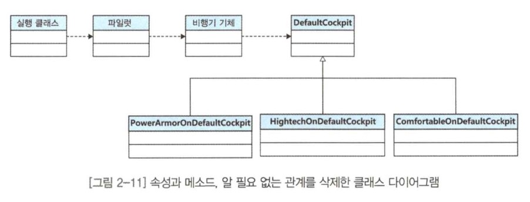

 

## 3. 클래스 다이어그램
- 클래스 다이어그램은 소프트웨어의 정적인 구조를 보여준다.
- 정적이라함은, 소프트웨어 관련 이벤트의 발생 유무와 상관없이, 있는 그대로의 소프트웨어 구조인 클래스, 클래스와의 관계, 클래스 내부의 속성과 메소드를 의미한다.
### 클래스와 인터페이스

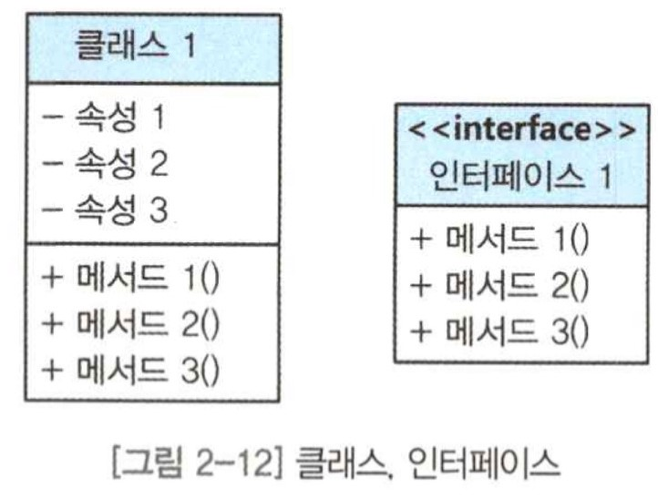

### 상속
- 화살표 방향의 클래스나 인터페이스를 자신이 상속받았다는 뜻이다.

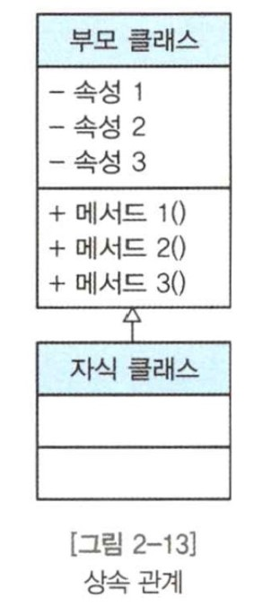

### 연결(의존)
- 클래스A가 클래스B와 연결되어 있다는 의미이다.
- 화살표 방향의 클래스나 인터페이스를 알고 있다는 뜻이다.

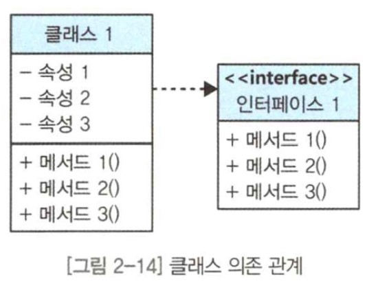

### 위임(집합)
- 클래스A와 다른 한쪽의 클래스 그룹B가 연결된 상태를 나타낸다.
- 마름모는 가까운 쪽이 다른쪽의 서비스를 사용한다는 뜻이다.

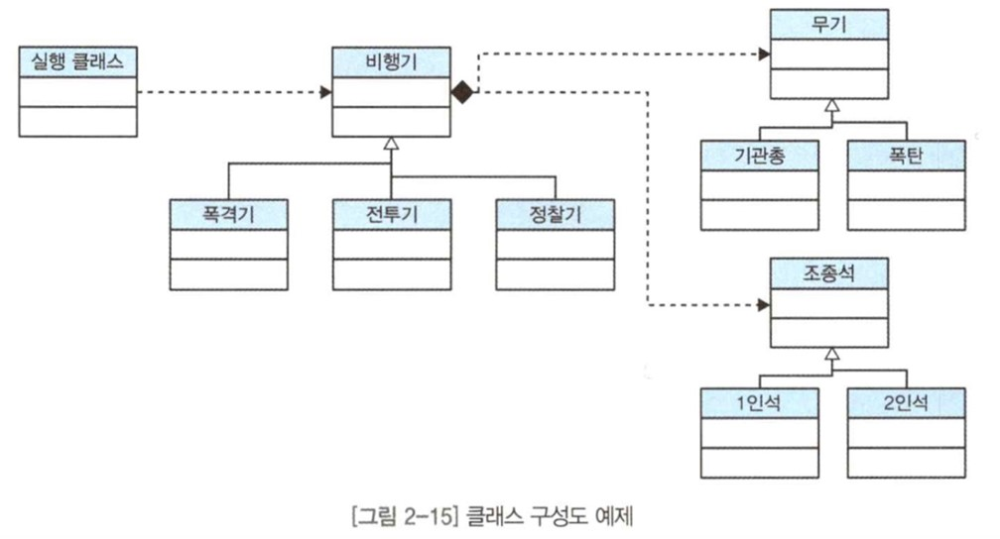
