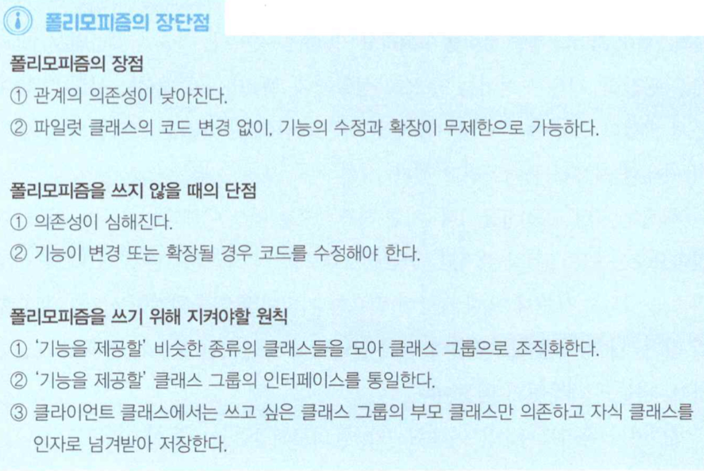
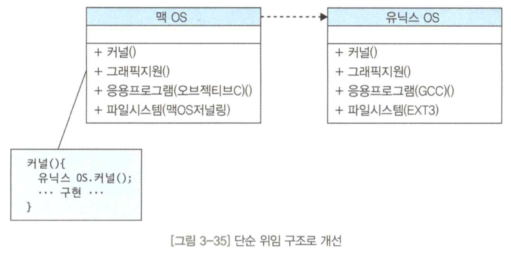

# 객체지향의 기본 요소 5가지
## 1. 객체(Object)
- 세상의 거의 모든 사물이 곧 객체이다.

### 객체의 일반적인 뜻
- 객체는 사람이 인식할 수 있는(이름이 부여된) 최소한의 의미를 가진 사물이다.
- 객체는 세상에서 '유일한' 사물이다.

### 객체지향에서의 객체
- 객체지향 언어에서 객체는 `데이터`와 `기능`의 두 가지 요소를 갖추었다.
- 객체는 이 두 가지 요소 덕분에 객체지향 소프트웨어에서 요구하는 최소한의 독립 단위로 의미를 가진다.

</br>

## 2. 클래스(Class)

### 분류와 범주
- `외연`
  - 일정한 개념이 적용되는 사물의 전체 범위
  - 일정한 개념에 속하는 모든 객체들의 집합
  - 이동수단의 외연 : 비행기, 배, 자동차, 기차 등
- `종 개념`
  - 하나의 개념 속에 포함되어 있는 여러 개의 개별 개념
  - 정찰기는 비행기의 종 개념, 비행기는 이동수단의 종 개념
- `분류`
  - 개념의 외연에 포함된 종개념을 명확하게 구분하여 체계적으로 정리하는 것
- `범주`
  - 동일한 성질을 가진 사물을 하나의 단어로 묶은 것
  - 하늘을 나는 기구A, 하늘을 나는 기구 B -> 비행기
- `분류`는 종류별로 구분하여 체계적이고 계층적으로한 Tree와 같고, `범주`는 분류의 상세 목록에 해당하는 `Node`명이라 할 수 있다.
- `분류`와 `범주`를 통해 우리는 세상의 사물과 생명의 종류를 추상화시켜 바라볼 수 있다.
- 막연해 보였던 대상도 `분류`와 `범주`를 통해 분명하게 볼 수 있다.
- 어떤 `분류`와 `범주`에서 구체적인 대상을 표현하는 것을, 객체지향에서는 `객체화`라고 한다.


### 객체지향에서의 분류와 범주 - 클래스
- `클래스`
  - 어떤 분류 중의 어느 범주를 코드로 구현한 것
  - ex. 비행기 클래스는 이동수단이라는 `분류`에 해당하는 비행기 `범주`를 코드로 구현한 것
  - 클래스란 코드로 작성한 설계도이며, 클래스 코드를 바탕으로 실제로 생성해 메모리에 올라가면 객체가 된다.
  - 클래스는 아직 코드로 만든 설계도일 뿐, 아직 소프트웨어 세상으로 나온 구체적인 실체는 아니다.
  - 클래스는 유사한 특징을 가진 대상들을 일정하게 묶어서 하나의 종류로 정의한 분류와 범주이다.


</br>

## 3. 속성(Attribute)
- 우리가 객체를 설계할 때도 고유한 특징을 발견해 속성으로 정의하는 것이 중요하다.

### 속성이란
- 속성은 객체가 가지고 있는 고유 값이다.(또는 변수라고 한다.)

### 속성을 정의하는 두 가지 상황
- 현실 세계에 존재하는 대상을 객체로 만들 때
  - 새롭게 창조할 객체에 어떤 특징을 부여해야 하는지 고민하는 관점으로 접근해야 한다.
  - '이 객체가 어떤 속성을 책임져야 하는가' 따져보는 관점이다.
- 현실 세계에 없는새로운 존재를 창조할 때

### 속성을 잘 추출하는 방법
> 점(객체 하나하나) 보다 선(객체 간의 협력관계)으로 접근한다.
- 위의 원칙을 지킨다면, 적절한 속성 추출은 저절로 따라온다.
- 객체 하나만 생각하지 말고 항상 선(객체 간의 협력관계)의 관점으로 접근해야 한다.
- 선의 관점에서는 속성보다 `메소드`에 더 의식하게 되는데, 메소드가 다른 객체와 상호작용하는 관문 역할을 담당하기 때문이다.
- 속성은 '객체가 주어진 역할을 최대한 잘 수행하기 위해서, 어떤 기능이 필요할까?' 하는 관점으로 접근해야 한다.


</br>

## 4. 메소드(Method)
### 1단계, 메소드를 함수처럼 쓰기
- 메소드를 함수처럼 쓰는 단계까지 알고 활용하는 개발자는 아래와 같다.
  - 기본적인 처리, 판단, 반복문을 활용할 줄 안다.
  - 함수 개념을 활용해 반복되는 로직을 함수 안에 집어넣고 호출해서 쓸 줄 안다.

### 2단계, 메소드에 객체 개념 적용하기
- 데이터를 효과적으로 추출하는 방법을 알아야 한다.
- 객체지향에서는 하나의 객체를 크게 속성과 행동으로 나눈다.
- 객체지향에서 행동은 메소드로 표현한다.
- 메소드란 객체가 자신 또는 다른 객체에게 제공하는 기능이다.
- 메소드를 객체 개념 적용하기 단계까지 알고 활용하는 개발자는 아래와 같다.
  - 기본적인 처리, 판단, 반복문을 활용할 줄 안다.
  - 함수 개념을 활용해 반복되는 로직을 함수 안에 집어넣고 호출해서 쓸 줄 안다.
  - 객체를 만들 때 속성과 객체에 필요한 기능이 무엇인지 고려하면서 메소드를 작성한다. 즉 로직 관점이 아닌, 객체 설계 관점으로 시야를 넓게 가진다.
- **로직 관점** : 이 로직을 어떤 알고리즘으로 구현하면 효율적이고 정확하게 구현할 수 있지?
- **객체 설계 관점** : 상식적인 선에서 이 비행기에 필요한 기능은 무엇일까?

### 3단계, 메소드에 캡슐화 개념 적용하기
- 메소드는 객체의 속성을 변경하는 통로이다.
- 객체지향이 추구하는 가이드를 따르면, 속성은 외부로부터의 접근이 차단되어야 한다.
- 속성은 오로지 메소드를 통해서만 접근가능해야 하는데, 이 규칙이 `캡슐화`이다.
- 이런 캡슐화를 통해 객체의 무결성과 안전성을 강화시킬 수 있다.
- 메소드를 객체 개념 적용하기 단계까지 알고 활용하는 개발자는 아래와 같다.
  - 기본적인 처리, 판단, 반복문을 활용할 줄 안다.
  - 함수 개념을 활용해 반복되는 로직을 함수 안에 집어넣고 호출해서 쓸 줄 안다.
  - 객체를 만들 때 속성과 객체에 필요한 기능이 무엇인지 고려하면서 메소드를 작성한다. 즉 로직 관점이 아닌, 객체 설계 관점으로 시야를 넓게 가진다.
  - 캡슐화를 지키려고 한다. 캡슐화를 왜 해야 하는지 안다. 속성은 다른 객체가 접근하지 못하게 `private`로 선언하고, 메소드로만 접근하도록 구성할 줄 안다.

### 4단계, 메소드에 협력 개념 적용하기
- 객체의 속성이 은밀하고 수동적이라면 메소드는 적극적이고 능동적이다.
- 객체들끼리 메시지를 주고받으면서 소프트웨어의 결과에 영향을 주기 때문에 능동적이다.
- 메소드는 다른 객체와 상호작용하는 통로가 된다.
- 메소드를 객체 개념 적용하기 단계까지 알고 활용하는 개발자는 아래와 같다.
  - 기본적인 처리, 판단, 반복문을 활용할 줄 안다.
  - 함수 개념을 활용해 반복되는 로직을 함수 안에 집어넣고 호출해서 쓸 줄 안다.
  - 객체를 만들 때 속성과 객체에 필요한 기능이 무엇인지 고려하면서 메소드를 작성한다. 즉 로직 관점이 아닌, 객체 설계 관점으로 시야를 넓게 가진다.
  - 캡슐화를 지키려고 한다. 캡슐화를 왜 해야 하는지 안다. 속성은 다른 객체가 접근하지 못하게 `private`로 선언하고, 메소드로만 접근하도록 구성할 줄 안다.
  - 점(객체 하나하나)보다 선(객체 간 협력관계)으로 접근할 줄 안다.


</br>

## 5. 생성자(Constructor)

### 생성자는 다른 형태의 메소드
- 생성될 때 호출되는 일종의 메소드다. 그래서 객체가 처음 생성되는 순간에 객체가 어떤 특별한 일을 해야 한다면 생성자에서 구현한다.

### 생성자는 오버로딩 기능을 자주 사용하게 된다.
- 경우에 따라 여러 생성자가 필요하다면, 생성자의 인자값을 다르게 주어서 같은 이름의 여러 생성자(메소드)를 호출하는 객체지향의 오버로딩 기업을 사용할 수 있다.

</br>

# 객체지향의 근본 조건 7가지
- 객체지향의 근본 조건은 낮은 관계의 의존성과 높은 기능의 집중도를 추구하는 객체지향의 장점을 지키기 위한 필수 조건이다.

## 1. 객체지향 보물지도
- 객체, 클래스, 상속의 사전적인 뜻만 외우지 말고 객체지향의 요소와 조건들이 어떻게 서로 뭉치고 작용하는지 큰 그림을 그려야 한다.


</br>

## 2. 상속(세로)(Ingeritance)
- 상속을 코드를 재활용하는 용도로만 쓰다보면 좋은 코드 구성은 할 수 없다.

### 상속의 일반적인 의미
- 세상의 사물은 따로 존재하지 않고, 어떤 사물의 하위 개념이기도 하면서 동시에 다른 사물의 상위 개념도 된다.
- 분류법을 통해 어떤 분류에 속하는 다른 객체가 어떤 특징을 가지고 있음을 알게 되면, 그 분류와 하위 분류에 속하는 다른 객체도 그 속성을 가지고 있을 것이라 추론할 수 있다.
- 상위에 위치한 분류 계층을 하위 분류 계층의 **일반화**라고 한다. 하위에 위치한 분류를 상위분류 계층의 **특수화**라고 한다.

### 상속의 문법적인 의미
- 상속을 받으면, 자식 클래스는 물려받은 속성과 메소드가 코드에 명시되지는 않지만, 상속받은 속성과 메소드를 거의 아무 제약 없이 사용할 수 있게 된다.
- 클래스의 관계 측면에서 상속의 역할을 보면, 부모 클래스와 자식 클래스 간에 "세로"로 관계 맺어져 있다.
- 자식 클래스는 부모 클래스에 강하게 연결되어 있다.

### 상속의 효과
- **코드 관점**
  - 코드의 재사용 가능 : 부모의 속성과 기능을 사용
  - 코드의 수정(확장)의 편리함 : 부모만 고치면 자식들도 수정
- **개발 편의성 관점**
  - 상속의 장점은 분류하고 범주 정하기에 익숙한 인간의 사고와 비슷하게 프로그래밍 할 수 있게 해준다.
- **낮은 관계의 의존성과 높은 기능의 집중도를 위한 관점**
  - 오버라이딩 가능 : 부모의 메서드 재정의
  - 폴리모피즘 가능 : 다형성이란 객체지향 요소를 구현

</br>

## 3. 오버로딩
- 메소드 이름은 같지만, 메소드의 인자값을 다르게 해서 같은 메소드 이름을 가졌어도 별개의 메소드로 보고 접근할 수 있게 하는 개념
- 이름을 붙이는 작업에 시간을 낭비하지 않게 해주고, 읽을 때 메소드의 뜻을 해석하는데 불필요한 시간을 쏟지 않게 한다.

</br>

## 4. 오버라이딩
- 상속을 받은 부모 클래스에서 정의한 메소드를, 자식 클래스의 특징에 맞게 로직을 덮어쓰기 해서 재구현하는 개념

### 현실의 오버라이딩


### 객체지향의 오버라이딩
- 아래 코드 중, 위와 같이 코딩하는데 익숙 해 져야 한다.

```java
DefaultAirplane dAirplane2 = new JetAirplane();
dAirplane2.airplaneFeature();

JetAirplane dAirplane4 = new JetAirplane();
dAirplane4.airplaneFeature();
```


</br>

## 5. 폴리모피즘(Polymorphism)
- 폴리모피즘이야말로 객체지향 문법의 정상이라 할 수 있다.

### 폴리모피즘의 정의
- 같은 그룹에 속하는 클래스들의 동일한 메소드를 호출할 때 자식 클래스들이 저마다 다른 로직을 수행하고 리턴하는 것


### 현실의 폴리모피즘
- 비행기는 저마다 다 이륙을 해야 한다. 관제사가 비행기에게 이륙을 요청하면, 비행기마다 각각 다른 방식으로 이륙할 것이다.

### 객체지향의 폴리모피즘


```java
public class Pilot {
    DefaultAirplane defaultAirplane1;

    public Pilot(DefaultAirplane defaultAirplaneReceived) {
        defaultAirplane1 = defaultAirplaneReceived;
    }

    public void intoAirplane() {
        defaultAirplane1.airplaneFeature();
    }
}

public class LaunchMain {
    public static void main(String[] args) {
        Pilot defaultPilot = new Pilot(new PropellerAirplane());
        defaultPilot.intoAirplane();
    }
}
```


### 폴리모피즘으로 구성할 때의 장점
1. 관계 의존성이 낮아진다.
   1. `Pilot`은 `DefaultAirplane`에만 의존하기 떄문에, 관계의 의존성이 획기적으로 낮아진다.
2. `Pilot` 클래스의 코드 변경 없이, 기능의 수정과 확장이 무제한으로 가능하다.
   

### 폴리모피즘으로 구성하지 않았을 때


1. 의존성이 심해진다.
   1. `if`문을 사용하기 때문에, 변경 또는 확장될 경우 기존 코드도 따라서 수정되어야 한다.

### 폴리모피즘을 위한 원칙 3가지
1. '기능을 제공할' 비슷한 종류의 클래스들을 모아 클래스 그룹으로 조직화한다.
   
2. 기능을 제공할 클래스 그룹의 인터페이스를 통일한다.
   1. 자식 클래스도 인터페이스를 완전하게 통일시켜야 한다.
3. 클라이언트 클래스에서는 쓰고 싶은 클래스 그룹의 부모 클래스만 의존하고 자식 클래스를 인자로 넘겨받아 저장한다.

### 폴리모피즘 정리
- 같은 그룹에 속하는 클래스들의 동일한 메소드를 호출할 때 자식 클래스들이 저마다 다른 로직을 수행하고 리턴하는 것
- 개발자가 폴리모피즘을 이해했는가, 폴리모피즘을 쓸 줄 아느냐 모르느냐를 간단하게 판단할 수 있는 기준이 있다.

```java
StealthAirplane stealthAirplane = new StealthAirplane();
DefaultAirplane stealthAirplane = new StealthAirplane();
```




</br>

## 6. 캡슐화

### 속성의 캡슐화
- 캡슐화의 의미는 관련 있는 여러 정보들을 어떤 틀 안에 담는다는 뜻이다.
- 캡슐화와 정보은닉을 하는 이유는 캡슐화를 통해 객체안의 데이터를 다른 객체가 잘못 조작하는 것을 막기 위해서이다.
- 캡슐화를 통해 속성이 다른 객체에서 잘못 조작하는 것을 막을 수 있다.
- `캡슐화`를 지키고 싶다면 다음의 원칙을 잘 기억하자
  - 속성은 `private`로 선언한다
  - `getter` 메소드를 만들어 `getter`메소드로만 속성을 가져올 수 있게 한다.
  - `setter` 메소드로 데이터를 제한적으로 조작하게 허용하거나, 아예 `setter` 메소드를 제거하여 외부로부터 속성값의 조작을 금지한다.
- 1단계 속성의 캡슐화를 알고 있는 개발자는 아래와 같다.
  - 되도록 속성을 `private`로 만들고 `getter/setter` 메소드로 호출하는 습관을 가졌다.
  - 왜 이렇게 해야 하는지 이유를 안다.

### 기능의 캡슐화
- 객체지향에서 캡슐화의 의미는 객체 간의 관계에서도 쓰인다.
- 즉 '변하는 기능을 분리해서 따로 캡슐화하라'는 객체지향 원칙에서다.
- 객체의 기능 중 일부를 그 객체로부터 분리하여 다른 클래스 그룹으로 새롭게 구성하는 것 역시 캡슐화이다.
- 객체의 기능을 별도의 클래스 그룹으로 분리해 담으면, 프로그램의 유연성과 확장성이 좋아진다.


- 2단계 기능의 캡슐화를 알고 있는 개발자는 아래와 같다.
  - 되도록 속성을 `private`로 만들고 `getter/setter` 메소드로 호출하는 습관을 가졌다.
  - 왜 이렇게 해야 하는지 이유를 안다.
  - 변하는 기능을 인식할 수 있고, 변하지 않는 기능으로부터 분리하여 별도의 클래스 그룹으로 추출할 줄 안다. 따라서 기능 수정과 확장 요구에 유연하게 대처할 수 있다.

### 정보의 캡슐화, 집합과 분해
- 캡슐화를 지키면 정보은닉 규칙도 함께 지킬 수 있다.
- 정보은닉은 외부에 필요 없는 정보들을 노출하지 않고 숨기는 것이다.
- 집합은 추상화 과정이고, 분해는 전체를 세부로 분할하는 과정이다.
- 집합과 분해는 한 번에 다뤄야 하는 대상의 수를 줄여 머리의 피로도를 줄인다.
- 객체지향 소프트웨어에서는 `패키지` 개념으로 표현한다.
- 2단계 기능의 캡슐화를 알고 있는 개발자는 아래와 같다.
  - 되도록 속성을 `private`로 만들고 `getter/setter` 메소드로 호출하는 습관을 가졌다.
  - 왜 이렇게 해야 하는지 이유를 안다.
  - 변하는 기능을 인식할 수 있고, 변하지 않는 기능으로부터 분리하여 별도의 클래스 그룹으로 추출할 줄 안다. 따라서 기능 수정과 확장 요구에 유연하게 대처할 수 있다.
  - 소프트웨어에서 얼만큼 정보를 보여주고, 감춰야 할지 알고 있다. 정보의 집합과 분해에 능숙하다. 정보의 추상화 개념을 알고 쓸 줄 안다. 따라서 제공하는 인터페이스가 깔끔해지고, 코드의 가독성이 높아져 개발 편의성이 높아진다. 또한 다른 클라이언트가 필요 이상의 정보가 담긴 클래스를 의존하고 조작하는 상황을 막을 수 있다.

</br>

## 7. 인터페이스(Interface)

### 인터페이스의 일반적인 의미
- 어떤 대상의 의미를 구현할 때 지켜야 할 규칙과 표준을 의미한다.
- 상호 교류하는 대상끼리 정보를 주고받는 방법에 대한 규칙이자 표준이다.

### 인터페이스의 문법적인 의미
- Java를 기준으로, 인터페이스는 클래스의 한 종류이다.
- 인터페이스 하나만으로는 프로그램에서 어떤 일도 할 수 없다. 어떤 클래스가 인터페이스를 상속받고, 구현해야 의미가 있다.

### 인터페이스의 효과
1. 다중 상속 효과가 가능하다.
2. 인터페이스와 로직이 명확하게 분리된다.(로직은 자식 클래스)
3. 인터페이스와 로직이 명확히 분리된다. 그래서 부모 클래스 코드가 깔끔해진다.
4. 인터페이스와 로직이 명확하게 분리되어 보다 중요한 메소드 명세를 더 강조할 수 있다.
5. 인터페이스와 로직이 명확히 분리 되어 외부에 노출할 필요 없는 로직을 캡슐화한다.
6. 개발자 시야가 넓어진다. 나무보다 숲을, 로직보다 인터페이스 관점으로 볼 수 있다.

### 한 개의 파일에 모두 개발하는 것
- 클래스 하나가 커지면 다음과 같은 문제가 발생한다.
1. 코드가 지저분해진다.
2. 원하는 기능을 제공하는 객체/메소드/속성을 찾기 힘들다.
3. 객체의 의존 일관성이 없어지고 복잡해진다.(클래스의 기능 부여에 일관성이 없으면 관계 맺기도 지저분해진다.)
4. 객체지향의 장점, 디자인 패턴을 적용하기가 어려워진다.
5. 기능을 변경하거나 확장할 때 기존 코드를 직접고쳐야 할 가능성이 높아진다
6. 사이드 이펙트가 높아진다.

</br>

## 8. 위임(가로)(Delegation)

### 상속의 문제
- 상속은 모든 자식 클래스들이 부모 클래스의 속성과 기능을 무조건 모두 상속받아야 한다

### 상속 대신 위임
- 상속을 지나치게 사용하면 오히려 프로그램에 나쁜냄새가 나는 경우가 생긴다. 이때는 위임 구조로 개선하여 객체지향에서 본래 의도하는 유연성, 확장성, 유지보수 편리성을 다시 회복할 수 있다.


```java
public static void main(String[] args) {
    Airplane airplane = new Airplane(new UlatraStealth());
    airplane.doingStealthFunction();

    Airplane airplane = new Airplane(new NormalStealth());
    airplane.doingStealthFunction();

    Airplane airplane = new Airplane(new NotDoStealth());
    airplane.doingStealthFunction();
}
```

### 정리
- 세로(상속)보다 가로(위임)로 접근하라.


</br>

# 객체지향 구현 원리 5가지
- SOLID 법칙은 이전에 다룬 객체지향을 이롭게 하는 대부분의 법칙과 앞으로 다룰 디자인패턴의 기본이 되는 원리가 담겨 있다.
- SOLID 법칙은 이전의 객체지향 보물지도 지식을 발전시키고, 다음의 디자인 패턴을 이해하는 디딤돌 같은 도움을 준다.

## 1. SRP(Single Responsibility Principle)
- 클래스는 오직 하나의 일만 수행해야 객체지향 공장의 생산성이 높아진다.
- 아래 CRC 카드 테스트로 SRP 규칙을 지키고 있는지 확인할 수 있다.


</br>

## 2. OCP(Open Closed Principle)
- 클래스는 기능 확장에 대해서는 열려있지만, 코드 수정에 대해서는 닫혀있어야 한다.
- 상속과 오버라이드, 폴리모피즘이 OCP를 지원한다.

</br>

## 3. LSP(Liskov Substitution Principle)
- 자식 클래스는 부모 클래스가 사용되는 곳에 대체될 수 있어야 한다.
- 상속과 폴리모피즘을 깔끔하게 적용하고 싶을 때 곱씹어야 할 중요한원칙이다.


- 부모 클래스의 인터페이스에만 의존한다.
- 자식 클래스가 추가되더라도, 클라이언트 클래스는 새로운 자식 클래스를 알 필요가 없다.
- 자식 클래스에 추가적인 기능이 필요하다면, 위임을 활용하면 된다.
- `단순위임`은 클라이언트 클래스가 다른 클래스의 기능을 사용하지만, 사용하는 기능을 변경할 필요가 없을 때 사용한다.
- `위임`은 단순 위임을 해주고 있는 클래스의 기능을 다른 기능으로 교체할 수도 있는 요구사항이 있을 때 자식 클래스를 교체할 수 있는 위임을 사용한다.
- `상속`은 자식 타입들은 부모 타입들이 사용되는 곳에 100% 대체할 수 있는 LSP규칙을 지킬 수 있다면 사용한다.





</br>

## 4. ISP(Interface Segregation Principle)
- 인터페이스 관점에서 클래스는 자신이 사용하지 않는 메소드에 의존하며 안 된다.
- 어떤 자식 클래스는 쓰지 않는 인터페이스를 억지로 상속받게 되면, 상위 부모 인터페이스를 분리해야 한다.


</br>

## 5. DRY(Don't Repeat Yourself) / DIP(Dependency Inversion Principle)

### DRY
- 하나의 요구사항은중복하지 말고 한곳에 두어야 한다는 원리이다.
- 중복 코드가 존재하면 다음과 같은 문제가 생긴다.
  - 어느 코드를 사용해야 할지 혼란스럽다.
  - 로직변경 시 하나만 수정이 일어날 수 있다.
  - 버그가 발생할 수 있다.

### DIP
- 구체적인 클래스 대신 추상적인 클래스에 의존하라는 뜻
