- 디자인패턴은 객체와 객체간의 관계에서 반복적으로 발견되는 좋은 원칙을 끌어내 패턴으로 만들어낸 것이다.
- 디자인패턴은 점(코드, 함수, 로직)의 재활용이 아니라 선(관계)의 재활용이다.

# Strategy Pattern

## 개요
- `Strategy Pattern`은 디자인패턴의 기본이고 다른 패턴에 비해 이해하기도 쉽다.
- `Strategy Pattern`은 위임을 활용한다.
- 프로그램의 변경되는 부분을 찾아내서, 바뀌지 않는 부분으로부터 분리시킨다.

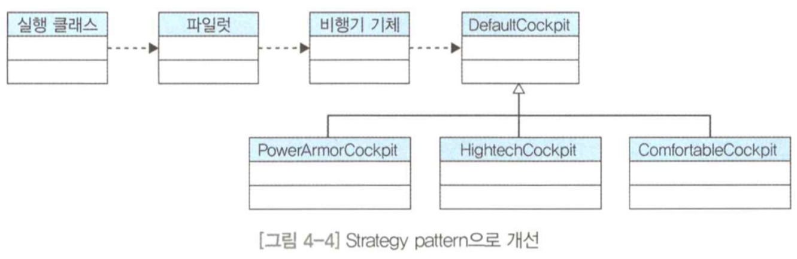

```java
// Airplane
protected DefaultCockpit cockpit;

public Airplane(DefaultCockpit cockpit) {
    this.cockpit = cockpit;
    armorPower += cockpit.armorFeature();
}

public int armorFeature() {
    return cockpit.armorFeature();
}

public int chairFeature() {
    return cockpit.chairFeature();
}
```

```java
// Pilot
public Airplane intoCockpit() {
    airplane = new Airplane(new HightechOnDefaultCockpit());
    return airplane;
}
```

- `DefaultCockpit`의 하위 클래스를 자유롭게 교체할 수 있다.
- 새로운 조종석 클래스를 추가해도 기존 코드의 수정은 발생하지 않는다.

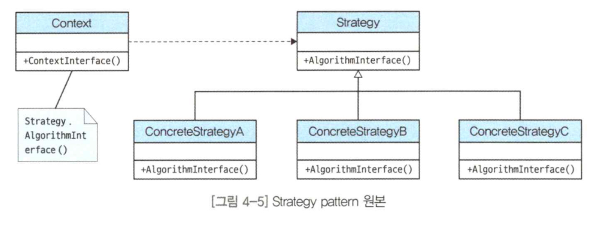

## 실전

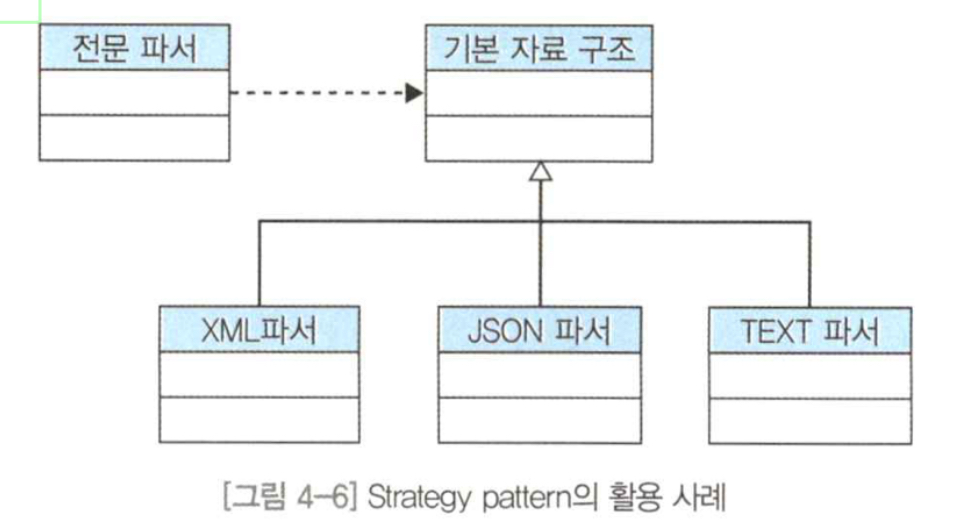

- 파서로 활용
- 스프링의 IoC

</br>

# State Pattern

## 개요
- 객체지향의 중요한 원칙 중 하나는 캡슐화이다. 캡슐화는 속성을 숨겨 다른 객체가 함부로 접근하지 못하게 하는 것이다.
- `State Pattern`은 상태를 캡슐화해준다.

## 적용
- 전투기는 대기, 이륙, 순항, 정찰, 전투, 피격, 파괴, 착률 등의 상황에 따라 상태가 달라진다.

```java
public String wheelStateChange(String statusGubun) {
    if (statusGubun.equals("대기")) {
        wheelImplement = "상태1";
    } else if (statusGubun.equals("이륙")) {
        wheelImplement = "상태2";
    } else if (statusGubun.equals("순행")) {
        wheelImplement = "상태3";
    } 
    ...
    return wheelImplement;
}
```

## 위기
- `if`문 로직이 반복되고 있다. (코드 중복 문제)
- 비행기 상태의 추가 등의 변경이 발생할 때마다 코드 내부를 번거롭게 수정해야 함.

## 해결
- 바뀌는 것은 캡슐화한다.

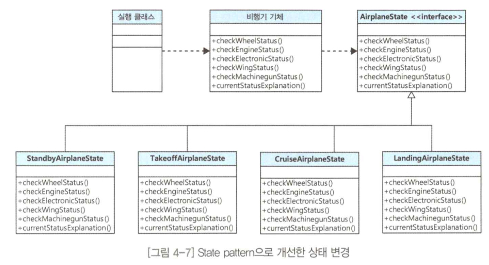

```java
public interface AirplaneState {
    public String checkWheelStatus();
    public String checkEngineStatus();
    public String checkElectronicStatus();
    public String checkWingStatus();
    ...
}
```

```java
public class StandbyAirplaneState implements AirplaneState {
    @Override
    public String checkWeelStatus() {
        String result = "...";
        return result;
    }

    @Override
    public String checkEngineStatus() {
        String result = "...";
        return result;
    }

    ...
}
```

```java
public class AirplaneGoodState {
    //...
    protected AirplaneState airplaneState;

    public AirplaneState getAirplaneState() {
        return airplaneState;
    }

    public void setAirplaneState(AirplaneState airplaneState) {
        this.airplaneState = airplaneState;
    }

    public String checkWeelStatus() {
        String result = airplaneState.checkWheelStatus();
        return result;
    }

    public String checkEngineStatus() {
        String result = airplaneState.checkEngineStatus();
        return result;
    }

    ...
}
```

- 확장이 필요시 상태 클래스를 추가로 더 생성하면 된다.

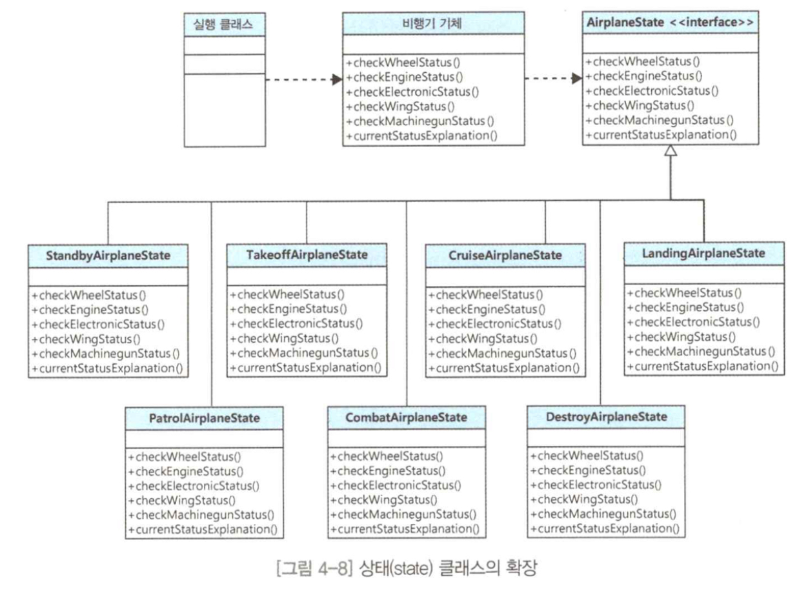

```java
public class LauncherWW2 {
    public static void main(String[] args) {
        AirplaneGoodState airplane = new AirplaneGoodState(new PowerArmorOnDefaultCockpit());
        airplane.setAirplaneState(new StandbyAirplaneState());
        airplane.checkWheelStats();
        ...

        airplane.setAirplaneState(new TakeoffAirplaneState());
        airplane.checkWheelStats();
        ...
    }
}
```

## 정리
- `Strategy Pattern`과 비슷하지만, 차이가 있다.
- `Strategy Pattern`
  - 교체 가능한 알고리즘을 캡슐화 한다.
  - 클라이언트가 사용하고 싶은 알고리즘을 취선택해 인자로 넘긴다.
  - 보통 하나의 메소드를 위임 처리할 때 쓰이곤 한다.
  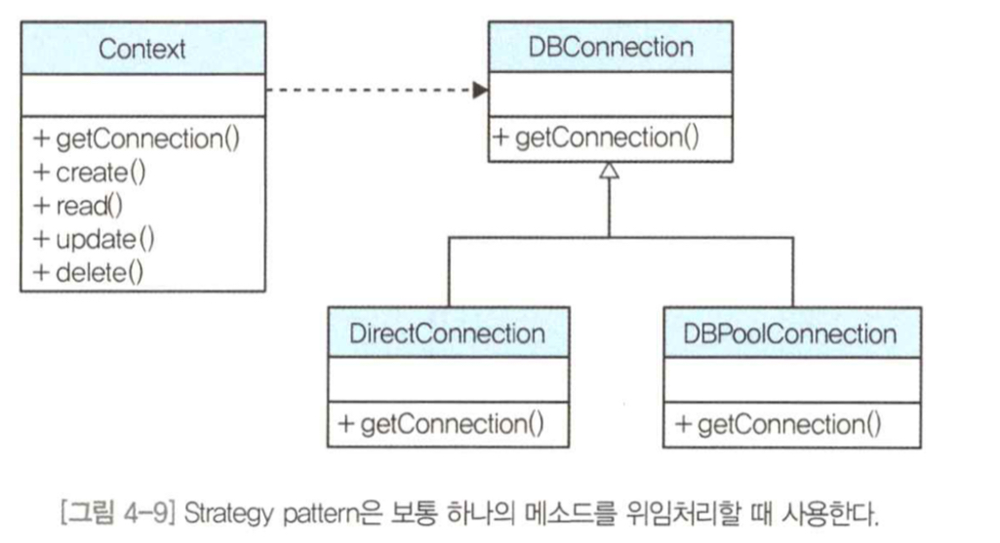
  - 주로 실행 시에 전략 객체를 변경할 수 있는 유연성과 확장성을 제공한다.
  - 보통 실행 클래스에서 컨텍스트 객체한테 어떤 전략 객체를 사용할지 지정한다.
  - 이후에는 컨텍스트 객체가 전략을 직접 변경하는 경우는 드물다.
- `State Pattern`
  - 대상 객체의 상태를변경할 때 쓰인다.
  - 주로 수많은 `if`문을 집어넣을 상태 처리 로직 대신에 사용하는 패턴이다.
  - 보통 컨텍스트 객체의 메소드 명세를 똑같이 구현하는 State 클래스 그룹을 만들어 통째로 위임한다.
  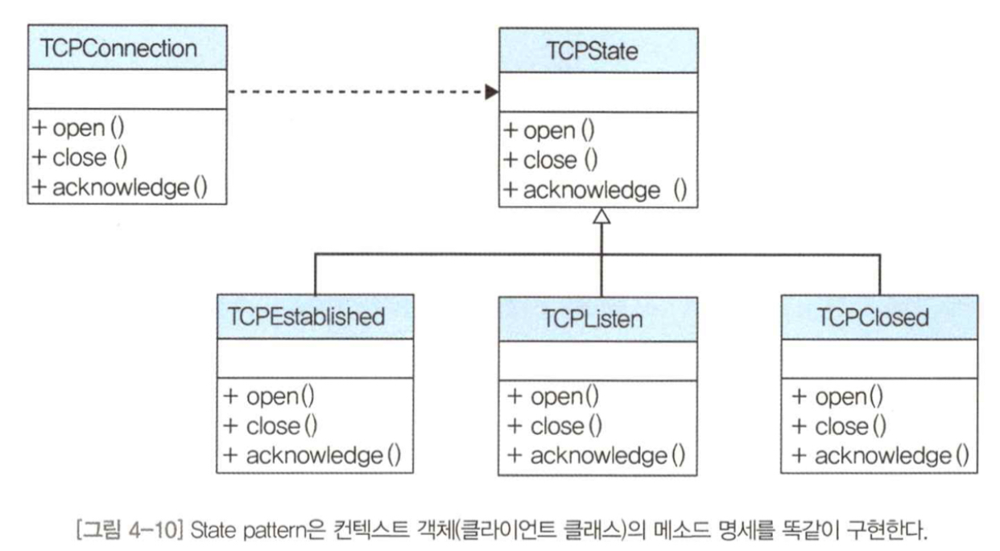
  - 주로 컨텍스트 객체에 수많은 조건문을 집어넣는 대신 사용하는 패턴이다.
  - 컨텍스트 객체를 초기 생성할 때 최초 상태를 한번 지정한다.
  - 그러나 이후에는 컨텍스트 객체가 거의 알아서 자신의 상태를 변경한다.

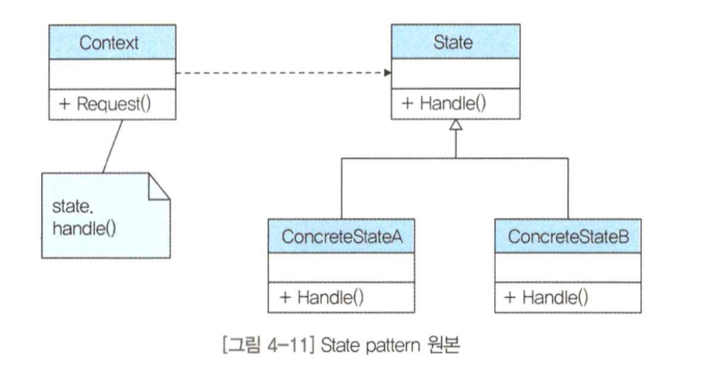

## 현장
- 게임에 많이 사용될 것 같다.

</br>

# Template method pattern

## 개요
- `Framework`는 소프트웨어 개발을 수월하게 하려고 소프트웨어의 제어 흐름과 구현을 재사용할 수 있고, 개발자들이 협업하기 쉽게 돕는 소프트웨어를 뜻한다.
- 프레임워크는 제어 흐름을 통제하여 개발자들이 딴 길로 새지 않고 수석 개발자가 의도한 방향으로 개발하도록 길을 제시해준다.
- 프레임워크의 제어 흐름을 통제하는 역할에서 바로 `Template method pattern`이 활약한다.

## 위기
- 표준기능은 사람이 개발하다보니 혼자 여러 클래스를 개발해도 누락할 수 있다.
- 또는 여러 개발자가 협업을 하면 개발자들 스킬, 스타일에 따라 표준 기능이 누락되거나 왜곡될 수 있다.

## 해결
- 보호해야 할 것은 '제어 흐름'이다.
- 제어 흐름을 보호하는 방법은, 이 제어 흐름을 거의 변하지 않는 상속 클래스로 추출하는 방법이 있다.

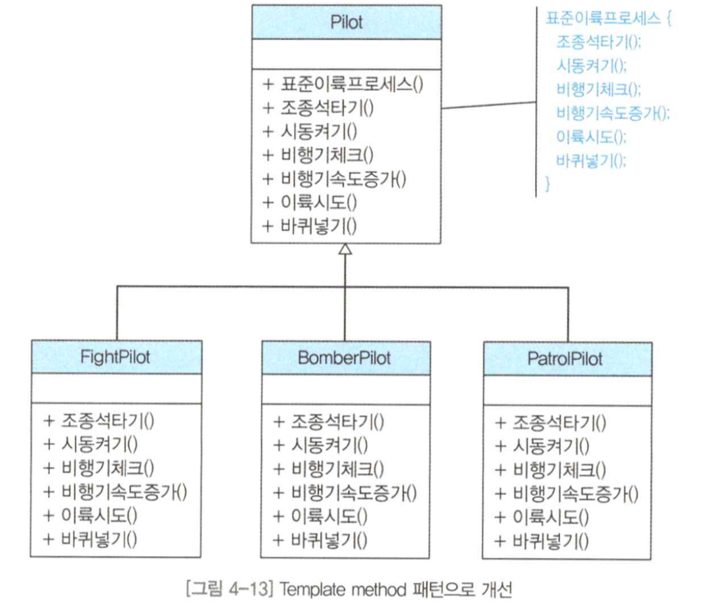

- 세부 로직을 담을 메소드는 `abstract`로 정의한다.

```java
public abstract class Pilot {
    Airplane airplane = null;
    AirplaneState airplaneState = null;

    public Pilot(Airplane airplane) {
        this.airplane = airplane;
    }

    public boolean takeOffProcess() {
        boolean result = false;

        this.airplaneState = intoCockpit();

        boolean turnOnResult = turnOnAirplane();

        boolean isGoodAirplane = false;
        if (turnOnResult) {
            isGoodAirplane = checkAirplane();
        } else {
            System.out.println("비행기 구동 중에 문제가 발생했습니다.");
        }

        boolean increaseSpeedResult = false;
        if (isGoodAirplane) {
            increaseSpeedResult = increaseSpeedOnLand();
        } else {
            System.out.println("비행기 체크 중에 문제가 발생했습니다.");
        }
        ...
        return result;
    }

    public abstract AirplaneState intoCockpit();
    public abstract boolean turnOnAirplane();
    public abstract boolean checkAirplane();
    public abstract boolean increaseSpeedOnLand();
    ...
}
```

```java
public class FightPilot extends Pilot {
    public FightPilot(Airplane airplane) {
        super(airplane);
    }

    @Override
    public AirplaneState intoCockpit() {
        return airplane.getAirplaneState();
    }

    @Override
    public boolean turnOnAirplane() {
        boolean turnOnResult = airplane.turnOnAirplane();
        return turnOnResult;
    }

    @Oberride
    public boolean checkAirplane() {
        boolean checkResult = airplane.checkAirplane();
        return checkResult;
    }
    ...
}
```

```java
public class LauncherWW2 {
    public static void main(String[] args) {
        Airplane airplane = new Airplane(new PowerArmorOnDefaultCockpit());
        Pilot pilot = new FightPilot(airplane);
        pilot.takeOffProcess();
    }
}
```

- 제어 흐름이 자식 클래스에 있다보니, 흐름의 누락 왜곡이 발생하는 문제와 제어 흐름이 자식 클래스에 중복되는 문제를 해결했다.

## 정리
- `Template method pattern`은 프레임워크에서 개발자가 정형화된/일관된 코딩을 하도록 유도해야 할 경우 많이 쓰인다.
- 대신 프레임워크에서 명시한 알고리즘의 세부 로직은 개발자 마음대로 구현할 수 있다.

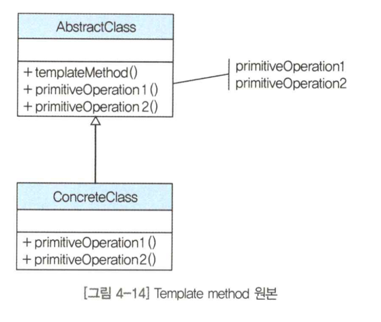

## 현장
- Template mtehod 패턴은 프레임워크에서 많이 쓰인다.

</br>

# Decorator pattern

## 개요
- 세상의 사물은 사물 그 자체로 기능을 수행하기도 한다.
- 어떤 사물은 자신을 돋보여 줄 다른 사물을 필요로 한다.

## 적용

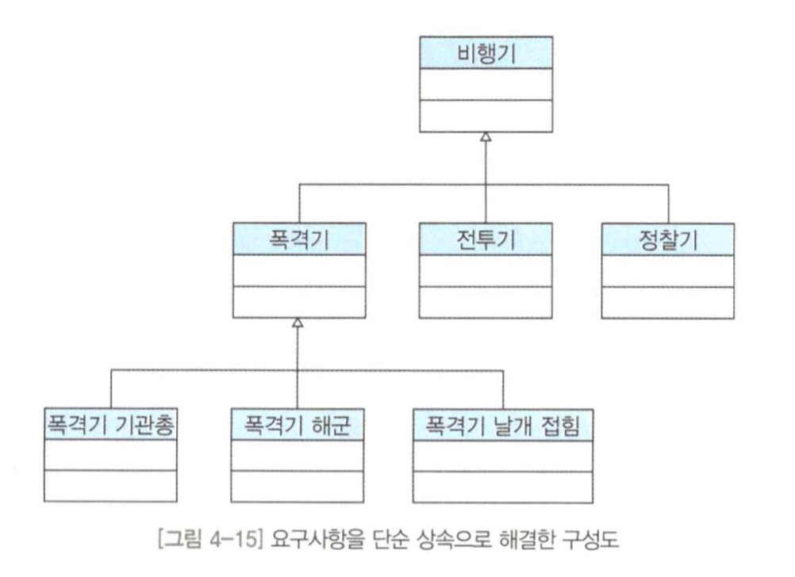

## 문제
- 고정 역할을 하는 클래스가 무수히 증가할 수 있다.
- 유연하지 않다

## 해결

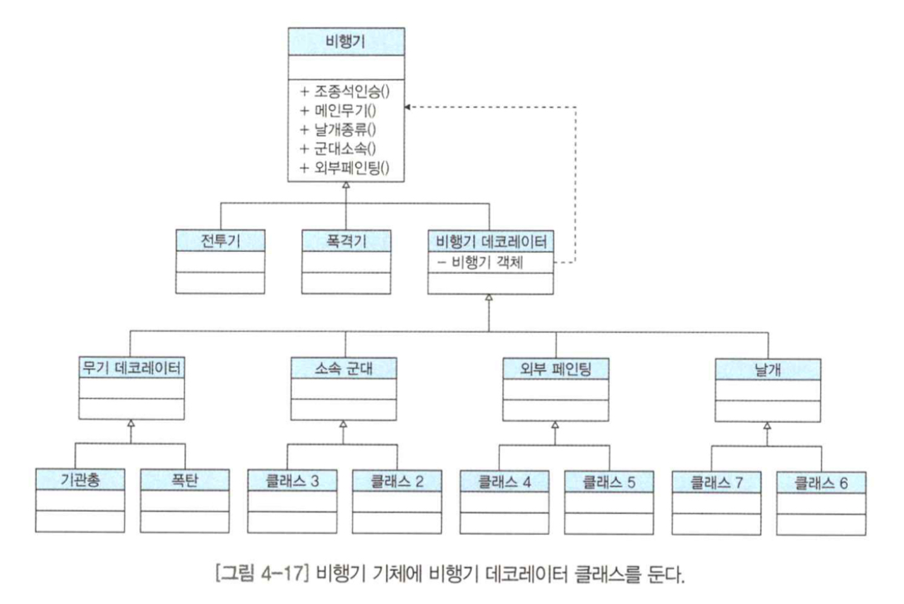

```java
public abstract class Airplane {
    ...
    public abstract String cockpitPerson();
    public abstract String mainWeapon();
    public abstract String wingTuning();
    ...
}
```

```java
public class DecoratorAirplane extends Airplane {
    protected Airplane airplane;

    public DecoratorAirplane(Airplane airplane) {
        this.airplane = airplane;
    }

    @Override
    public String cockpitPerson() {
        return airplane.cockpitPerson();
    }

    @Override
    public String mainWeapon() {
        return airplane.mainWeapon();
    }
    ...
}
```

```java
public class DecoratorAirplaneWingTuningFold extends DecoratorAirplaneWingTuning {
    public DecoratorAirplaneWingTuningFold(Airplane airplane) {
        super(airplane);
    }

    @Override
    public String wingTuning() {
        return airplane.wingTuning() + ", 비행기 날개 접힘";
    }
}
```

```java
//사용
Airplane airplaneExtending = new DecoratorAirplaneMainWeaponBomb(
        new DecoratorAirplaneMilitaryfeatureAirforce(
            new DecoratorAirplanePaintingAnimal()
        )
);
```

## 정리
- 클라이언트 클래스와 조합해야 하는 부가 기능이 많을 경우, Decorator Pattern으로 좀 더 깔끔하게 해결할 수 있다.
- 무수히 많은 기능의 결합이 필요해도 유연하게 요구사항을 처리할 수 있다.
- 이떄 쓰인 디자인 원칙은 `OCP`이다.

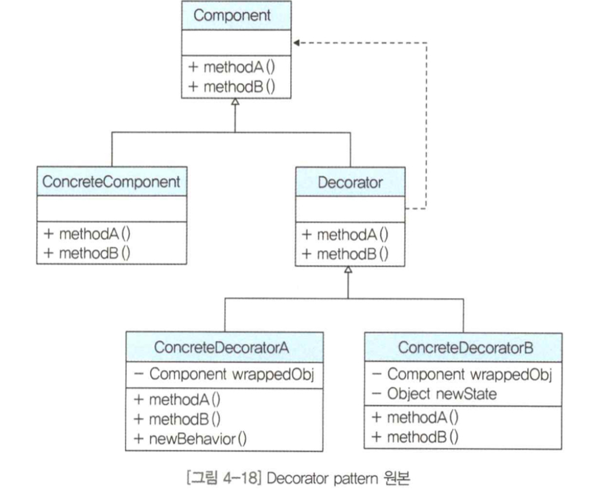

## 현장
- 게임이나 어떤 아이템을 구현하는 소프트웨어 개발에 사용 가능하다.
