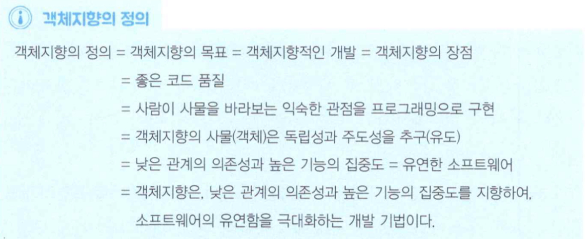
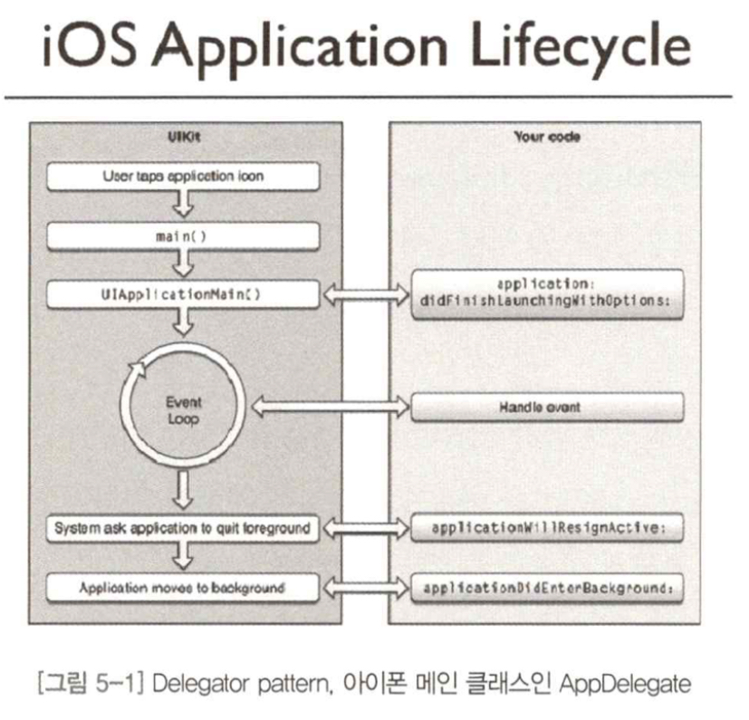

# 객체지향의 한 점
- 우리는 객체지향 기본 요소, 근본 조건 구현원리, 디재인패턴 등으로 객체지향 능력을 정형화된 틀 안에서 기르고 있다.
- 언젠가 우리가 능력을 얻게 되면, 우리는 객체지향에서 얻은 능력을 바탕으로 더 넓은 기술로 향해야 한다.
- 객체 지향의 한 점이란, 객체 지향을 통해 개발자가 얻어야 할 최종 능력을 의미한다.

## 1. 객체 지향의 한 점
- 우리는 직관적으로 어떤 개발자가 되고 싶을까?

- 우리는 객체지향을 통해서, 낮은 관계의 의존성과 높은 기능의 집중도를 가진 유연한 소프트웨어를 만들줄 아는 능력을 얻어야 한다.

> 기능을 담을 그릇(객체 간의 관계)을 유연하게 만들 줄 아는 능력 = 기능보다 객체 관계 중심 접근법

- 우리는 기능보다 '어떻게 하면 객체 관계를 잘 구성할까?'의 관점으로 접근해야 한다.

### 기능은 변한다. 그러나 객체 간의 관계는 거의 변하지 않는다.
- 객체지향에 신경 쓰다 보면 객체 간의 관계는 많은 요구사항 변경에도 잘 견디도록 설계된다.
- 자주 변화하는 요소는 변경되지 않을 요소로부터 최대한 분리했기 때문이다.

### 변하는 기능을 변하지 않는 기능으로부터 분리한다.
- 객체지향의 목표는 로직보다 인터페이스에 집중하여 유연한 소프트웨어를 얻는 것이다.
- 기능을 담을 그릇을 유연하게 만들 줄 아는 능력은 세로보다 가로로 접근하는 것이다.

## 2. 가족 문파, Objective-C와 스프링 프레임워크

### Objective-C

### 스프링 프레임워크

## 3. 전통의 문파, RDB
- 대부분 프로젝트와 소프트웨어에서 가장 근간이 되고 가장 파급 효과가 크고, 위험하고, 업무를 잘 알아야 하는 기술이 RDB인 것 같다.

## 4. 신생 문파, 함수형 언어
- 함수형 언어는 모든 프로그램이 여러 개의 모듈형 함수를 조합하여 프로그램을 완성하는 것을 추구한다.
- 개발자가 자신의 생각을 편하게 소프트웨어로 구현하게 해주기 때문에, 개발자가 더 행복해지는 개념이다.
- 함수형 언어가 사이드 이펙트를 최대한 멀리하는 방법은 순수 함수를 만드는 것이다.

> 객체지향은 움직이는 부분을 캡슐화하여 코드 이해를 돕는다.
>
> 함수형 언어는 움직이는 부분을 최소화하여 코드 이해를 돕는다.