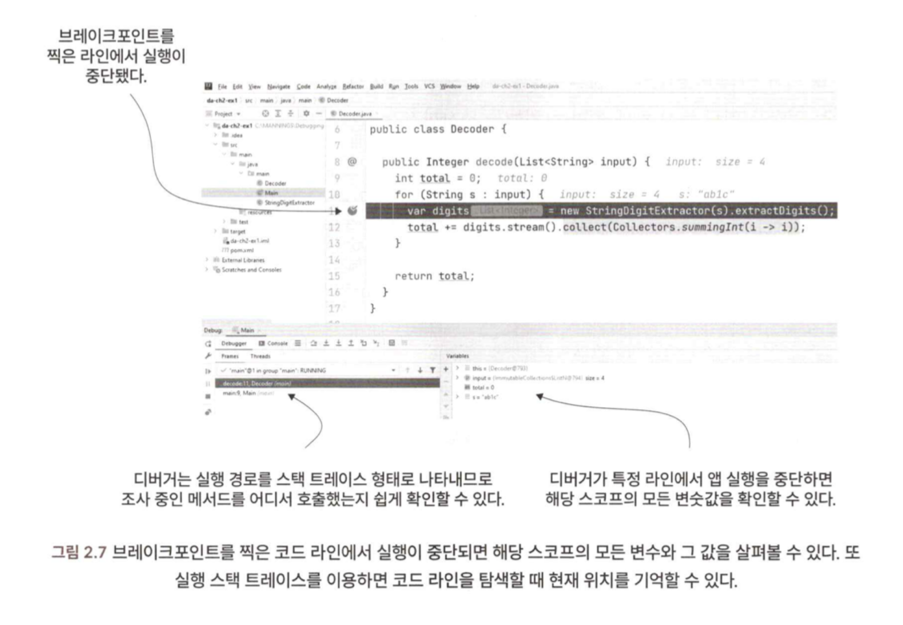
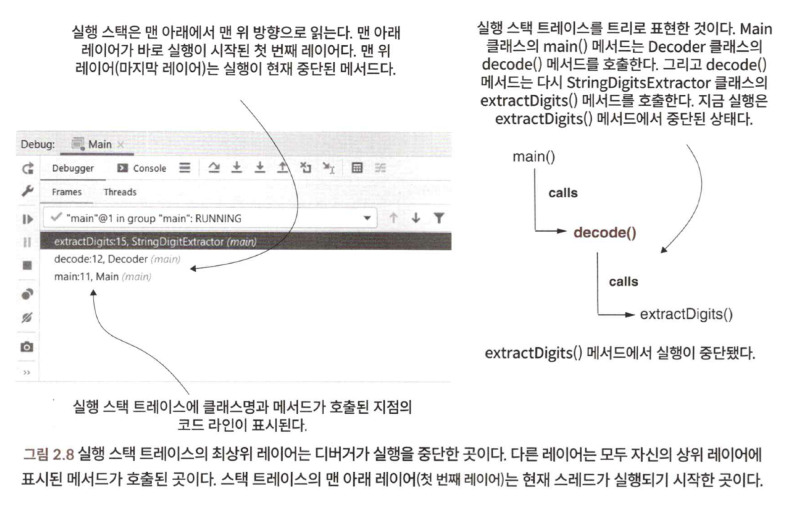
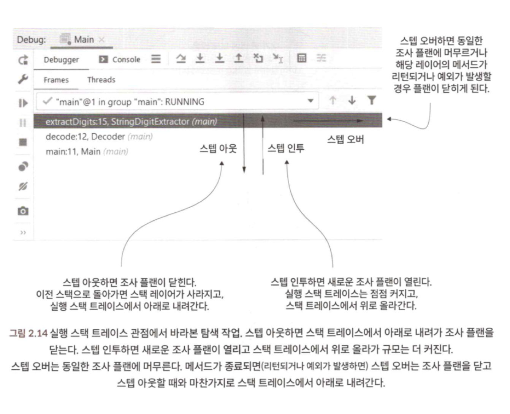

> 디버거를 사용할 때와 사용하지 말아야 할 때는 언제인가?
> 디버거로 코드 조사하기

## 1. 코드 분석만으로는 불충분한 경우
- 코드는 선형적이지 않고, 모든 사람에게 동일한 의미를 지닌다.
- 선형적이지 않기 때문에, 새로운 코드 커맨드를 조사할 때마다 인지 복잡성이 가중된다.

## 2. 디버거를 이용한 코드 조사
- 디버거를 사용하면 조사 프로세스가 간소화된다.
- 지금 내가 조사하려는 로직이 무엇인가를 알아야, 디버거를 활용할 수 있다.
- 어느 커맨드부터 코드 조사를 시작해야 할지 모른다면 디버거를 사용할 수 없다.
- 디버거로 코드를 조사할 때는 이해할 수 없는 코드의 첫 라인부터 시작한다.
  - 

### 2-1. 실행 스택 트레이스란 무엇이고 어떻게 사용해야 할까?
- 스택 트레이스는 디버거가 실행을 멈춘 지점까지 메서드가 서로 어떻게 호출하는지 나타내며, 메서드명, 클래스명, 호출한 코드 라인을 자세히 표시한다.
- 
- `Spring`이나 하이버네이트 등의 프레임워크는 메서드의 실행 체인을 바꾸는 경우도 많다.

### 2-2. 디버거로 코드 탐색하기
- `Step Over` : 동일한 메서드에서 다음 코드 라인으로 계속 실행한다.
- `Step Into` : 현재 라인에서 호출된 메서드 중 하나의 내부에서 실행을 계속한다.
- `Step Out` : 조사하던 메서드를 호출한 메서드로 실행을 되돌린다.
- 
- 코드의 작동 방식을 알고 싶다면 `Step Over`로 시작하고, 로직을 도저히 알 수 없다면 `Step Into`로 코드를 뜯어본다.

## 3. 디버거로도 충분하지 않다면
- 디버거로 불충분하거나, 디버거를 사용할 수 없는 몇 가지 시나리오
  - 코드의 어느 부분이 아웃풋을 내는지 모르는 채 아웃풋 문제를 조사한다.
    - 앱 프로파일링이나 스터빙 등으로 시작할 위치를 파악한다.
  - 성능 문제를 조사한다.
    - 프로파일링과 로깅 기법을 적용하여 성능 문제의 실마리를 찾는다.
    - 앱이 완전히 멈춰버리는 경우 대개 스레드 덤프를 수집해 분석하면 빠르다.
  - 앱 전체가 실패한 크래시를 조사한다.
    - 감사로그를 활용하거나, 스레드 또는 힙 덤프를 수집하여 조사한다.
  - 멀티스레드 구현체를 조사한다.
    - 디버깅, 모킹, 스터빙, 프로파일링 등의 다양한 기술을 익혀야 한다.
