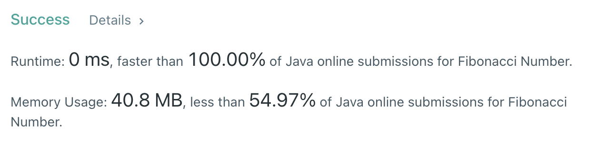

# 509. Fibonacci Number

## Problem

The Fibonacci numbers, commonly denoted F(n) form a sequence, called the Fibonacci sequence, such that each number is the sum of the two preceding ones, starting from 0 and 1. That is,

```java
F(0) = 0, F(1) = 1
F(n) = F(n - 1) + F(n - 2), for n > 1.
```

Given n, calculate F(n).

<br>

---

<br>

## My Answer

```java
class Solution {
    public int fib(int n) {
        int[] ans = { 0, 1 };

        if (n<=1) return ans[n];
        for(int i = 2; i<=n; i++) caculateNextFib(ans);
        return ans[1];
    }

    public void caculateNextFib(int[] arr) {
        int nextFibNumber = arr[0] + arr[1];
        arr[0] = arr[1];
        arr[1] = nextFibNumber;
    }
}
```

두개의 요소를 가진 배열(`ans`)을 사용해서 DP에 사용되는 공간을 최소화 했으며,
다음 피보나치 수열을 계산하는 `calculateNextFib` 함수를 호출하여 계산

최대 N번의 반복을 하여 O(N)의 시간복잡도를 가지게 됨.

<br>

---

<br>

## Result



<br>

---
