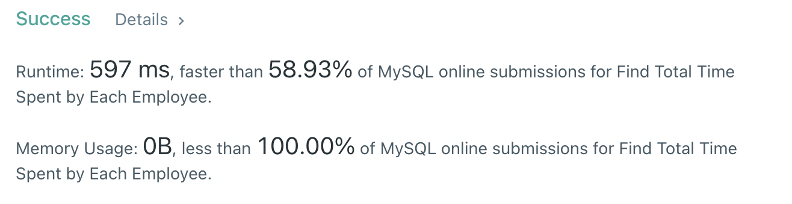

# 1741. Find Total Time Spent by Each Employee

## Problem

+-------------+------+

| Column Name | Type |

+-------------+------+

| emp_id | int |

| event_day | date |

| in_time | int |

| out_time | int |

+-------------+------+

(emp_id, event_day, in_time) is the primary key of this table.

The table shows the employees' entries and exits in an office.

event_day is the day at which this event happened, in_time is the minute at which the employee entered the office, and out_time is the minute at which they left the office.

in_time and out_time are between 1 and 1440.

It is guaranteed that no two events on the same day intersect in time, and in_time < out_time.

<br>

Write an SQL query to calculate the total time in minutes spent by each employee on each day at the office. Note that within one day, an employee can enter and leave more than once. The time spent in the office for a single entry is out_time - in_time.

Return the result table in any order.

The query result format is in the following example.

<br>

---

<br>

## My Answer

```mysql
SELECT event_day as day, emp_id, SUM(cc.calculate_time) as total_time
  FROM (SELECT emp_id, event_day, out_time - in_time as calculate_time
          FROM Employees
       ) cc
 GROUP BY cc.emp_id, event_day
 ORDER BY cc.event_day, emp_id;
```

`Employees 테이블` 먼저 출퇴근 시간을 계산하여 `cc 테이블`로 만들고,

cc 테이블을 사용하여 `그룹핑`하여 계산.

<br>

---

<br>

## Result



<br>

---
