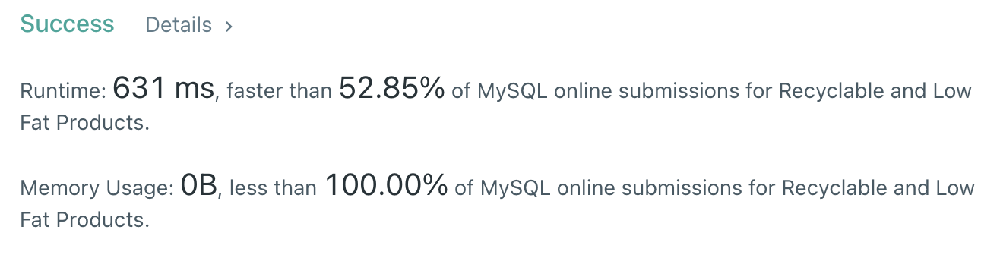

# 1757. Recyclable and Low Fat Products

## Problem

+-------------+---------+

| Column Name | Type |

+-------------+---------+

| product_id | int |

| low_fats | enum |

| recyclable | enum |

+-------------+---------+

product_id is the primary key for this table.

low_fats is an ENUM of type ('Y', 'N') where 'Y' means this product is low fat and 'N' means it is not.

recyclable is an ENUM of types ('Y', 'N') where 'Y' means this product is recyclable and 'N' means it is not.

<br>

Write an SQL query to find the ids of products that are both low fat and recyclable.

Return the result table in any order.

The query result format is in the following example.

<br>

---

<br>

## My Answer

```mysql
SELECT product_id
  FROM Products pd
 WHERE pd.low_fats = 'Y'
   AND pd.recyclable = 'Y';
```

`위의 방식`과 `column을 하나씩 스캔`하는 방식으로 각각 짜보고 실행시켰는데,

쿼리를 실행시킬 때 마다 무언가가 leetcode 내부에서 실행시키는 쿼리 익스큐터의 `캐시`에 기록되는 듯 하다.

같은 쿼리여도 실행마다 속도가 다르게 측정된다.

<br>

---

<br>

## Result



<br>

---
